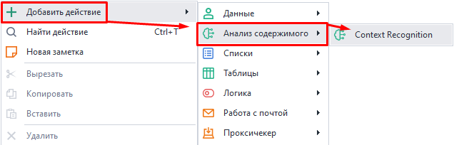
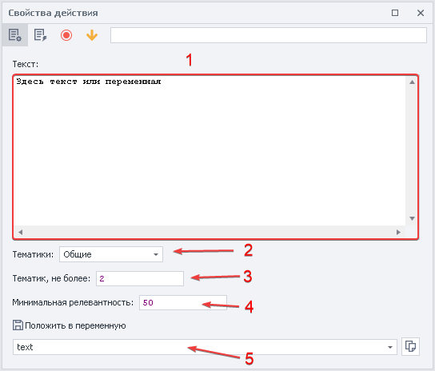
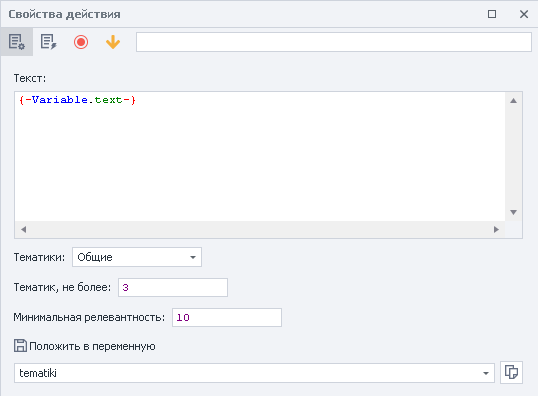
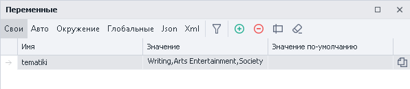

---
sidebar_position: 4
title: Распознавание контекста
description: Определить тематику контента.
---  
:::info **Пожалуйста, ознакомьтесь с [*Правилами использования материалов на данном ресурсе*](../Disclaimer).**
:::  
_______________________________________________    
## Описание.  
С этим экшеном вы сможете определить тематику выбранного текста. Он может:  
- Определять тематику сайта;  
- Фильтрация сайтов по категориям для размещения ссылок;  
- Парсинг контента;  
- Определение текста по заданным критериям.  

:::warning **Работает только с английским языком.**
:::  

### Как добавить в проект?  
Через контекстное меню: **Добавить действие → Анализ содержимого → Context Recognition**  

 

:::tip **Если вам нужно определить тематику текста вне проекта.**  
То воспользуйтесь ***Распознаванием контекста*** в виде **Инструмента**.
:::
_______________________________________________
## Работа с окном.  
 

**1.** Тут мы вводим текст или переменные, контекст которых хотим определить.  
**2.** Тематики:  
    - **Общие**. Сюда входит около 20-ти тематик общего содержания, которые подходят большинству текстов.  
    - **Подробные**. Более узкие направления текстов, примерно 250 тем.  
**3.** В этом поле можно задать максимальное количество тематик, которые мы получим после анализа. *Доступно использование переменной.*  
**4.** Указываем минимальную релевантность текста в процентах, от 0% до 100%. *Доступно использование переменной.*  
**5.** Здесь можно выбрать переменную, в которую мы положим результат.  

:::info **Все полученные тематики будут разделены в переменной через `;`.**
:::  
_______________________________________________
## Пример использования.  
Представим, что нам нужно спарсить текст с главной страницы сайта и определить минимум три тематики.  

  

1. Парсим основную статью в переменную `text`.  
2. Указываем низкий процент релевантности (10%), потому что на сайте много разных тематик.  
3. Результат кладём в переменную `tematiki`.  

   
_______________________________________________
## Совет по работе.  
Экшен **Contex Recognition** пользуется популярностью среди SEO-специалистов. Одно из самых частых применений — это определение тематики сайтов для размещения рекламных ссылок.  

Если публиковать ссылки на свой продукт на всех ресурсах подряд, то высок риск получить бан от поисковых систем. Поэтому сначала мы рекомендуем определять темы страниц, где вы хотите размещаться. И если текст не подходит под направление вашего сайта, то пропускать его.  

Затем, когда вам нужно будет прорекламировать свой сайт, вы просто возьмёте ссылки для постинга не из общей базы, а из заранее отсортированной по тематикам. Так, например, вы сможете постить статью про страхование машин в автомобильный блог, а не в тот, где публикуют рецензии на фильмы.

Это значительно увеличивает ваш шанс пройти модерацию. Что особенно важно на крупных и авторитетных ресурсах.

Аналогично можно проверять и те ссылки, которые размещены на вашем сайте.  
_______________________________________________

