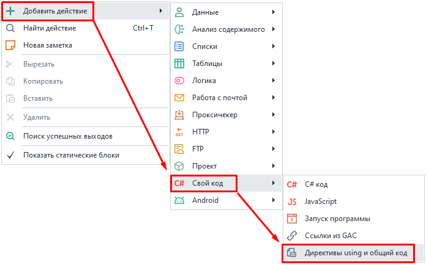
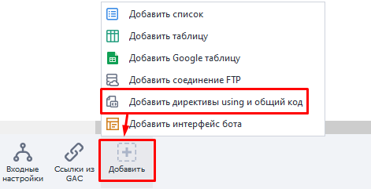
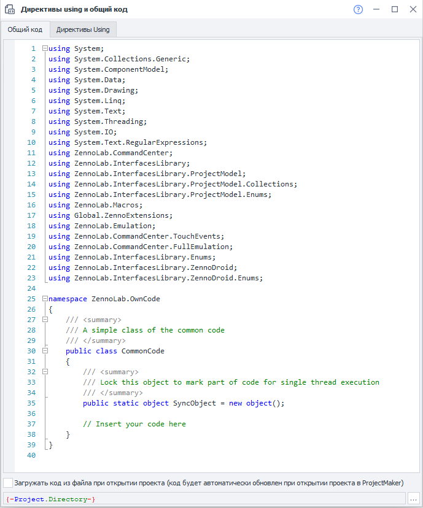
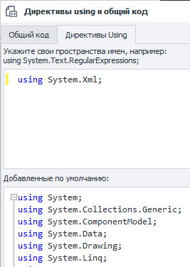

---
sidebar_position: 5
title: Директивы using и общий код
description: Дополнительные классы и функции.
---  
:::info **Пожалуйста, ознакомьтесь с [*Правилами использования материалов на данном ресурсе*](../../Disclaimer).**
:::  
_______________________________________________   
## Описание.  
**Общий код** - это функционал, расширяющий возможности стандартных кубиков C#. Он используется для вставки дополнительных классов и функций.   

А **Using-директивы** нужны для доступа к функциям и классам, а также для создания пространства имён (*namespaсes*).  

#### Как можно использовать?  
- Более эффективная работа с C# кодом.  
- Создание новых пространств имен.  
- Организация работы с большим объемом кода.  
- Избежание конфликтов в пространстве имен.

:::warning **Работа с общим кодом подразумевает, что у вас уже есть базовые знания C#.**
:::  
_______________________________________________
## Как добавить в проект?  
Через контекстное меню: **Добавить действие → Свой код → Директивы using и общий код**.  

  

Или через **[*Панель статических блоков*](../Static%20Block%20Panel/CommonPrinciples) → Добавить → Добавить директивы using и общий код**:  

  
_______________________________________________
## Общий код.  
  

Это окно представляет собой редактор кода с подсветкой синтаксиса. В контекстном меню можно получить доступ к базовому функционалу для редактирования кода: копирование, вставка, комментирование, поиск, замена и т. д.  

В нижней части окна есть чекбокс, который позволяет загружать код из своего файла в форматах `.txt` или `.cs`.  

Самыми первыми в коде перечислены все **using**, используемые в проекте. А далее идет пример объявления `namespace ZennoLab.OwnCode`. Вы можете по аналогии создавать свои пространства имён и обращаться к ним в дальнейшем.  

Для доступа к функциям и методам общего кода их нужно объявлять с модификатором `public`. Если не нужно работать с объектами определенного класса, то его можно объявить статичным `public static`. А когда не понадобится наследование, то лучше сразу объявить как `public sealed`.  
_______________________________________________
## Директивы Using.  
  

Перейдя на эту вкладку, вы увидите перед собой два поля:  
- **Верхнее**. Служит для добавления *namespaces*, которые используются при выполнении кода в экшенах C#. Например, для парсинга XML нужно написать `using System.Xml;`.  
- **Нижнее**. Здесь перечислены все *using*, которые используются проектом по умолчанию. Их нельзя редактировать.  
_______________________________________________
## Пример работы.  
Подадим изображение и коэффициент прозрачности на вход метода `SetImageOpacity`. В результате мы получим картинку с эффектом полупрозрачности, которую можно сохранить на диск.  
```C
public static Image SetImageOpacity(Image image, float opacity)  
{  
    try  {  
		Bitmap bmp = new Bitmap(image.Width, image.Height);
        //создание графики из картинки
        using (Graphics gfx = Graphics.FromImage(bmp)) {
            //создание объекта color matrix  
            ColorMatrix matrix = new ColorMatrix();      
            //установка прозрачности 
            matrix.Matrix33 = opacity;  
            //создание новых атрибутов
            ImageAttributes attributes = new ImageAttributes();      
            //установка цвета прозрачности картинки
            attributes.SetColorMatrix(matrix, ColorMatrixFlag.Default, ColorAdjustType.Bitmap);    
            //отрисовываем картинку
            gfx.DrawImage(image, new Rectangle(0, 0, bmp.Width, bmp.Height), 0, 0, image.Width, image.Height, GraphicsUnit.Pixel, attributes);
        }
        return bmp;  
    }  
    catch (Exception ex) {  
        return null;  
    }  
} 
```  

А вот так эта функция вызывается из [**экшена C#**](./С):  
`Image img = OwnCode.CommonCode.SetImageOpacity(Image.FromFile(project.Directory + "//image.jpg"), .5f);`
_______________________________________________
## Полезные ссылки.  
- [**Полное руководство по языку программирования С#**](https://metanit.com/sharp/tutorial/?ysclid=m6tuqoibxu646819911).
- [**Директива using: импорт типов из пространства имен**](https://learn.microsoft.com/ru-ru/dotnet/csharp/language-reference/keywords/using-directive).  
