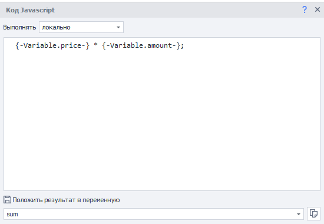
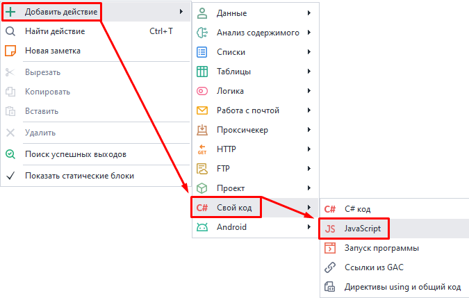
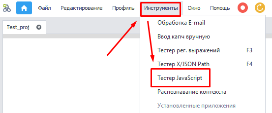
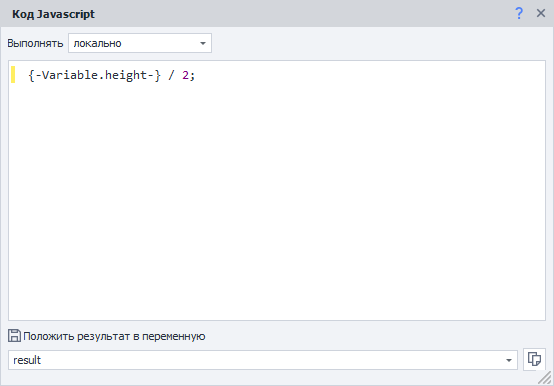

---
sidebar_position: 2
title: Код JavaScript
description: Работа с JavaScript в ZennoDroid.
---  
:::info **Пожалуйста, ознакомьтесь с [*Правилами использования материалов на данном ресурсе*](../../Disclaimer).**
:::  
_______________________________________________   
## Описание.  
Этот экшен позволяет выполнять пользовательский JavaScript код и производить арифметические операции с переменными проекта.  

  

_______________________________________________ 
## Как добавить в проект?  
Через контекстное меню: **Добавить действие → Свой код → JavaScript**.  

  
_______________________________________________
## Как работать с экшеном?  
Есть **два режима работы:**  

### Локально.  
Код будет выполнен в изолированном окружении, независимо от открытого приложения и за его пределами.   
Этот способ можно использовать для работы с любыми данными, которые поддерживает JS. Например с:  
- *переменными*,  
- *числами*,  
- *строками*.  

 

При работе в данном режиме **не надо** указывать ключевое слово *return*, если собираетесь вернуть какое-то значение. Данный экшен сам вернет результат вычислений из последней строки.  
В примере выше в переменную проекта `{-Variable.result-}` попадёт значение `6`, результат выражения `2+2*2`.  

:::info **Протестировать такой код можно с помощью *Тестера JavaScript*.**  

:::

### На текущей странице.  
Код будет выполнен на открытой странице браузера. Этот способ стоит использовать для работы с DOM-древом, чтобы взаимодействовать с элементами страницы.  

При работе в данном режиме открывается доступ ко все объектам текущей страницы. В том числе к подключенным на сайте библиотекам и фреймворкам (например jQuery).  

_______________________________________________  
:::warning **Независимо от выбранного режима**  
В настройках экшена обязательно должна быть указана переменная, в которую сохранится результат работы. Даже если логика кода не подразумевает возврат значения. 
:::  
_______________________________________________  

## Примеры использования.  
### Арифметические операции.  
|   |
|:--:|
| *После выполнения этого экшена в переменную **result** сохранится результат деления переменной **height** на **2*** |  

### Подключение JavaScript библиотек.  
Можно также встроить на страницу библиотеку, которой изначально не было. Например, с помощью кода добавить jQuery:  

```JS  
int value1 = Convert.ToInt32(project.Variables["value1"].Value);
int value2 = Convert.ToInt32(project.Variables["value2"].Value);
int value3 = value1 + value2; //или value1 - value2 или value1 * value2 и т. д.
return value3.ToString(); //сумма двух чисел  
```  
_______________________________________________
## Полезные ссылки.  
- [**Основные принципы работы в JavaScript**](https://medium.com/@stasonmars/%D0%BE%D1%81%D0%BD%D0%BE%D0%B2%D1%8B-%D0%BE%D1%81%D0%BD%D0%BE%D0%B2-%D0%B2-javascript-%D0%B4%D0%BB%D1%8F-%D1%82%D0%BE%D0%B3%D0%BE-%D1%87%D1%82%D0%BE%D0%B1%D1%8B-%D0%B8%D0%B4%D1%82%D0%B8-%D0%B4%D0%B0%D0%BB%D1%8C%D1%88%D0%B5-a5beae5dc9e4).
- [**Тестер JavaScript**](../../Tools/Java_Tester).  
- [**Окно переменных**](../../pm/Interface/Variables). 