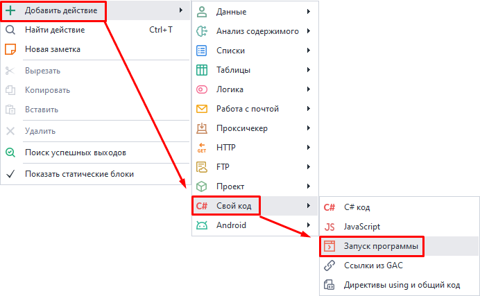
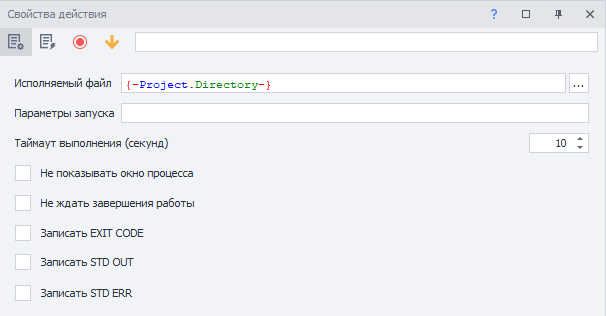
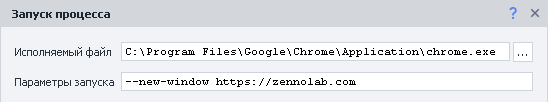
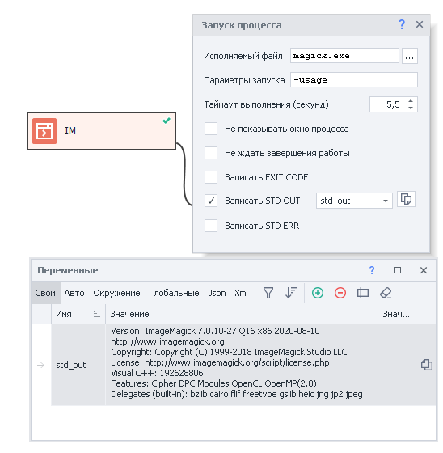
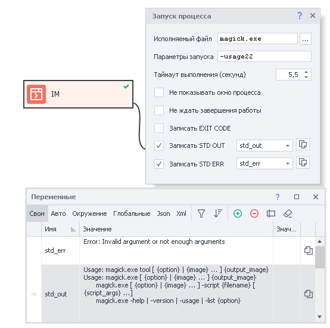
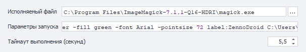
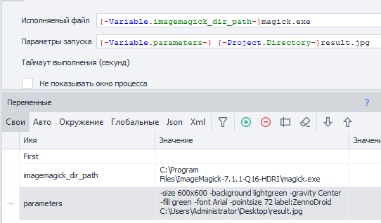
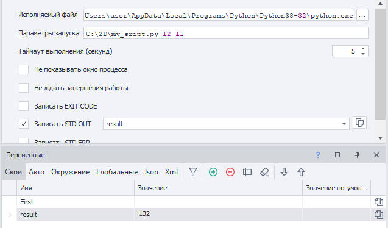

---
sidebar_position: 3
title: Запуск программ
description: Запуск сторонних приложений.
---  
:::info **Пожалуйста, ознакомьтесь с [*Правилами использования материалов на данном ресурсе*](../Disclaimer).**
:::  
_______________________________________________  
## Описание.  
Экшен служит для запуска сторонних программ. Таких как:  
| Десктопные программы  | Консольные утилиты | 
|:--:| :--:|
| Notepad, WinRar, Paint | ffmpeg, ImageMagick | 

#### Как можно использовать:  
- [**ImageMagick**](https://imagemagick.org). Набор утилит для чтения и редактирования файлов множества графических форматов (изображений).  
- [**FFmpeg**](https://ffmpeg.org). Библиотеки с открытым исходным кодом. Позволяют записывать, конвертировать и передавать цифровые аудио- и видеозаписи в различных форматах.   
- Запуск скриптов на [**Python**](https://www.python.org) и других языках программирования.  
- Работа с любыми другими приложениями.  

_______________________________________________ 
## Как добавить в проект?  
Через контекстное меню: **Добавить действие → Свой код → Запуск программы**.  

  
_______________________________________________
## Как работать с экшеном?  
  
_______________________________________________
### Исполняемый файл.  
Тут пишем полный путь к файлу, который надо запустить. Нажатие на многоточие откроет стандартное окно поиска файлов на компьютере.  
#### Особенности:  
- **Если файл по указанному пути не будет найден, то экшен завершится с ошибкой.**  
- Можно использовать ***макросы переменных***.  
- Если каталог выполняемой программы находится в переменной [**среды PATH**](https://ru.wikipedia.org/wiki/PATH_(%D0%BF%D0%B5%D1%80%D0%B5%D0%BC%D0%B5%D0%BD%D0%BD%D0%B0%D1%8F)), то можно указывать не полный путь к файлу, а только его название (например, `notepad.exe` или `calc.exe`).  
_______________________________________________
### Параметры запуска.  
Здесь можно указать дополнительные команды, которые передаются запускаемой программе. У каждой программы свои параметры запуска (можно использовать макросы переменных).  

|   |
|:--:|
| *Запуск нового окна браузера Chrome с URL https://zennolab.com* |  

:::info **При запуске консольных утилит в данной строке передаются аргументы.**
:::  
_______________________________________________
### Таймаут.  
Если вызванная программа не выполнится за указанное здесь количества секунд, то экшен завершится с ошибкой. Это удобно использовать, если вы знаете точное время выполнения.  

:::info **Можно указывать дробное значение через `,`.**
::: 
_______________________________________________
### Не показывать окно процесса.  
При включении данной опции запускаемая программа не будет отображена.  
_______________________________________________
### Не ждать завершения работы.  
С этой настройкой *Таймаут* будет игнорироваться, и экшен не будет ждать, пока программа закончит работу.  
_______________________________________________
### Записать EXIT CODE.  
[**Код возврата**](https://ru.wikipedia.org/wiki/%D0%9A%D0%BE%D0%B4_%D0%B2%D0%BE%D0%B7%D0%B2%D1%80%D0%B0%D1%82%D0%B0) — это числовое значение, возвращаемое программой после завершения своей работы. Этот код может сообщать о том, завершилась ли программа успешно или произошла ошибка.  

При нормальном завершении работы программы возвращают `0` (ноль). Если возвращено что-то другое, то скорее всего программа завершилась с ошибкой.  

Чтобы опознать конкретный код, стоит вбить в поиск запрос: `название_программы exit code код_возврата`. **Пример:** `ffmpeg exit code 137`.  
_______________________________________________
### Записать STD OUT.  
**STDOUT (Standard Output)** — это стандартный поток вывода, который используется программами для вывода текстовой информации, любой кроме ошибок. Он отображается в окне консоли.  

#### Рассмотрим пример:  
При установке *ImageMagick* программа добавляет путь к своей папке в переменную [*среды PATH*](https://ru.wikipedia.org/wiki/PATH_(%D0%BF%D0%B5%D1%80%D0%B5%D0%BC%D0%B5%D0%BD%D0%BD%D0%B0%D1%8F)). После этого нет необходимости указывать полный путь к исполняемому файлу, можно просто написать: `magick.exe <тут_аргументы>`.  

Для демонстрации запустим программу с аргументом `-usage` и перенаправим **STD OUT** в переменную. В ответ программа напишет базовую информацию о себе.  

  
_______________________________________________
### Записать STD ERR.  
**STD ERR (Standard Error)** — стандартный поток, предназначенный только для вывода данных при ошибках.  

#### Пример:  
Повторим команду из предыдущего пункта, но сделаем ошибку и напишем `-usage22`:  

  

На скриншоте видно, что в **STD ERR** попал текст ошибки, сообщающий о неправильном аргументе или недостаточном их количестве.  
Но мы также получили текст и в **STD OUT** — программа подсказывает, как правильно ею пользоваться.  
_______________________________________________
:::info **Чтобы повторить команды, описанные выше.**  
Установите [**ImageMagick**](https://imagemagick.org).  
Откройте окно консоли (например, через **Win+R → ввести cmd.exe → нажать Enter**).  
Затем написать команды: `magick-usage` и `magick-usage22`.  
:::  
_______________________________________________
## Примеры использования.  
Рассмотрим несколько сценариев на основе ImageMagick.  

**Цель:** создать изображение.  
- **Размер**: 600 на 600 пикселей (`-size 600x600`).  
- **Цвет фона**: светло-зеленый (`-background lightgreen`).  
- **Расположение**: по центру (`-gravity Center`).  
- **Цвет текста**: зеленый (`-fill blue`).  
- **Шрифт**: Arial (`-font Arial`).  
- **Размер шрифта**: 72 (`-pointsize 72`).  
- **Текс**: ZennoDroid (`label:ZennoDroid`).  

**Результат сохраним** в файл: `C:\Users\Administrator\Desktop\result.jpg`.  

**Путь**: `C:\Program Files\ImageMagick-7.1.1-Q16-HDRI\magick.exe`.  

:::info **На вашем компьютере пути к файлам скорее всего будут отличаться.**
:::  

|   |
|:--:|
| *Результат* |  

### Способ №1. Все параметры жёстко прописаны.  
  

**Исполняемый файл**: `C:\Program Files\ImageMagick-7.1.1-Q16-HDRI\magick.exe`.  

**Параметры запуска**: `-size 600x600 -background lightgreen -gravity Center -fill green -font Arial -pointsize 72 label:ZennoDroid C:\Users\Administrator\Desktop\result.jpg`.  

После выполнения данного экшена на рабочем столе появится файл `result.jpg`  
_______________________________________________
### Способ №2. Параметры переданы в переменных.  
  

**Исполняемый файл**: `{-Variable.imagemagick_dir_path-}magick.exe`.  

**Параметры запуска**: `{-Variable.parameters-} {-Project.Directory-}result.jpg`.  

> *`{-Project.Directory-}` — системная переменная, в которой хранится полный путь к расположению текущего проекта.*

Здесь мы вынесли *путь к папке с исполняемым файлом* и *все параметры* в отдельные переменные. Это удобно для запуска шаблона на разных компьютерах, когда путь может отличаться.  

Параметры также можно поместить не в одну переменную, а разделить на несколько разных.  

Итоговый файл `result.jpg` сохранится в ту же директорию, в которой находится проект.  

:::warning **Обратите внимание.**  
Проект должен быть сохранён на компьютере для использовании переменной `{-Project.Directory-}`, иначе она будет пустой.
::: 
_______________________________________________
### Пример со скриптом на Python.  
:::tip Для работы данного примера в системе должен быть установлен Python.  
:::  

При поиске решения в интернете для той или иной задачи можно найти скрипты написанные на разных языках программирования. Можно, конечно, полностью переписать код скрипта и запустить его с помощью соответствующего экшена. Но чаще удобнее запустить скрипт непосредственно через экшен **Запуск программы* и сразу воспользоваться результатом его работы.  

  

**Исполняемый файл**: `C:\Users\user\AppData\Local\Programs\Python\Python38-32\python.exe`.  

**Параметры запуска**: `C:\ZD\my_sript.py` и два аргумента: `12 11`.  

**Результат**: `132` запишется в переменную `result`.

В этом примере скрипт лежит в `C:\ZD\my_sript.py`. На входе он принимает два числа и умножает их друг на друга. Затем ответ возвращается в консоль.  

В вашем случае скрипт может генерировать изображения или текст. Также он может содержать нейросеть для разгадывания капчи. В общем, все что угодно. 
 
