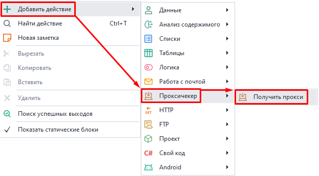
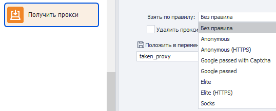

---
sidebar_position: 2
title: Получить прокси
description: Получить прокси
---  
:::info **Пожалуйста, ознакомьтесь с [*Правилами использования материалов на данном ресурсе*](../Disclaimer).**
:::  
_______________________________________________    

В ZennoDroid вы можете использовать сторонний прокси-сервер для работы с приложениями во время выполнения проекта. Данный экшен подходит для получения значений из Proxychecker.  
_______________________________________________ 
## Как добавить в проект?  
Через контекстное меню: **Добавить действие → Проксичекер → Получить прокси**.  

 
_______________________________________________ 
## Как работать с экшеном?  
   

### Взять по правилу.  
На выбор доступно несколько вариантов:  
- **Без правил**;  
- **Anonymous/Anonymous (HTTPS)**;  
- **Google passed with Captcha**;  
- **Google passed**;  
- **Elite/Elite (HTTPS)**;  
- **Socks**.  

Редактировать эти правила нужно через Proxychecker.  

При выборе варианта ***Без правил*** прокси будут браться по очередности.  

А опция **Удалять прокси из живого списка** удаляет прокси-сервер из списка после получения.  

Полученное прокси также можно **Положить в переменную**.  
На скриншоте выше это `{-Variable.taken_proxy-}`.   
