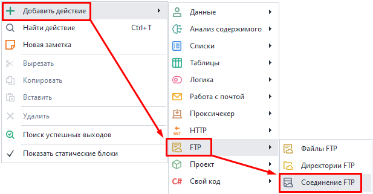
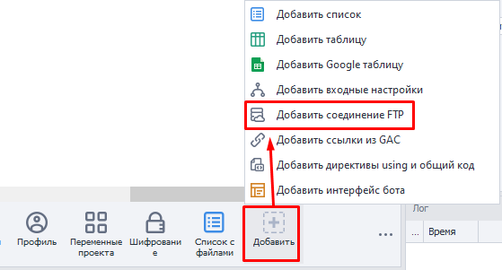
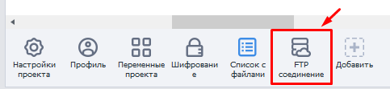
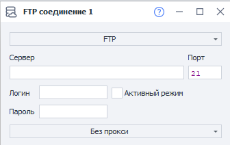

---
sidebar_position: 6
title: Соединение FTP
description: Настройки FTP соединения.
---  
:::info **Пожалуйста, ознакомьтесь с [*Правилами использования материалов на данном ресурсе*](../../Disclaimer).**
:::  
_______________________________________________  
### Как создать?  
Создать новое FTP-соединение можно из контекстного меню:  
**Добавить действие → FTP → соединение FTP** 

  

или через ***Панель статических блоков***:  

  
_______________________________________________
## Как работать?  
  

### Доступные настройки.  
  

#### Выбор типа протокола передачи.  
Нажатием на самое верхнее поле можно вызвать список доступных протоколов:  
- **FTP (File Transfer Protocol).**  
Cтандартный протокол, который предназначен для передачи файлов.  
- **FTPs (FTP + SSL).**  
Защищённый протокол передачи файлов.  
- **sFTP (SSH(Secure Shell) + FTP).**  
Протокол для операций с файлами поверх надёжного и безопасного соединения.  

#### Сервер (обязательно).  
Здесь указываем имя FTP-сервера.  

#### Порт (обязательно).  
Нужно указать порт FTP соединения. По умолчанию указано `21`.  

#### Логин и Пароль.  
Данные для авторизации к соединению. Их можно не использовать, если это позволяет сервер.  

#### Активный режим.  
Ставим здесь галочку, если нужно использовать активный режим работы FTP.  
:::info **Основная особенность активного режима**  
В том, что именно *сервер инициирует соединение* для передачи данных.  
Это может вызывать проблемы, если у вас включен Firewall или NAT, которые блокируют входящие соединения.
::: 

#### Прокси.  
Можно оставить режим *Без прокси*, либо выбрать между:  
- *Строка формата protocol://login:pass@ip:port*;  
- *Другой*.  

В режиме *Другой* можно вставить прокси в любом формате, указав в полях необходимую информацию.  
Адрес, порт и данные авторизации берутся у поставщика услуг.