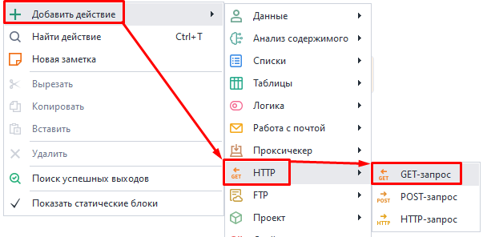
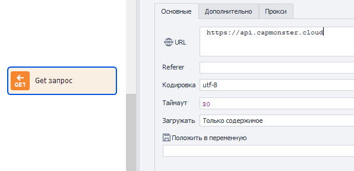
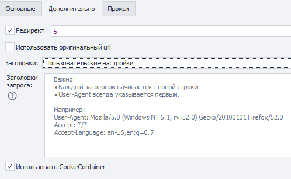
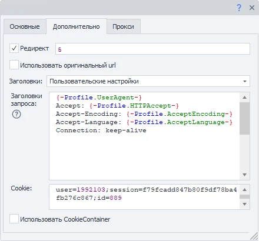
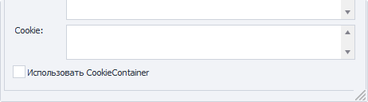
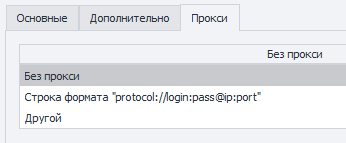
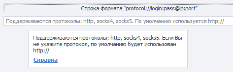
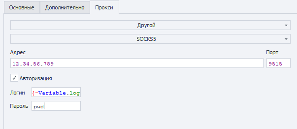
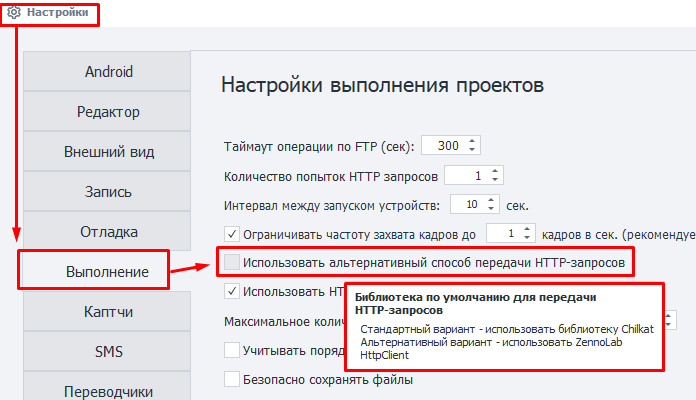

---
sidebar_position: 1
title: GET-запрос
description: Получение данных через GET-запросы
---  
:::info **Пожалуйста, ознакомьтесь с [*Правилами использования материалов на данном ресурсе*](../../Disclaimer).**
:::  
_______________________________________________  

В ZennoDroid вы можете использовать ***HTTP запросы*** при работе с различными сайтами.  
Например, можно получать данные через **GET-запросы**:  
- *запрашивать результаты из поисковой системы*,    
- *скачивать файлы*,  
- *парсить данные*,  
- *запускать шаблоны без браузера*,   
- *работать с API веб-сервисов и приложений*.  
_______________________________________________ 
### Как добавить в проект?  
Через контекстное меню: **Добавить действие → HTTP → GET-запрос**.  


_______________________________________________ 
## Вкладка «Основные»   
  
_______________________________________________ 
### URL.  
Целевой адрес сайта (ссылка), по которому будет отправлен запрос. *Можно использовать переменную*.  
_______________________________________________ 
### Referer.  
Заголовок [**Referer**](https://developer.mozilla.org/ru/docs/Web/HTTP/Headers/Referer) используется для указания URL-адрес, с которого пользователь пришел на текущую страницу. Он помогает анализировать трафик и узнавать, с какого ресурса переходят чаще всего.  

:::warning **Заголовок *Referer* может раскрыть информацию об истории посещённых страниц, что может привести к нарушению приватности.**
:::  
_______________________________________________ 
### Кодировка.  
Выбираем кодировку для запроса.  
_______________________________________________ 
### Таймаут.  
Максимальное время ожидания ответа от сайта в секундах.  
При достижении установленного времени, действие будет завершено ошибкой и выйдет по *красной ветке*.  
Можно использовать макросы переменных.  
_______________________________________________ 
### Загружать.  
#### Только содержимое.  
В переменную будет сохранено только тело ответа.  
<details>
<summary>**Пример ответа при запросе *https://httpbin.org/get*.**</summary>
<!--All you need is a blank line-->

   ```JS
   {
  "args": {}, 
  "headers": {
    "Accept": "text/html,application/xhtml+xml,application/xml;q=0.9,image/avif,image/webp,image/apng,*/*;q=0.8,application/signed-exchange;v=b3;q=0.9", 
    "Accept-Encoding": "gzip, deflate", 
    "Accept-Language": "en-US,en;q=0.8", 
    "Host": "httpbin.org", 
    "Referer": "https://google.com", 
    "User-Agent": "Mozilla/5.0 (Windows NT 10.0; Win64; x64) AppleWebKit/537.36 (KHTML, like Gecko) Chrome/87.0.4280.141 Safari/537.36", 
    "X-Amzn-Trace-Id": "Root=1-26erb44t-465basaw0z2qwbji492yh5t3"
  }, 
  "origin": "1.2.3.4", 
  "url": "https://httpbin.org/get"
    }
   ```
</details>   

#### Только заголовки.  
Сохранятся только заголовки.  
<details>
<summary>**Пример ответа при запросе *https://httpbin.org/get*.**</summary>
<!--All you need is a blank line-->

   ```JS
   HTTP/1.1 200 OK
    Date: Sat, 23 May 2020 01:56:45 GMT
    Content-Type: application/json
    Content-Length: 613
    Connection: keep-alive
    Server: gunicorn/19.9.0
    Access-Control-Allow-Origin: *
    Access-Control-Allow-Credentials: true
   ```
</details>  

#### Заголовки и содержимое.  
В переменную сохранятся и заголовок ответа, и его тело, разделенные двумя пустыми строками.  
<details>
<summary>**Пример ответа при запросе *https://httpbin.org/get*.**</summary>
<!--All you need is a blank line-->

   ```JS
HTTP/1.1 200 OK
Date: Sat, 23 May 2020 01:56:45 GMT
Content-Type: application/json
Content-Length: 613
Connection: keep-alive
Server: gunicorn/19.9.0
Access-Control-Allow-Origin: *
Access-Control-Allow-Credentials: true


{
  "args": {}, 
  "headers": {
    "Accept": "text/html,application/xhtml+xml,application/xml;q=0.9,image/avif,image/webp,image/apng,*/*;q=0.8,application/signed-exchange;v=b3;q=0.9", 
    "Accept-Encoding": "gzip, deflate", 
    "Accept-Language": "en-US,en;q=0.8", 
    "Host": "httpbin.org", 
    "Referer": "https://google.com", 
    "User-Agent": "Mozilla/5.0 (Windows NT 10.0; Win64; x64) AppleWebKit/537.36 (KHTML, like Gecko) Chrome/87.0.4280.141 Safari/537.36", 
    "X-Amzn-Trace-Id": "Root=1-26erb44t-465basaw0z2qwbji492yh5t3"
  }, 
  "origin": "1.2.3.4", 
  "url": "https://httpbin.org/get"
}
   ```
</details>  

#### Как файл.  
Выбирайте этот режим, если нужно скачать файл с помощью запроса.  
В переменную сохранится путь к скачанному файлу.  

:::info **По умолчанию файлы скачиваются в папку `Trash` в директории с программой.**  
Путь может выглядеть так:  
`C:\Program Files\ZennoLab\RU\ZennoPoster Pro V7\7.4.0.0\Progs\Trash\googlelogo_color_92x30dp.png`  

Изменить его можно в настройках, но только глобально для всех проектов. 
:::  

#### Как файл + заголовки.  
В переменную сохранятся заголовки ответа и путь к скачанному файлу.  
_______________________________________________ 
### Положить в переменную.  
Здесь надо выбрать (или создать новую) переменную, в которую будет сохранён результат запроса.  
_______________________________________________ 
## Вкладка «Дополнительно».  

_______________________________________________ 
### Редирект.  
Используется для установки перенаправления. Если ответ на запрос будет содержать *код редиректа*, то ZennoDroid перейдет к следующей странице, используя заголовок ***Location***.  

Здесь мы цифрами указываем максимальное количество переходов. К примеру, `0` — остаться на исходной странице, `5` — количество переходов до конечного URL.  
_______________________________________________ 
### Использовать оригинальный URL.  
Когда эта опция включена, кодирование URL из вкладки «Основные» будет отменено. Пример:  
- **URL по умолчанию (с кодированием)**:  
`https://ru.wikipedia.org/wiki/%D0%9F%D1%80%D0%B8%D0%B2%D0%B5%D1%82%D1%81%D1%82%D0%B2%D0%B8%D0%B5`  
- **Оригинальный URL**:  
`https://ru.wikipedia.org/wiki/Приветствие`  
_______________________________________________ 
### Заголовки.  
#### Использовать по умолчанию.  
В запрос будут подставлены заголовки по умолчанию. Заголовок `Host` меняется в зависимости от адреса в запросе.  

<details>
<summary>**Пример ответа при запросе *https://httpbin.org/get*.**</summary>
<!--All you need is a blank line-->

   ```
Host: httpbin.org
User-Agent: Mozilla/5.0 (Windows NT 10.0; WOW64; rv:45.0) Gecko/20100101 Firefox/45.0
Accept: text/html,application/xhtml+xml,application/xml;q=0.9,*/*;q=0.8
Accept-Encoding: gzip, deflate
Accept-Language: en-US,en;q=0.5
   ```
</details>  

#### Текущий профиль.  
Будут подставлены заголовки из текущего ***профиля проекта***.  

#### Загрузить из профиля.  
Необходимо выбрать файл или указать переменную, содержащую путь до профиля, из которого будут загружены заголовки для запроса.  

#### Пользовательские настройки.  
  

Позволяет самостоятельно указать каждый параметр заголовка, следуя правилам:  
- :warning: Первой **всегда указывается строка User-Agent!** И только потом все остальные заголовки.  
- Каждый заголовок начинается с новой строчки.  
- Можно указать *статичные значения*, *свои переменные* или *переменные профиля*.  
_______________________________________________ 
### Использовать CookieContainer.  
С помощью этой опции можно синхронизировать куки с целым браузером или между отдельными запросами. Вам не понадобится вручную их парсить и подставлять.  

<details>
<summary>**Пример использования.**</summary>
<!--All you need is a blank line-->

   Представим, что наш проект работает с сайтом, используя запросы. Для работы нужно быть авторизованным. При этом процесс авторизации крайне сложен для повторения его через запросы. Поэтому для входа на сайт используем браузерный режим.  

   После авторизации ***отключаем браузер*** и начинаем работать с запросами. С включенной опцией **Использовать CookieContainer** куки будут автоматически синхронизированы между браузером и запросами, их не придется подставлять вручную.    

    Если при одном из запросов сайт вернет новое значение кук, то оно автоматически синхронизируется с браузером и будет использовано в дальнейшем.
</details>  
_______________________________________________ 
### Сookie.  
:::info **Данное поле ввода отображается только при отключении прошлой опции.**
:::    

 

Можно указать готовые куки или взять из переменной.  

**Формат:** `имя=значение`, несколько значений разделяются через `;`  
***Пример:*** `user=1992103;session=f79fcadd847b80f9df78ba4fb276c867;id=889`  
_______________________________________________ 
## Вкладка «Прокси».  
  
_______________________________________________ 
### Без прокси.  
Экшен будет работать через реальный IP компьютера или сервера.  
_______________________________________________ 
### Строка формата.  
  

Указываем прокси в формате (можно указать переменную):  
- ***С авторизацией***. `socks5://логин:пароль@ip:port` или `http://логин:пароль@ip:port`  
- ***Без авторизации***. `socks5://ip:port` или `http://ip:port`  
- ***Без указания протокола (по умолчанию http://)***. `логин:пароль@ip:port` или `ip:port`  
_______________________________________________ 
### Другой.  
  

Выбираем в том случае, если нужно указать детальные настройки прокси.  
Тип прокси, данные авторизации, адрес и порт уточняйте у поставщика услуг.  
Во всех полях можно использовать переменные.  

:::info **Если не указан протокол, то по умолчанию используется http://**
:::  
_______________________________________________ 
## Способ передачи запроса.
В ZennoDroid есть два метода работы с запросами:  
- **Стандартный**. Стоит по умолчанию (библиотека Chilkat).  
- **Альтернативный**. Наша собственная разработка.  

Если при работе с HTTP-запросами что-то работает неправильно, то попробуйте переключиться на альтернативный метод.  
Сделать это можно через **Настройки →  Выполнение → Использовать альтернативный способ передачи HTTP-запросов**.  

  


