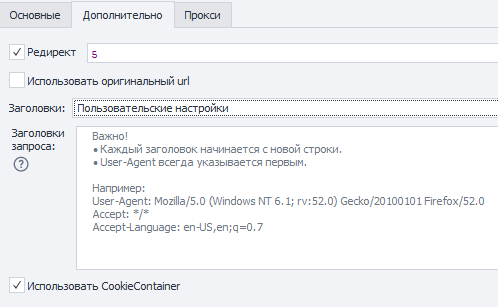
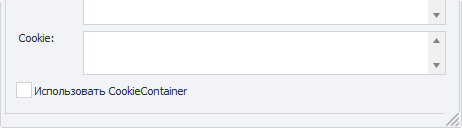
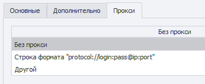
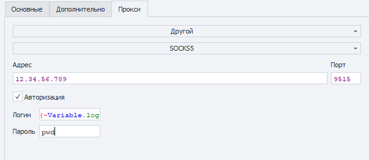
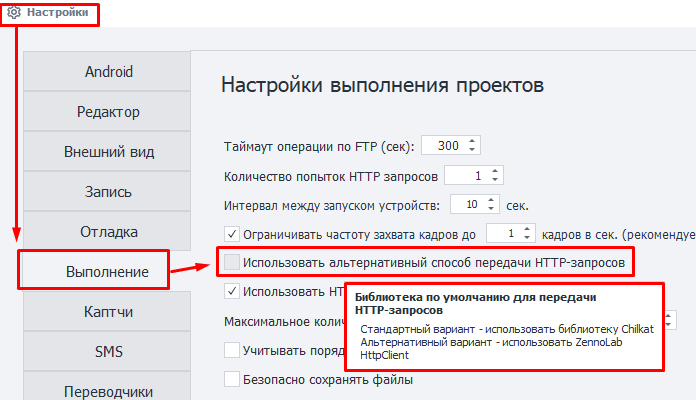

---
sidebar_position: 3
title: HTTP-запросы
description: Остальные типы запросов
---  
:::info **Пожалуйста, ознакомьтесь с [*Правилами использования материалов на данном ресурсе*](../../Disclaimer).**
:::  
_______________________________________________  
С помощью этого экшена можно создать любой тип HTTP-запроса:  
- **Put** — полностью обновляет информацию;   
- **Delete** — удаляет записи;  
- **Head** — получает только заголовки ответа, без содержимого;  
- **Options** — запрашивает информацию о поддерживаемых методах;  
- **Patch** — частично обновляет записи;  
- **Trace** — диагностический запрос для отладки.  

А для запросов [**GET**](./GET) и [**POST**](./POST) есть отдельные экшены.
_______________________________________________ 
## Как добавить в проект?  
Через контекстное меню: **Добавить действие → HTTP → HTTP-запрос**.  


_______________________________________________ 
## Вкладка «Основные»   
  
_______________________________________________  
### Тип запроса.  
Выбираем необходимый запрос из списка.  
### URL.  
Целевой адрес сайта (ссылка), по которому будет отправлен запрос. *Можно использовать переменную*.  
_______________________________________________ 
### Referer.  
Заголовок [**Referer**](https://developer.mozilla.org/ru/docs/Web/HTTP/Headers/Referer) используется для указания URL-адрес, с которого пользователь пришел на текущую страницу. Он помогает анализировать трафик и узнавать, с какого ресурса переходят чаще всего.  

:::warning **Заголовок *Referer* может раскрыть информацию об истории посещённых страниц, что может привести к нарушению приватности.**
:::  
_______________________________________________ 
### Кодировка.  
Выбираем кодировку для запроса.  
_______________________________________________ 
### Таймаут.  
Максимальное время ожидания ответа от сайта в секундах.  
При достижении установленного времени, действие будет завершено ошибкой и выйдет по *красной ветке*.  
Можно использовать макросы переменных.  
_______________________________________________   

### Данные.  
Тут пишем сам текст запроса.  
_______________________________________________ 
### Тип данных.  
Здесь мы выбираем, какие данные будут отправлены в запросе. Указанный тип будет передан в заголовке как [***Content-Type***](https://developer.mozilla.org/ru/docs/Web/HTTP/Headers/Content-Type).  

Доступные варианты:  
#### urlencoded.  
:::info ***`Content-Type: application/x-www-form-urlencoded`***
:::  

Стоит использовать, когда на сервер отсылается *текстовая информация*. В поле **Данные** она указывается в формате:  
`имяпараметра1=значение1&имяпараметра2=значение2`  

#### multipart.  
:::info ***`Content-Type: multipart/form-data`***
:::  
Этот тип используется, когда в запросе отправляются *двоичные данные (файлы)* на сервер.  

#### Другой.  
Вы можете задать любой другой тип данных, если два заготовленных не подходят.  

Например, для взаимодействия с API [**CapMonster Cloud**](https://docs.capmonster.cloud/ru/docs/category/api) нужно отправлять POST-запрос в формате JSON. Для этого указываем в **Типе данных** `application/json`   
_______________________________________________ 
### Загружать.  
#### Только содержимое.  
В переменную будет сохранено только тело ответа.  
  
#### Только заголовки.  
Сохранятся только заголовки.   

#### Заголовки и содержимое.  
В переменную сохранятся и заголовок ответа, и его тело, разделенные двумя пустыми строками.    

#### Как файл.  
Выбирайте этот режим, если нужно скачать файл с помощью запроса.  
В переменную сохранится путь к скачанному файлу.  

:::info **По умолчанию файлы скачиваются в папку `Trash` в директории с программой.**  
Путь может выглядеть так:  
`C:\Program Files\ZennoLab\RU\ZennoPoster Pro V7\7.4.0.0\Progs\Trash\googlelogo_color_92x30dp.png`  

Изменить его можно в настройках, но только глобально для всех проектов. 
:::  

#### Как файл + заголовки.  
В переменную сохранятся заголовки ответа и путь к скачанному файлу.  
_______________________________________________  
### Положить в переменную.  
Здесь надо выбрать (или создать новую) переменную, в которую будет сохранён результат запроса.  
_______________________________________________  
## Вкладка «Дополнительно».  

_______________________________________________ 
### Редирект.  
Используется для установки перенаправления. Если ответ на запрос будет содержать *код редиректа*, то ZennoDroid перейдет к следующей странице, используя заголовок ***Location***.  

Здесь мы цифрами указываем максимальное количество переходов. К примеру, `0` — остаться на исходной странице, `5` — количество переходов до конечного URL.  
_______________________________________________ 
### Использовать оригинальный URL.  
Когда эта опция включена, кодирование URL из вкладки «Основные» будет отменено. Пример:  
- **URL по умолчанию (с кодированием)**:  
`https://ru.wikipedia.org/wiki/%D0%9F%D1%80%D0%B8%D0%B2%D0%B5%D1%82%D1%81%D1%82%D0%B2%D0%B8%D0%B5`  
- **Оригинальный URL**:  
`https://ru.wikipedia.org/wiki/Приветствие`  
_______________________________________________ 
### Заголовки.  
#### Использовать по умолчанию.  
В запрос будут подставлены заголовки по умолчанию. Заголовок `Host` меняется в зависимости от адреса в запросе.  

<details>
<summary>**Пример ответа при запросе *https://httpbin.org/get*.**</summary>
<!--All you need is a blank line-->

   ```
Host: httpbin.org
User-Agent: Mozilla/5.0 (Windows NT 10.0; WOW64; rv:45.0) Gecko/20100101 Firefox/45.0
Accept: text/html,application/xhtml+xml,application/xml;q=0.9,*/*;q=0.8
Accept-Encoding: gzip, deflate
Accept-Language: en-US,en;q=0.5
   ```
</details>  

#### Текущий профиль.  
Будут подставлены заголовки из текущего ***профиля проекта***.  

#### Загрузить из профиля.  
Необходимо выбрать файл или указать переменную, содержащую путь до профиля, из которого будут загружены заголовки для запроса.  

#### Пользовательские настройки.  
  

Позволяет самостоятельно указать каждый параметр заголовка, следуя правилам:  
- :warning: Первой **всегда указывается строка User-Agent!** И только потом все остальные заголовки.  
- Каждый заголовок начинается с новой строчки.  
- Можно указать *статичные значения*, *свои переменные* или *переменные профиля*.  
_______________________________________________ 
### Использовать CookieContainer.  
С помощью этой опции можно синхронизировать куки с целым браузером или между отдельными запросами. Вам не понадобится вручную их парсить и подставлять.  

<details>
<summary>**Пример использования.**</summary>
<!--All you need is a blank line-->

   Представим, что наш проект работает с сайтом, используя запросы. Для работы нужно быть авторизованным. При этом процесс авторизации крайне сложен для повторения его через запросы. Поэтому для входа на сайт используем браузерный режим.  

   После авторизации ***отключаем браузер*** и начинаем работать с запросами. С включенной опцией **Использовать CookieContainer** куки будут автоматически синхронизированы между браузером и запросами, их не придется подставлять вручную.    

    Если при одном из запросов сайт вернет новое значение кук, то оно автоматически синхронизируется с браузером и будет использовано в дальнейшем.
</details>  
_______________________________________________ 
### Сookie.  
:::info **Данное поле ввода отображается только при отключении прошлой опции.**
:::    

 

Можно указать готовые куки или взять из переменной.  

**Формат:** `имя=значение`, несколько значений разделяются через `;`  
***Пример:*** `user=1992103;session=f79fcadd847b80f9df78ba4fb276c867;id=889`  
_______________________________________________ 
## Вкладка «Прокси».  
  
_______________________________________________ 
### Без прокси.  
Экшен будет работать через реальный IP компьютера или сервера.  
_______________________________________________ 
### Строка формата.  
  

Указываем прокси в формате (можно указать переменную):  
- ***С авторизацией***. `socks5://логин:пароль@ip:port` или `http://логин:пароль@ip:port`  
- ***Без авторизации***. `socks5://ip:port` или `http://ip:port`  
- ***Без указания протокола (по умолчанию http://)***. `логин:пароль@ip:port` или `ip:port`  
_______________________________________________ 
### Другой.  
  

Выбираем в том случае, если нужно указать детальные настройки прокси.  
Тип прокси, данные авторизации, адрес и порт уточняйте у поставщика услуг.  
Во всех полях можно использовать переменные.  

:::info **Если не указан протокол, то по умолчанию используется http://**
:::  
_______________________________________________ 
## Способ передачи запроса.
В ZennoDroid есть два метода работы с запросами:  
- **Стандартный**. Стоит по умолчанию (библиотека Chilkat).  
- **Альтернативный**. Наша собственная разработка.  

Если при работе с HTTP-запросами что-то работает неправильно, то попробуйте переключиться на альтернативный метод.  
Сделать это можно через **Настройки →  Выполнение → Использовать альтернативный способ передачи HTTP-запросов**.  

 