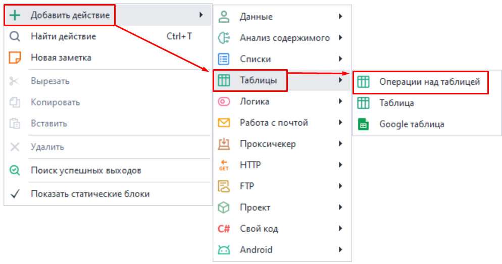
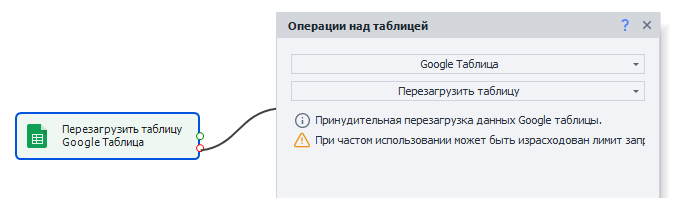
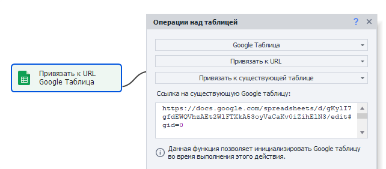
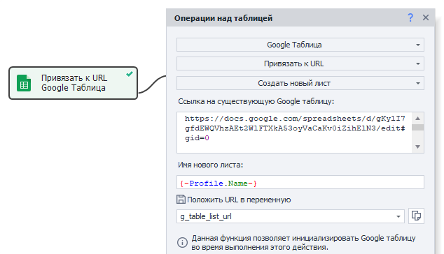
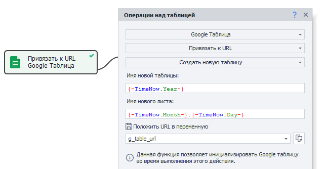

---
sidebar_position: 7
title: Операции и Многопоточная работа с Google-таблицами.
description: Операции и Многопоточная работа с Google-таблицами.
--- 
:::info **Пожалуйста, ознакомьтесь с [*Правилами использования материалов на данном ресурсе*](../../Disclaimer).**
:::   

В двух прошлых статьях мы [познакомились с тем, как выглядят Google-таблицы в ZD](./Google_Sheet), а также [настроили их подключение](./Connecting_GoogleSheets). Теперь же посмотрим, какие операции можно совершать с ними.  

Во многом они похожи на простые [Таблицы](./Tables). Для работы используется тот же экшен *Операции над таблицами* и все действия также актуальны (кроме *Привязки к файлу*). Но у Google-таблиц все-таки есть несколько уникальных функций, с которыми мы познакомимся ниже.  
_______________________________________________ 
## Как добавить экшен в проект?  
Через контекстное меню: ***Добавить действие → Таблицы → Операции над таблицей***.  

  
_______________________________________________ 
## Действия с Google-таблицей.  
:::info **Экшен Операции над таблицами.**  
В данной статье описаны только уникальные для Google Таблиц функции. Про все остальные операции можно прочитать в статье [Операции над таблицами](./Tables).
::: 

### Перезагрузить таблицу.  
 

Данная функция позволяет обновить Google Таблицу и получить актуальные данные из нее. Пригодится, если в таблицу были внесены изменения вручную или с помощью другого шаблона.  

:::warning **Локальная таблица будет перезаписана данными из таблицы в облаке.**  
:::   
_______________________________________________ 
### Привязать к URL → Привязать к существующей таблице.  
С помощью этого действия можно привязаться к таблице в процессе выполнения проекта. Удобно использовать, когда на момент старта шаблона адрес таблицы неизвестен.  

 

В поле ввода нужно указать ссылку на таблицу, к которой привязываемся.  
_______________________________________________ 
### Привязать к URL → Создать новый лист.  
Создает новый лист в Google таблице. 

  

- **Ссылка на существующую Google таблицу**. Здесь указываем ссылку на таблицу, в которой создаем новый лист.  
- **Имя нового листа**. Тут задаем имя для листа.  
- **Положить URL в переменную**. Указываем переменную, в которую сохранится ссылка на новый лист.  
_______________________________________________ 
### Привязать к URL → Создать новую таблицу.  
Данное действие позволяет создать новую Google таблицу.  

  

- **Имя новой таблицы**. Придумываем имя таблице.  
- **Имя нового листа**. Тут задаем имя для листа.  
- **Положить URL в переменную**. Указываем переменную, в которую сохранится ссылка на новую таблицу.  
_______________________________________________ 
## Многопоточная работа с Google-таблицами.  
### Общая информация.  
**ZennoDroid поддерживает многопоточную работу с Google-таблицами.**  
Это значит, что к одной таблице можно обращаться сразу в несколько потоков. Для каждого из них при выполнении будет создан один инстанс виртуальной таблицы, изменения из которой периодически синхронизируются с облаком.  

**Несколько копий ZennoDroid могут работать с одной Google-таблицей.**  
Однако изменения из программы поступают в облако не моментально, а в течении 60 секунд. Так что эта задержка будет действовать между разными копиями программы. В связи с чем для сохранения целостности данных мы рекомендуем использовать атомарное добавление строк. Его можно подключить в настройках статического блока.  
_______________________________________________ 
### Атомарное добавление строк.
При включении данной настройки новые строки будут добавляться в облако специальным запросом, независящим от адресов ячеек. Это позволит гарантированно добавить новые данные в таблицу без потерь существующих, которые могли бы быть вызваны перезаписью уже заполненных ячеек.   

У такого способа есть и свои нюансы. Так как строки отправляются отдельным запросом, то данные будут последовательно записаны в конец таблицы. Из-за этого могут возникнуть разногласия между локальной версией и облачной.  

Например, рассмотрим следующую последовательность действий:  
```
1. Записываем ячейки в строки 0-5;  
2. Добавляем строку (в программе она будет 6);  
3. Записываем ячейки в строки 7-10;  
4. Добавляем строку (в программе она будет 11);  
```  
По итогу данные, добавленные действиями ***Добавить строку***, попадут именно в 11 и 12 строки в облако Google, хотя в самой программе они находятся в 6 и 11 строках.  

:::tip **Мы рекомендуем при использовании атомарного добавления строк добавлять данные только с помощью действия *Добавить строку*.**  
:::  

Несмотря на то, что данный способ более безопасный, изменение и удаление строк все равно может повлечь за собой задержку синхронизации между копиями. Поэтому для обработки важных данных мы советуем использовать отдельный лист Google-таблицы для каждой копии программы.  
_______________________________________________ 
### Оптимизация многопоточной записи.  
Если вы осуществляете парсинг данных в больших объемах и складываете все результаты в одну Google-таблицу, то синхронизация может занять много времени. Так как ZennoDroid всегда старается поддерживать актуальность данных между программой и облаком.  

В таком случае можно настроить режим быстрой записи через опцию:  
**Редактирование → Настройки → Google таблицы → Политика обработки изменений таблиц**  

  

В этом режиме каждая копия программы будет только отправлять данные, не тратя время на их сопоставлении с облаком.


