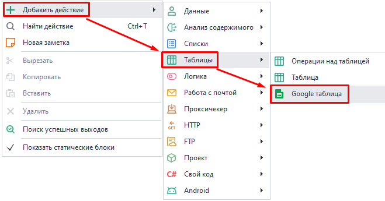
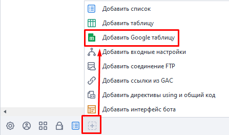
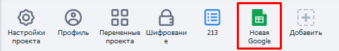
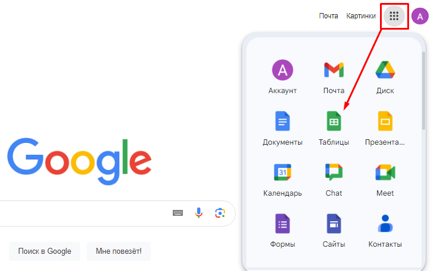
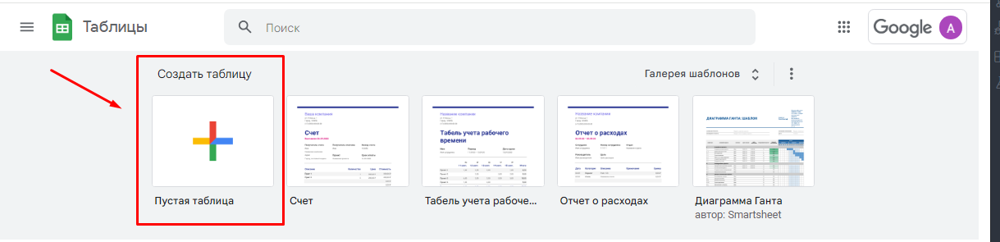
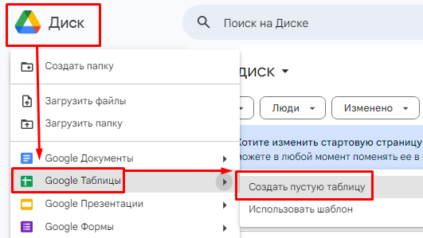
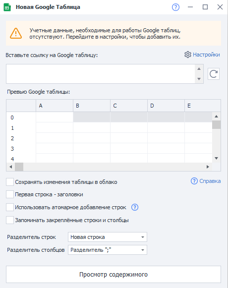
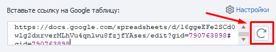
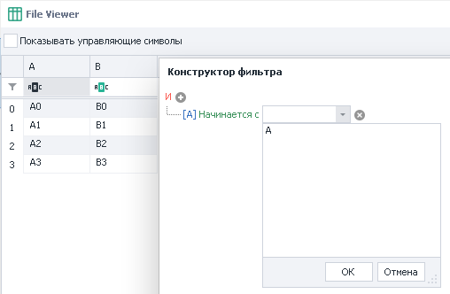

---
sidebar_position: 5
title: Google таблица 
description: Что можно делать с Google таблицами в ZD.
---  
:::info **Пожалуйста, ознакомьтесь с [*Правилами использования материалов на данном ресурсе*](../../Disclaimer).**
:::    

## Создание Google таблицы:
### Через ProjectMaker.  
- Из контекстного меню: ***Добавить действие → Таблицы → Google таблица***:  

 

- Через ***Панель статических блоков***:  

  

Созданная таблица отобразится в нижней панели:

  
_______________________________________________
### Через облако.  
Переходим на Google.com → авторизуемся в свой аккаунт → нажимаем на значок с 9-ю точками → выбираем **Таблицы** → создаем Пустую таблицу.  

 
  
_______________________________________________
Либо через [**Google Диск**](https://drive.google.com/drive/my-drive) → Создать → Google таблицы → Создать пустую таблицу.  

  
_______________________________________________
После создания таблицы любым из способов скопируйте URL из адресной строки для привязки к ProjectMaker.   
_______________________________________________
## Настройки таблицы.  
  

:::info **Подключение.**  
Перед началом работы с Google Таблицами их надо подключить к программе.  
Как это сделать мы рассмотрим в следующей статье [**Настройка подключения Google Таблиц**](./Connecting_GoogleSheets).
:::   

### Разберем подробнее каждый из разделов:   
#### Вставьте ссылку на Google таблицу.  
В это поле нужно вставить ссылку (URL) на таблицу, с которой будем работать.  
_______________________________________________  
#### Перезагрузить Google таблицу.  
 

С помощью нажатия на эту кнопку можно обновить данные в таблице.  
:::info **Для чего нужно?**  
*Это может быть полезно, если вы что-то меняли не через саму программу, а с обычного браузера или с другого устройства.*  
:::  
_______________________________________________
#### Превью Google таблицы.  
В этом окне будут отображены данные таблицы. Если она большая, то все данные могут не поместиться, тогда вы увидите только часть.  
_______________________________________________
#### Сохранять изменения таблицы в облако.  
Если поставить здесь галочку, то в облако будут сохраняться все изменения, которые вы внесете через ZennoDroid.  
_______________________________________________
#### Первая строка - заголовки.  
Первая строка таблицы станет заголовком.  
_______________________________________________
#### Использовать атомарное добавление строк.  
Включение данной настройки может быть полезным, когда с таблицей работает сразу несколько копий ZennoDroid.  
Более подробно об атомарном добавлении можно почитать в статье [**Операции и Многопоточная работа с Google-таблицами**](./GoogleSheet_Processing).
_______________________________________________
#### Запоминать закреплённые строки и столбы.  
Данная опция позволяет сохранять закрепленное состояние строк и столбцов.  
При этом будет отправлен дополнительный запрос к API, который расходует лимит.  
_______________________________________________
#### Разделитель строк.  
Тут мы указываем, что будет использовано в качестве разделителя строк таблицы:  
- **Новая строка**;
- **Свой разделитель**;  
- **Несколько разделителей**;  
_______________________________________________
#### Разделитель столбцов.  
А здесь уже определяем разделитель для столбцов таблицы:  
- Символ `;`  
- Табуляция через `Tab`  
- Любой кастомный разделитель  
- Несколько своих разделителей.  
_______________________________________________
#### Просмотр содержимого.  
Эта кнопка позволяет открыть таблицу и полностью посмотреть ее содержимое. В открывшемся окне можно включить отображение управляющих символов, задать фильтр для поиска нужной строки или ячейки, а так же воспользоваться конструктором фильтра.  

  
_______________________________________________
### Нюансы работы с Google-таблицами.  
- При каждом новом старте проекта в программе создаётся виртуальная копия Google-таблицы.  
- Виртуальная копия содержит в себе все данные из Google-таблицы.  
- В процессе выполнения проекта программа работает именно с виртуальной копией.  
- Если включена опция **Сохранять изменения таблицы в облако**, то данные периодически будут переноситься из виртуальной копии в оригинальную Google-таблицу.  
:::info **Данные в Google-таблице появляются не моментально, а в течение от 10 до 60 секунд.**   
:::
_______________________________________________
## Полезные ссылки.  
- [**Гид по Google Таблицам**](https://www.unisender.com/ru/blog/google-tablicy-dlya-nachinayushchih/). 
- [**Google таблицы**](https://docs.google.com/spreadsheets/). 
