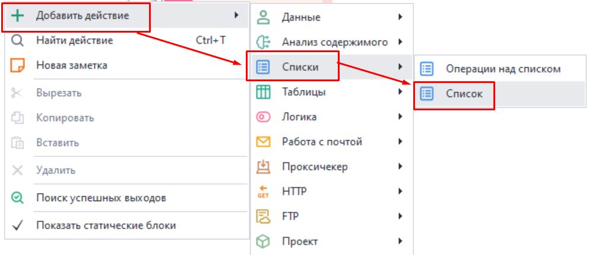
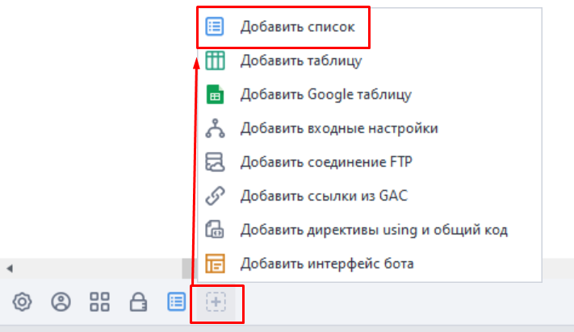
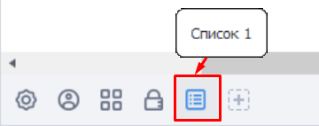
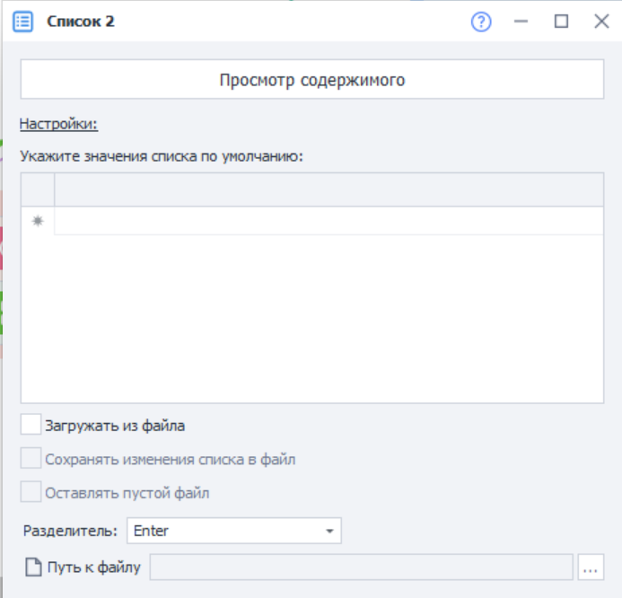
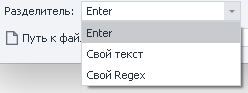
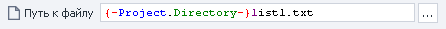
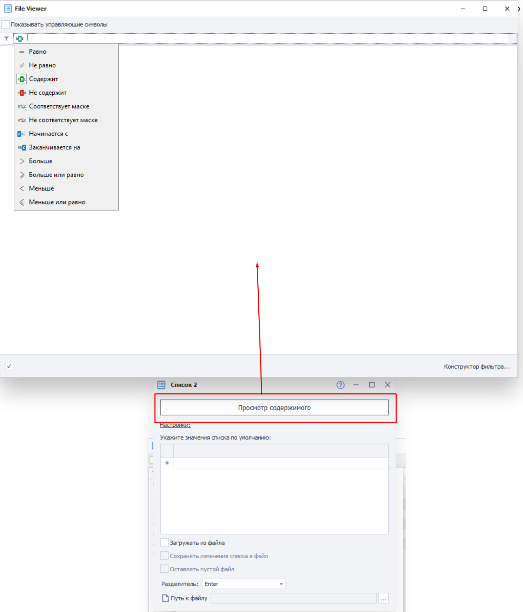

---
sidebar_position: 1
title: Список
description: Создание списка и его настройки.
--- 
:::info **Пожалуйста, ознакомьтесь с [*Правилами использования материалов на данном ресурсе*](../../Disclaimer).**
::: 

Список — это упорядоченный набор строк. С помощью них можно получать данные из текстового документа, сохранять их в файл, либо вовсе работать с набором строк в памяти без привязки к конкретному файлу.  
_______________________________________________ 
## Создание списка.  
Создать новый список можно из контекстного меню: ***Добавить действие → Списки → Список***.  

 

Либо через *Панель статических блоков*: ***клик по иконке*** `+` ***→ Добавить список***.  

 

Созданный список отобразится на панели статических блоков:  

  

При открытии списка появятся его настройки и превью содержимого.  
Если список привязан к файлу, то отобразится содержимое этого файла.  
Но когда привязки к файлу нет, то можно задать свои значения по умолчанию.  
_______________________________________________ 
## Настройки списка.    
 

#### Загружать из файла.  
Поставив галочку, мы обозначаем, что будем брать данные для списка из текстового файла формата `.txt`.  
В случае, если галочку мы не ставим, то у каждого потока будет своя независимая копия списка.  

#### Сохранять изменения списка в файл.  
При включении данной опции результат работы со списком будет автоматически сохраняться в привязанный текстовый файл.  

Если включена предыдущая настройка *Загрузка из файла*, но выключено *Сохранение в файл*, то для каждого потока будет создана своя, локальная, копия списка на основе указанного файла. Изменения списка внутри потоков никак не отразятся на привязанном файле.  

Но в случае, когда эта опция включена, то все потоки будут работать с одной копией списка. Соответственно, все изменения будут сохраняться в привязанный файл.  

#### Оставлять пустой файл.  
Отвечает за то, нужно ли оставить пустой файл или удалить его, когда все данные в списке закончатся.  

#### Разделитель.  
Здесь мы указываем, что будет использоваться в качестве разделения строк списка. Это может быть клавиша **Enter**, произвольный текст или регулярное выражение (Regex).

   

#### Путь к файлу.  
   

Тут указываем путь к текстовому документу, из которого будем загружать список. Данные из него будут выгружаться в список при старте проекта.  
:::tip **Если вы не знаете путь к файлу.**
Бывает такое, что путь определяется только во время выполнения проекта. Тогда можно использовать экшен **Работа со списком** с функцией ***Привязать к файлу***.  
::: 
_______________________________________________ 
### Просмотр содержимого.  
 

Здесь можно полностью посмотреть весь список.   
Помимо этого можно включить отображение управляющих символов, задать фильтр для поиска нужной строки, а также воспользоваться конструктором фильтра.  
:::tip **Что такое управляющие символы?**
*Это невидимые символы, которые используются для управления форматированием текста и дополнительными операциями: перенос строки, табуляция.* 
::: 