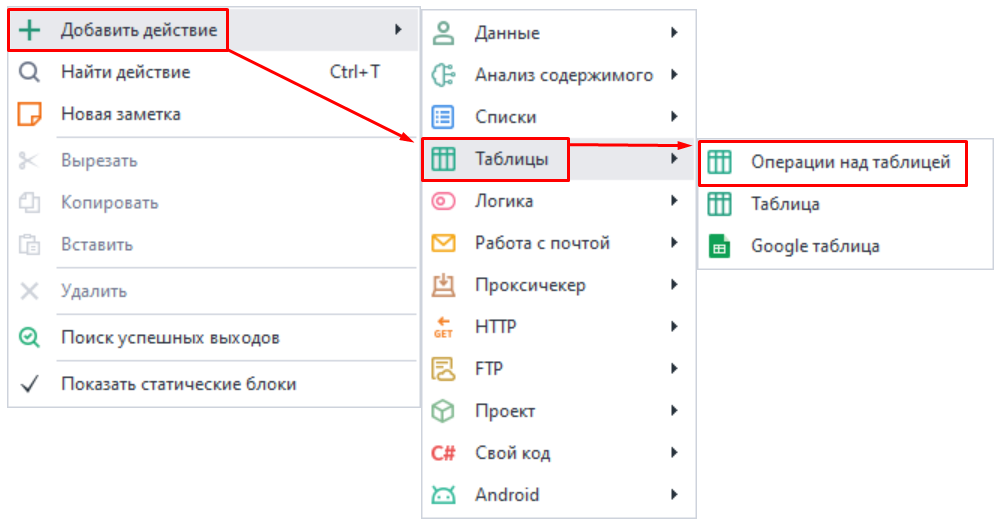
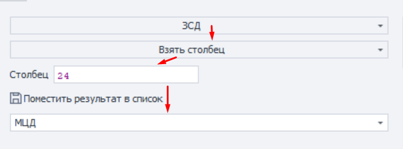
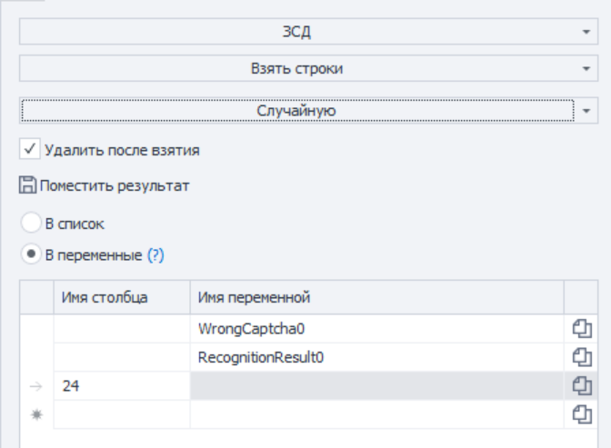
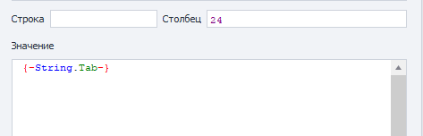
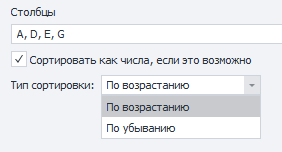
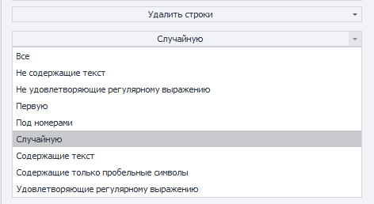
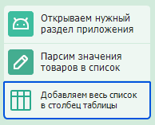

---
sidebar_position: 4
title: Операции над таблицами
description: Рассмотрим экшен для работы с таблицами.
--- 
:::info **Пожалуйста, ознакомьтесь с [*Правилами использования материалов на данном ресурсе*](../../Disclaimer).**
:::   

Таблицы используются для получения более сложно организованных данных, чем [**списки**](./Lists). Это может быть каталог товаров для интернет-магазина, в котором построчно прописаны разные данные: название, цена, описание и тд.  

#### Они могут использоваться для:  
- Работы с комплексом данных;  
- Добавления и получения элементов таблицы;  
- Удаления строк, столбцов и дублей;  
- Привязки к файлу;  
- Получение количества строк и столбцов;  
_______________________________________________
## Как добавить в проект?  
Через контекстное меню: ***Добавить действие → Таблицы → Операции над таблицей***.  

   
_______________________________________________
## Доступные функции:  
:::tip **Нюанс.**  
*В качестве номера столбца можно использовать числа (нумерация с нуля), либо буквы латинского алфавита (в верхнем регистре).*
:::  

### Взять столбец.  
Позволяет взять значения определенного столбца из таблицы и положить его в список.  

 

Выбираем Таблицу → определяем Функцию → указываем Столбец, который хотим забрать → выбираем Список, куда поместим столбец.  
_______________________________________________
### Взять строки.  
Получаем строки с возможностью удаления их из таблицы и записью в список или переменные.  

- **Критерии выбора строк:**  
    - *Все*;  
    - *Не содержит текст*;  
    - *Неудовлетворяющие регулярному выражению*;  
    - *Первую*;  
    - *Под номерами*;  
    - *Случайную*;  
    - *Содержит текст*;  
    - *Удовлетворяющие регулярному выражению*;  
- **Удалить после взятия.** Определяет, останутся ли взятые строки в таблице или нет.  
- **Поместить результат.** Строку можно отправить В список или в Переменные. А далее идет таблица, где мы можем это контроллировать.  
_______________________________________________
### Добавить список. 
Здесь же наоборот можно положить выбранный список в определенный столбец таблицы.  

***Выбираем столбец, в который положим → Указываем список.***  
_______________________________________________
### Добавить строку.  
:::tip **Рекомендуем.**  
*Когда нужно добавить сразу несколько строк в таблицу, то стоит воспользоваться экшеном **Обработка текста с функцией «В таблицу»**.*
::: 
С помощью этой функции в таблицу можно положить статический текст (string) или переменную. Эти данные будут добавлены в конец таблицы.   

:::warning **Обратите внимание**  
Если таблица привязана к файлу с расширениями `.csv`, `.xls(x)` или `.ods`, то в качестве разделителя нужно использовать `{-String.Tab-}`. 
:::   
_______________________________________________
### Записать ячейку.  
Добавляет текст в конкретную ячейку. 

 

- **Строка и Столбец**. Здесь указываем статические координаты ячейки. Это также можно сделать через переменные.  
- **Значение**. Пишем статический текст (string) или переменную. 
_______________________________________________
### Получить количество столбцов.  
Здесь можно узнать, сколько всего столбцов содержит таблица.  
Результат можно положить в переменную (***содержит только числовое значение (int)***).  
_______________________________________________
### Получить количество строк.  
Эта операция показывает, сколько строк содержит таблица.   
Результат можно положить в переменную (***содержит только числовое значение (int)***).   
_______________________________________________
### Привязать к файлу.  
Позволяет привязать таблицу к файлу в ходе выполнения проекта.  

Этот экшен нужно использовать, если путь файла не известен на момент старта шаблона, а будет вычислен только во время выполнения.   

- **Путь к файлу**. Выбираем файл или указываем переменную, содержащую путь к файлу.  
- **Создавать файл при отсутствии**. Если файл отсутствует по указанному пути, то он будет автоматически создан.   
_______________________________________________
### Прочитать ячейку.  
Получить значение из заданной ячейки.  

- **Строка и Столбец**. Здесь указываем статические координаты ячейки. Это также можно сделать через переменные.  
- **Положить в переменную**. Указываем переменную, в которую положим результат.  
_______________________________________________
### Сортировать таблицу.  
Сортирует элементы таблицы по убыванию или возрастанию.  

 

- **Столбцы**. Выбираем нужные.   
ZennoDroid автоматически определяет столбцы со значениями и предлагает их.  
- **Сортировать как числа, если это возможно**. Использовать принцип сортировки как у чисел.  
:::info **Условие для работы**  
*Данная опция сработает, только если в столбце находятся целые числа. Если же там присутствуют дробные числа, то столбец отсортируется по принципу строк.*  
:::   
- **Тип сортировка**. Сортируем По возрастанию или По убыванию.  
_______________________________________________
### Сохранить в файл.  
Сохранение таблицы в файл во время выполнения проекта. Нужно выбрать файл или указать переменную, содержащую путь к нему.  

:::warning **Обратите внимание**  
Функция умеет только **перезаписывать** существующий файл.
:::   
_______________________________________________
### Удалить дубли.  
Эта функция удаляет повторяющиеся значения из таблицы.  

- **Столбцы**. Проверяем на дубли Все или конкретные.  
ZennoDroid автоматически определяет столбцы со значениями и предлагает их.  
_______________________________________________
### Удалить столбец.  
Целиком удаляет выбранный столбец из таблицы.  

- **Столбец**. Вводим конкретный столбец или переменную.  
:::warning **Обратите внимание**  
Столбец будет удалён **со всеми значениями**.
:::  
_______________________________________________
### Удалить строки.  
Позволяет удалить определенные строки во всех столбцах.  

- **Критерии выбора строк**:  
    - Все;
    - Не содержит текст;
    - Неудовлетворяющие регулярному выражению;
    - Первую;
    - Под номерами (*нумерация с нуля*);
    - Случайную;
    - Содержит текст;
    - Содержащие только пробельные символы;
    - Удовлетворяющие регулярному выражению;  

:::warning **Обратите внимание**  
Заданная строка будет удалена **во всех столбцах**.
:::  
_______________________________________________
## Рекомендации по работе с таблицами.  
:::tip **Эта информация будет полезна для корректной работы в проектах**  
:::  

- Не стоит привязывать к таблице слишком большие файлы (*100мб и более*) без опции ***«Сохранять изменения таблицы в файл»***. Особенно, если у вас мало оперативной памяти.  
- При работе с таблицой, которая привязана к одному файлу сразу в нескольких проектах, нужно использовать одинаковый разделитель. Например, если в одном шаблоне столбцы разделены через `;` , а в другом через `-` , то произойдет ошибка.  
- Когда проект работает в многопоточном режиме, а каждый поток при этом обрабатывает свою отдельную строку, то лучше включить опцию ***«Сохранять изменения таблицы в файл»***. Это позволит брать данные из таблицы и *удалять их после взятия*.  
- Если вы синхронизируетесь с файлом, то все изменения в каждом из потоков будут сразу отображаться в проекте, так как таблица одна на все потоки.  
- Однако если вы не используете синхронизацию с файлом, то для каждого потока будет создаваться своя копия таблицы. В этом случае удаление строки таблицы из одного потока не меняет таблицу в других потоках.  
- Стоит учитывать, что таблицы в оперативной памяти занимают намного больше места, чем исходный файл на жестком диске. Например, таблица на основе файла CSV размером 10 MB в 100 потоков без синхронизации с файлом, может занять 5 GB оперативной памяти. Поэтому старайтесь не использовать списки и таблицы в режиме ***«без синхронизации»*** с файлом без необходимости. 
_______________________________________________
## Пример использования.  
Открываем приложение маркетплейса, собираем название нужных товаров в список, а затем добавляем их в таблицу для дальнейшего использования.   

_______________________________________________
## Полезные ссылки.  
- [**Диапазоны значений**](../../pm/Creating/Value_Ranges). 
- [**Переменные окружения**](../../pm/Creating/Variables).  

