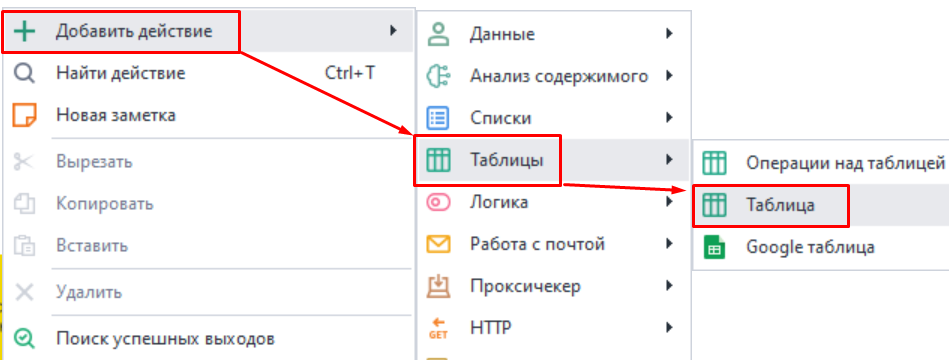
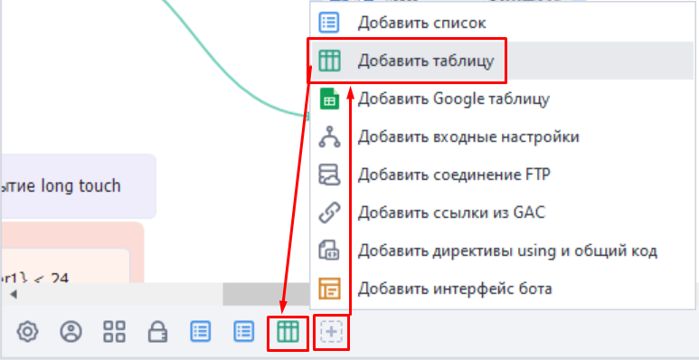
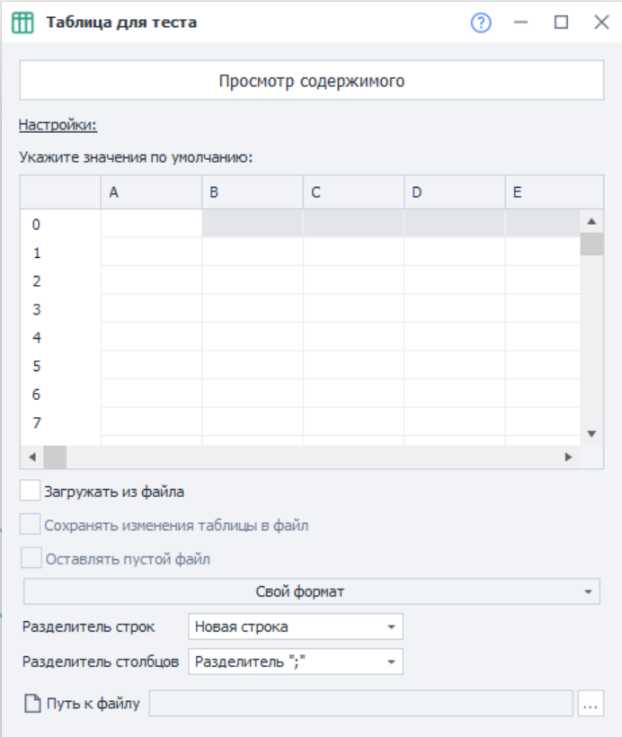
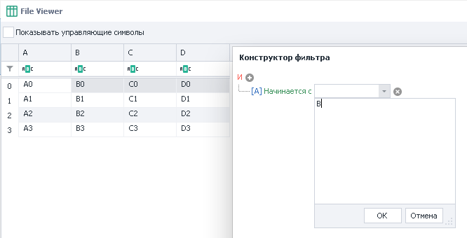
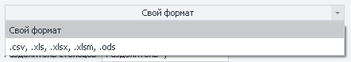
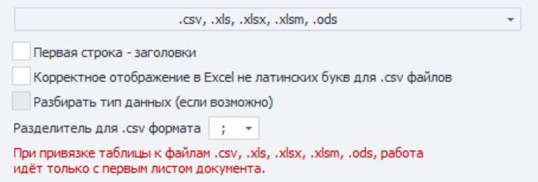

---
sidebar_position: 3
title: Таблица
description: Как работать со таблицами.
--- 
:::info **Пожалуйста, ознакомьтесь с [*Правилами использования материалов на данном ресурсе*](../../Disclaimer).**
:::   

Таблица — это структурированный набор данных, организованный в строки и столбцы. Строки обычно представляют отдельные записи, а столбцы — различные атрибуты или параметры этих записей. Таблицы позволяют сохранять и получать данные из файла в различных форматах, либо вообще работать с данными в памяти без привязки к файлу.  
_______________________________________________ 
## Создание таблицы.  
Создать новую таблицу можно из контекстного меню: ***Добавить действие → Таблицы → Таблица***  

 

Либо через *Панель статических блоков*: ***клик по иконке*** `+` ***→ Добавить таблицу***. Созданная таблица также отобразится на этой панели.    

   
_______________________________________________ 
## Настройки таблицы.  
  
_______________________________________________ 
### Просмотр содержимого.  
Эта опция позволяет посмотреть полное содержимое всей таблицы.  
Также здесь можно включить отображение управляющих символов, задать фильтр для поиска нужной строки или ячейки и воспользоваться конструктором фильтра.

 
_______________________________________________ 
### Загружать из файла.  
Позволяет брать данные для таблицы из файла.  

Если не загружать таблицу из файла, то у каждого потока будет своя, независимая копия таблицы.  
_______________________________________________ 
### Сохранять изменения таблицы в файл.  
Результат работы с таблицей будет автоматически сохранён в привязанный файл.  

Если включена предыдущая настройка *Загрузка из файла*, но выключено *Сохранение в файл*, то для каждого потока будет создана своя, локальная, копия таблицы на основе указанного файла. Изменения таблицы внутри потоков никак не отразятся на привязанном файле.  

Но в случае, когда эта опция включена, то все потоки будут работать с одной копией таблицы. Соответственно, все изменения будут сохраняться в привязанный файл.  
_______________________________________________ 
### Оставлять пустой файл.  
Если все данные в таблице закончатся, нужно ли оставить файл пустым или стоит удалить его.  
_______________________________________________ 
### Свой формат.  
Можно использовать как свой формат файла, так и выбрать один из готовых форматов таблиц.  
   

Если выбрать работу с готовыми форматами, то появятся дополнительные настройки:  

  

- **Первая строка — заголовки**. Использовать первую строку таблицы под заголовки;  
- **Корректное отображение в Excel не латинских букв для .csv файлов**.  
- **Разбирать тип данных (если возможно)**. Определяет тип данных в содержимом;  
- **Разделитель для .csv формата**. Доступны `;` и `,`  

:::warning **Обратите внимание.**
При выборе готовых форматов работа идёт только с первым листом документа.
:::  
_______________________________________________ 
### Разделитель строк. 
Этот параметр указывает, что должно использоваться в качестве разделения строк таблицы.  
В качестве разделителей могут выступать: новая строка (`Enter`), свой кастомный разделитель, либо несколько разделителей.  
_______________________________________________ 
### Разделитель столбцов.  
Устанавливает способ разделения столбцов таблицы.  
Ими могут быть: символ `;`, клавиша `Tab`, а также свой один или несколько разделителей.  
_______________________________________________ 
### Путь к файлу.  
Если таблица будет загружаться из файла, то здесь необходимо указать путь к нему. Данные будут загружены при старте проекта.  

:::tip **Если вы не знаете путь к файлу.**
Бывает такое, что путь определяется только во время выполнения проекта. Тогда можно использовать экшен **Работа с таблицами** с функцией ***Привязать к файлу***.  
:::  
_______________________________________________
## Полезные ссылки.  
- [**Что такое статические блоки?**](../Static%20Block%20Panel/CommonPrinciples)  
- [**Окно переменных**](../../pm/Interface/Variables).  

