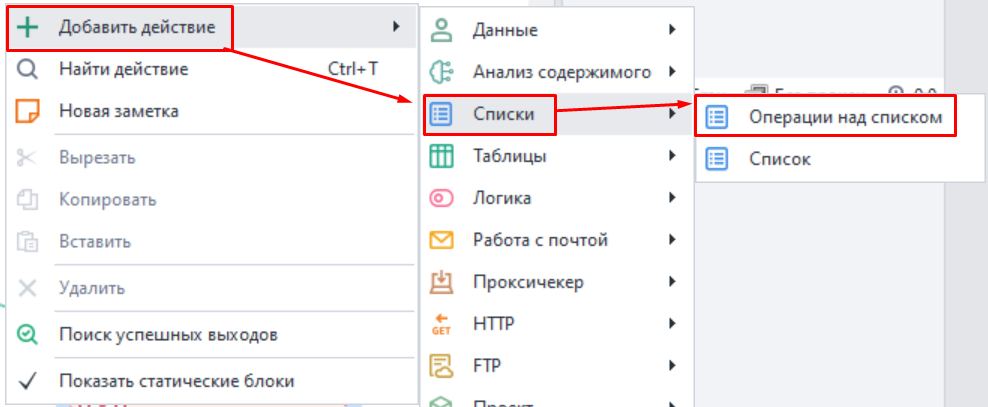
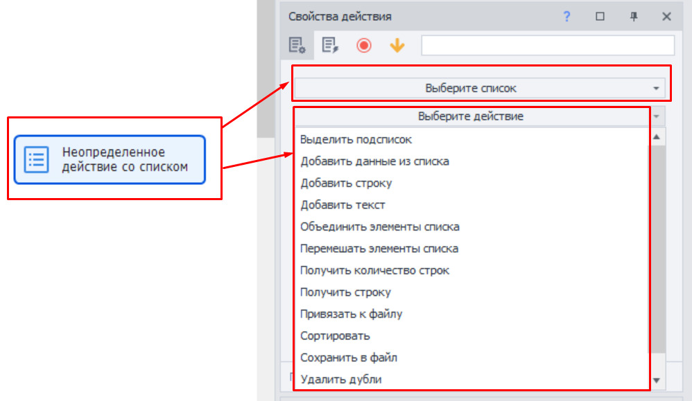
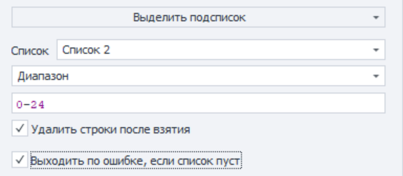
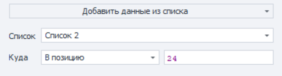
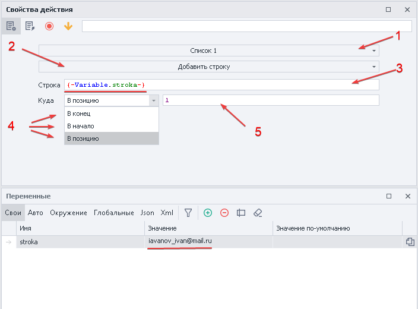
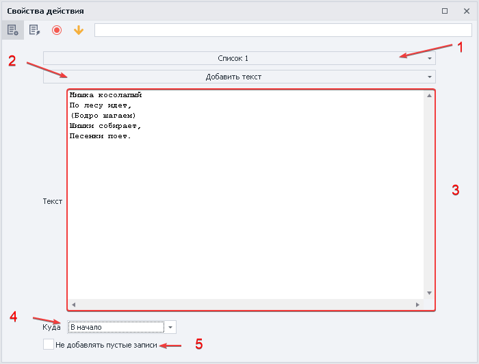
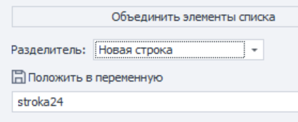
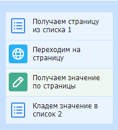

---
sidebar_position: 2
title: Операции над списком
description: Как работать со списками.
--- 
:::info **Пожалуйста, ознакомьтесь с [*Правилами использования материалов на данном ресурсе*](../../Disclaimer).**
::: 

Списки нужны для получения строк данных из текстового документа, либо для записи данных в файл.  
Например, есть файл со списком URL, на которые нужно зайти по очереди. Или же вы парсите какие-то значения с сайта (например, e-mail адреса) и нужно их отсортировать, удалить дубли и сохранить в файл.  
_______________________________________________ 
## Как добавить этот экшен в проект?  
Из контекстного меню: ***Добавить действие → Списки → Операции над списком***.  

    

### Для чего используется?  
- Добавление и получение элементов списка;  
- Удаление строк и дублей;  
- Привязка к файлу;  
- Получение количества строк;  
- Перемешивание;  
- Сортировка значений;  
_______________________________________________ 
## Как работать с экшеном?  
После добавления экшена в проект в его свойствах нам нужно выбрать список, с которым будем работать, а затем действие для выполнения.  

    
_______________________________________________ 
**Рассмотрим подробнее каждое доступное действие:**  
### Выделить подсписок.  
Выполняет выделение части строк из списка.  

   

- **Список.** Выбираем список, в который будет сохранен результат.  
- **Диапазон.** Способ фильтрации подсписка. Также для выбора доступны:  
    - *Элементы, не содержащие текст.*  
    Выберет все строки которые не содержат заданный текст. Можно использовать переменные.  
    - *Элементы, не удовлетворяющие регулярному выражению.*  
    Критерии поиска задаются с помощью Regex (регулярных выражений).  
    - *Элементы, содержащие текст.*  
    Выберет значения, которые содержат необходимый текст. Можно использовать переменные.  
    - *Элементы, удовлетворяющие регулярному выражению.*  
    Критерии поиска задаются с помощью Regex (регулярных выражений).  
- **Поле для ввода критериев.** Указываются значения, соответствующие прошлому пункту.  
- **Удалить строки после взятия.** Будут удалены строки, которые попали под критерии поиска.  
- **Выходить по ошибке, если список пуст.** Если список пустой, то выполнение проекта пойдёт по красной ветке.  
_______________________________________________ 
### Добавить данные из списка.  
Добавление данных из одного списка в другой.  

    

- **Список.** Выбираем список, в который будет сохранен результат.  
- **Куда.** В какую позицию поместим результат: `в конец`, `в начало`, `в позицию`.  
- **В позицию.** Если выбрали этот вариант, то в соседнем поле нужно указать номер строки или переменную.  

:::info *При копировании строки не удаляются из исходного списка.*
:::  
_______________________________________________ 
### Добавить строку.  
Добавление строки в список.  

  

**1.** Выбираем список, в который будем добавлять строку.  
**2.** Устанавливаем функцию.  
**3.** Вносим значение или переменную.  
**4.** В какую позицию поместим результат: `в конец`, `в начало`, `в позицию`.  
**5.** Если выбрали `в позицию`, то в соседнем поле нужно указать номер строки или переменную.  
***Подчеркнуто красной линией***. Значение, которое копируем в данном примере.  
_______________________________________________ 
### Добавить текст.  
Добавляет текст в существующий список.  

   

**1.** Выбираем список, в который будем добавлять текст.  
**2.** Устанавливаем функцию.  
**3.** Текст или набор символов для добавления в список, можно указать переменную. 
**4.** В какую позицию поместим результат: `в конец`, `в начало`, `в позицию`.  
**5.** Добавлять пустые строки в случае отсутствия текста.  
_______________________________________________ 
### Объединить элементы списка.  
Объединение элементов списка с указанием разделителя и возможностью записи в переменную.  

   

- **Разделитель.**  
    - *Новая строка.* Каждый элемент списка будет записан с новой строки.  
    - *Свой.* Указываем свой текст или символы, которые будут вставлены между элементами списка.  
    - *Указанный в списке.* Используется разделитель из настроек списка.  
- **Положить в переменную**. Переменная для записи данных после обработки.  

### Перемешать элементы списка.  
Размещает элементы в списке в случайном порядке.  

:::info *Изменение позиции не влечет за собой потери значений строки.*
:::  
_______________________________________________ 
### Получить количество строк.  
Позволяет узнать количество строк в списке.  

#### Критерии поиска:  
- Все;
- Не содержат текст;  
- Не удовлетворяет регулярному выражению;
- Со значением;
- Содержат текст;
- Удовлетворяет регулярному выражению;  

:::info *Переменная всегда будет содержать только цифровое значение.*
:::   
_______________________________________________ 
### Получить строку.  
Эта функция получает строку, а также дает возможность удалить ее из списка и записать в переменную.  

- **Критерии поиска:** 
    - *Не содержит текст*;
    - *Не удовлетворяет регулярному выражению*;
    - *Первую*;
    - *По номеру*;
    - *Случайную*;
    - *Удовлетворяет регулярному выражению*;  
- **Удалить строку после взятия**. Когда выбранная строка возьмется из списка, то после этого будет удалена.  
- **Положить в переменную**. Здесь указываем кастомную переменную, в которую мы положим скопированную строку.  
_______________________________________________ 
### Привязать к файлу. 
Привязка списка к файлу в ходе выполнения проекта.  

- **Путь к файлу**. Выбираем конкретный файл или указываем переменную, содержащую путь к нему.  
- **Создавать файл при отсутствии.** Если файл отсутствует по указанному пути, то он будет автоматически создан.  
_______________________________________________ 
### Сортировать.  
Сортировка элементов списка по убыванию или возрастанию.  

- **Сортировать как числа, если это возможно.** Использовать принцип сортировки как у чисел.  
- **Тип сортировки**. По возрастанию или убыванию.  

:::info *Не всегда буквенные и символьные строки можно упорядочить.*
:::  
_______________________________________________ 
### Сохранить в файл.  
Сохраняет список в файл.  

- **Разделитель**. Устанавливает разделитель:  
    - *Новая строка*;  
    - *Свой*;  
    - *Указанный в списке*;  
- **Путь к файлу**. Выбираем файл или указываем переменную, содержащую путь к файлу.    
- **Дописывать в конец файла**. Позволяет записывать новые данные в файл или перезаписывать его полностью.  
_______________________________________________ 
### Удалить дубли.  
Удаление повторяющихся строк в списке.  

:::info *Для обработки файла с большим количеством строк может потребоваться время.*
:::  
_______________________________________________ 
### Удалить строки.  
Удаляет строки из списка с заданными критериями.  

- **Критерии удаления строк:** 
    - *Все*;
    - *Не содержащие текст*;
    - *Не удовлетворяющие регулярному выражению*;
    - *Первую*;
    - *Под номерами (можно использовать диапазоны)*;
    - *Со значением*;  
    - *Содержащие текст*;
    - *Содержащие только пробельные символы*;
    - *Удовлетворяющие регулярному выражению*;  
_______________________________________________ 
### Пример работы со списками.  
Представим, что нам необходимо перейти по всем страницам из списка + собрать их названия + положить в другой список.  

   

**1.** Создаём `Список_1` с несколькими страницами, предварительно привязав его к файлу.  
**2.** Удаляем дубли, чтобы не переходить на страницу дважды.  
**3.** Создаём `Список_2` и привязываем его к файлу.  
**4.** Парсим необходимую информацию со страниц `Список_1` и копируем ее в `Список_2`.  
**5.** Удаляем дубли.  

Таким образом можно наполнять списки нужной информации для дальнейшей обработки и использования.

