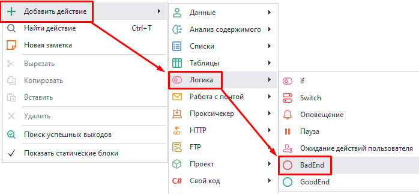
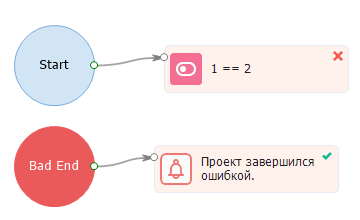
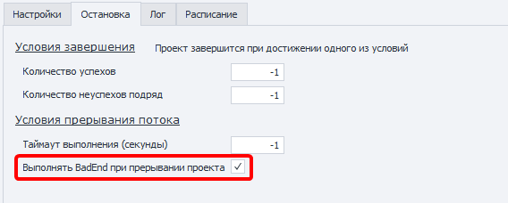
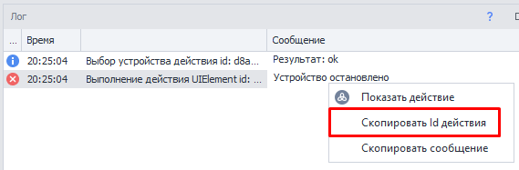
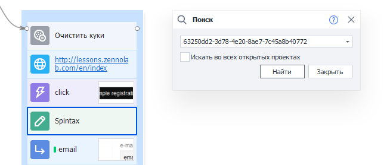
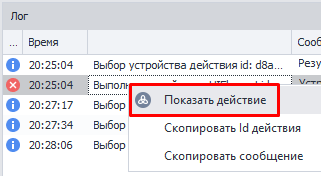
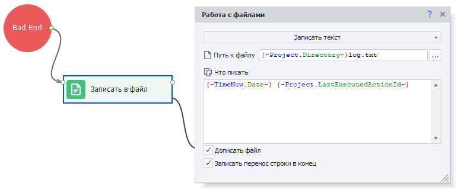
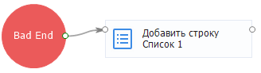
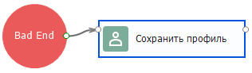

---
sidebar_position: 5
title: BadEnd 
description: Выход по красной ветке.
---  
:::info **Пожалуйста, ознакомьтесь с [*Правилами использования материалов на данном ресурсе*](../../Disclaimer).**
:::  
_______________________________________________  
В случае возникновения ошибки в каком-либо из экшенов и при выходе из кубика по красной ветке выполнение проекта переходит в блок, который связан с действием **Bad End**. Это нужно, чтобы задать дополнительные действия в случае завершения работы шаблона с ошибкой.   

#### Когда используется?  
При работе шаблона могут возникнуть ошибки:  
- На сайте изменилась верстка, и шаблон теперь не может найти нужный HTML элемент.  
- Логика шаблона не полностью продумана и не учитывает определенные ситуации.  

Из-за этого проект не будет выполнен до конца и завершится с ошибкой.  
Чтобы исключить такие ситуации, ***можно использовать Bad End для***:  

- Возврата данных обратно в списки или таблицы для последующего их использования без потерь;  
- Логирования ошибок;  
- Добавления в Blacklist невалидной информации;  
- Сохранения бэкапа.  
_______________________________________________ 
### Как добавить в проект?  
Через контекстное меню: **Добавить действие → Логика → BadEnd**.  

  
_______________________________________________ 
### Как работать с экшеном?  
В случае завершения шаблона ошибкой, выполнятся действия, привязанные к Bad End:  

  

Bad End также срабатывает при прерывании шаблона или по истечению глобального таймаута выполнения.  
За это отвечает настройка проекта в ZennoDroid — [**Выполнять BadEnd при прерывании проекта**](../../Execution/Stopping):  

 

:::info **Bad End срабатывает 1 раз для каждого потока.**
:::  

### Многократный переход в BadEnd.  
При отладке проект переходит в BadEnd по умолчанию только один раз. Затем нужно перезапустить проект кнопкой **С начала**.  
Для возможности переходить в BadEnd несколько раз подряд нужно включить в *Настройках* опцию [**Переходить в Bad/GoodEnd при многократной отладке**](../../Settings/Debugging).  

 
_______________________________________________ 
## Примеры использования.  
### Восстановление данных в случае ошибки.  
Представим, что для работы мы берем из списка строку с ее последующим удалением. Если в процессе проект завершился с какой-либо ошибкой до того, как мы обработали эту строку, то данные будут утеряны. Чтобы этого избежать мы используем Bad End вместе с действием добавления строки обратно в список. Таким образом при неудачном завершении работы необработанные данные будут сохранены назад в список для последующей обработки.  

### Отследить и исправить ошибку.  
Каждое действие в шаблоне имеет уникальный идентификатор, с помощью которого его можно найти. Для того чтобы получить id экшена с ошибкой, нужно в логе кликнуть по ней ПКМ и нажать ***Скопировать id действия***.  

  

Далее можно вызвать поиск через `Ctrl+F`, вставить полученный ID и нажать кнопку **Найти**.  
Программа выделит проблемный экшен синей рамкой:  

 

Ошибочное действие также можно подсветить через ПКМ в логе и выбором нужной опции:  

  

Так как сложно уследить за каждой ошибкой, мы рекомендуем логировать их в файл. Для этого нужно после **BadEnd** добавить кубик [**Записать в файл**](../../Android/Files) и вставить в него этот текст:  
```  
{-TimeNow.Date-} {-Project.LastExecutedActionId-}  
```   

  

Теперь при возникновении ошибки в проекте создастся файл `log.txt`, в котором будут записаны время и ID ошибки.  

Если одного ID мало для определения проблемы, то можно добавить сохранение:  
- ***скриншота экрана***;  
- ***исходного кода страницы***;  
- ***значения переменных***.  
Это позволит максимально подробно восстановить картину, которая привела к ошибке, и внести необходимые правки.  

### Добавление в Blacklist невалидной информации.  
Можно создать список для хранения невалидной информации, которая приводит к ошибкам. Это могут быть неправильные логин с паролем. Тогда при последующей работе шаблон будет проверять наличие данных в *Blacklist* и в случае совпадения производить замену.  

 

### Сохранение бэкапа.  
Можно сохранить рабочий профиль, чтобы в случае возникновения ошибки не потерять его. Затем после устранения проблемы его можно будет загрузить и продолжить работу.  


_______________________________________________
## Полезные ссылки.  
- [**Отладка проектов**](../../pm/Debugging).
- [**Окно лога**](../../pm/Interface/Log_window).  
- [**Настройки воспроизведения проектов**](../../Settings/Debugging). 