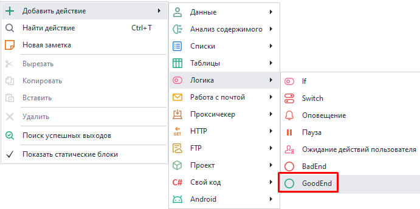
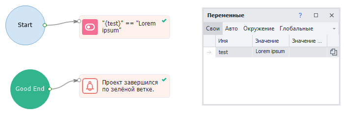
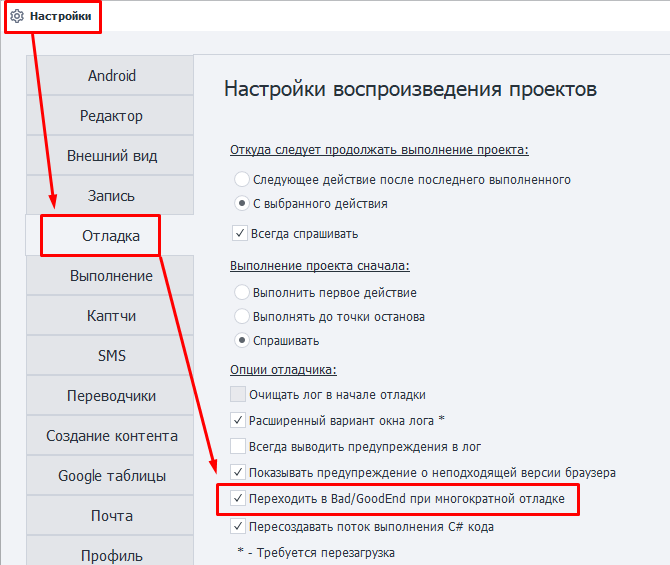

---
sidebar_position: 6
title: GoodEnd 
description: Выход по зеленой ветке.
---  
:::info **Пожалуйста, ознакомьтесь с [*Правилами использования материалов на данном ресурсе*](../../Disclaimer).**
:::  
_______________________________________________  
Данное действие предназначено для выполнения каких-либо дополнительных действий после удачного выполнения проекта.  
Может работать в связке с экшеном [**Bad End**](./BadEnd).  

_______________________________________________ 
### Как добавить в проект?  
Через контекстное меню: **Добавить действие → Логика → GoodEnd**.  

  
_______________________________________________ 
### Как работать с экшеном?  
Если последний кубик проекта завершится по зеленой ветке, то выполнение перейдет к действию, связанному с **GoodEnd**.  

   

### Многократный переход в GoodEnd.  
При отладке проект переходит в *GoodEnd* по умолчанию только один раз. Затем нужно перезапустить проект кнопкой **С начала**.  
Для возможности переходить в *GoodEnd* несколько раз подряд нужно включить в *Настройках* опцию **Переходить в Bad/GoodEnd при многократной отладке**.  

