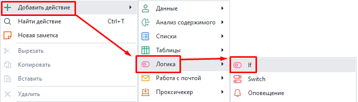
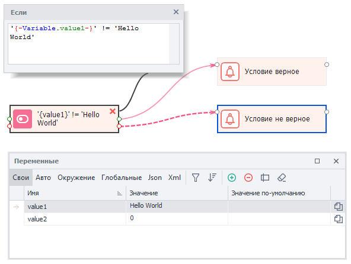
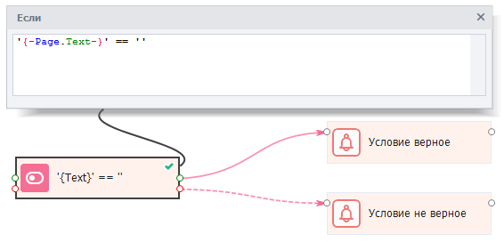
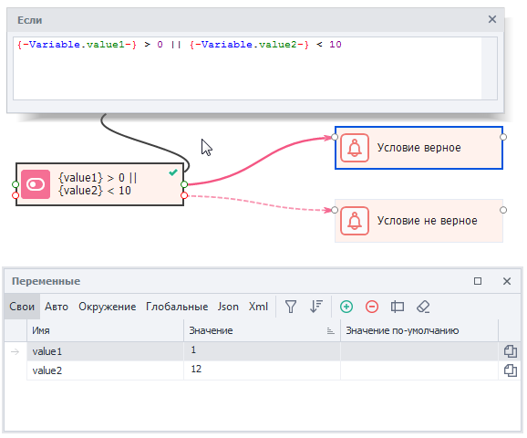
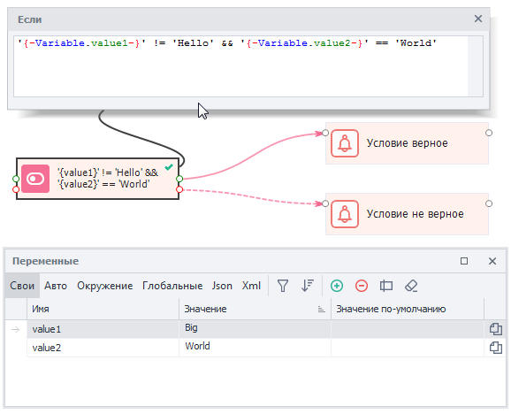

---
sidebar_position: 1
title: Оператор IF
description: Условие «Если ... то ...».
---  
:::info **Пожалуйста, ознакомьтесь с [*Правилами использования материалов на данном ресурсе*](../../Disclaimer).**
:::  
## Описание.  
Кубик **IF** — это один из основных логических экшенов, используемых в ZennoDroid. В своей работе он использует логику из *JavaScript*. Для сравнения используются логические операторы.   

Например, в самом простом виде оператор `if` сравнивает между собой два значения. Если значение оператора верное, то кубик принимает значение `True` (***выход по зелёной ветке***), а если не верное, то `False` (***выход по красной ветке***).  

В свойствах экшена есть поле ввода, куда можно вставить переменные проекта и окружения, а также константы. Кубик **IF** оперирует только двумя типами данных: числа и строки.  

#### Для чего используется:  
- Сравнить значения чисел;  
- Сопоставить текстовые строки;  
- Проверка условий.  
_______________________________________________ 
## Как работать с экшеном IF?  
### Добавление в проект.    
Через контекстное меню: **Добавить действие → Логика → If**.  

 

### Пример №1  
**Рассмотрим простой пример для понимания этого оператора:**  

 
  
**1.** Создадим переменную `value1` и присвоим ей значение `1`.  
**2.** Добавим кубик **IF** с помощью действий: ***Логика → If***.  
**3.** В поле свойств кубика вставим операнд: `{-Variable.value1-}`  
**4.** Добавим оператор *равно*: `==`  
**5.** Вставим второе сравниваемое значение: константу `1`.  
**6.** Если теперь запустить кубик, то он завершится по зеленой линии (*появится зеленая галочка*). Потому что значение верное (***True***), так как переменная `value1` равна `1`.  
**7.** А вот если заменить значение переменной на `2`, то кубик завершится по красной линии (*появится красный крестик*). Так как значение не верное (***False***).  

В этом примере мы использовали числовые данные и оператор сравнения `==`. А в следующем познакомимся с оператором **Не равно**: `!=`  
_______________________________________________ 
### Пример №2.  
:::warning **Кавычки при сравнении значений.**  
Для текстовых данных и переменных нужны **обязательно** (одинарные или двойные). А вот для чисел наоборот **не нужны**. Иначе сравнение будет работать некорректно.   
:::  

  

**1.** Создадим переменную `value1` и присвоим ей значение `“Hello World“`.  
**2.** Добавим кубик **IF** с помощью действий: ***Логика → If***.  
**3.** В поле свойств кубика вставим операнд: `{-Variable.value1-}`  
**4.** Добавим оператор *не равно*: `!=`  
**5.** Вставим второе сравниваемое значение: константу `“Hello World“`.  
**6.** Если теперь запустить кубик, то он завершится по красной линии. Потому что значение ошибочное (***False***), так как переменные равны (а у нас оператор **Не равно**).   
**7.** Когда мы поменяем значение переменной `value1` на `“Goodbye World“` и повторим кубик, то действие уже завершится по зеленой линии (***True***).  
_______________________________________________ 
### Пример №3  
Сравнение можно также использовать для проверки того, загрузился ли на странице хоть какой-то текст.  

  

**1.** Проверяем переменную окружения `{-Page.Text-}` на пустоту.  
**2.** Если на странице нет текста (она пустая), то кубик выйдет по зеленой ветке (***True***).  
**3.** Тогда можно перезагрузить страницу или поставить дополнительную паузу, ожидая подгрузки страницы.  

Также кубик **IF** часто используется в циклах со счетчиком для сравнения с каким-либо максимальным значением.
_______________________________________________ 
## Доступные операторы.  
:::info **Для логического сравнения, помимо кубика «IF», можно использовать аналогичный оператор из C# кода.** 
::: 
#### Таблица всех операторов:  
| Оператор   |      Описание     |  Пример использования |
|----------|:-------------:|------:|
| `<` |  Меньше | `1<2` |
| `>` |    Больше   |   `5>3` |
| `<=` | Меньше или равно | `7 <= 10` |  
| `>=` |  Больше или равно | `8 >= 8` |
| `==` |    Равно   |   `“Привет” == “Привет”` |
| `!=` | Не равно | `“Привет” != “Пока”` | 
| `&&` |  Логическое **И** | `“Привет” != “Пока” && 5>3` |
| &#124;&#124; |    Логическое **ИЛИ**   |  “День“ == “Ночь” &#124;&#124; 2 > 1  |  
_______________________________________________ 
### Оператор ИЛИ ||  
Этот оператор записывается как двойной символ вертикального слэша. Он позволяет сравнить сразу несколько условий в цепи, которые будут вычисляться слева направо. Кубик выдаст истинное значение **True**, если хотя бы одно из условий оказалось верным. Тогда как для получения **False** нужно, чтобы все выражения оказались ложными.  

  

  
**1.** Присвоим переменной `{-Variable.value1-}` значение `1`, а `{-Variable.value2-}` значение `12`.   
**2.** В поле ввода экшена напишем строку: `{-Variable.value1-} > 0 || {-Variable.value2-} < 10`.  
**3.** Несмотря на то, что второе равенство *неверное*, кубик все равно завершится по зеленой ветке. Так как оператор **ИЛИ** выдает ***True***, если хотя бы одно из сравнений **верное**.  
**4.** Изменим значение первой переменной на `-6`, тогда кубик выдаст ***False***, потому что все значения **неверные**.  
_______________________________________________ 
### Оператор И &&  
Оператор **И** пишется как два амперсанда `&&` и возвращает ***True***, когда все аргументы истинны, а если хотя бы одно ложное — ***False***.  

Рассмотрим работу этого оператора на конкретном примере с текстовыми строками.  

В этом случае оба аргумента истинны. В переменной `value1` значение отличное от (**Не равно**) `“Hello“`, а в переменной `value2` как раз значение (**Равно**) `“World“`. Поэтому кубик завершается по зеленой ветке.   
:::warning **Приоритет операторов.**  
Приоритет оператора **И &&** больше, чем у **ИЛИ ||**, поэтому **И** выполняется в первую очередь, если они оба присутствуют в одном кубике.
::: 
_______________________________________________
## Полезные ссылки.  
- [**Переменные окружения**](../../pm/Creating/Variables).
- [**Диапазоны значений**](../../pm/Creating/Value_Ranges). 
- [**BadEnd**](./BadEnd).

