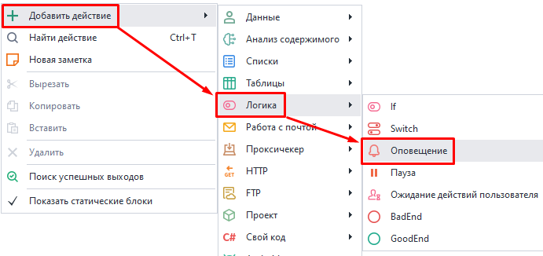
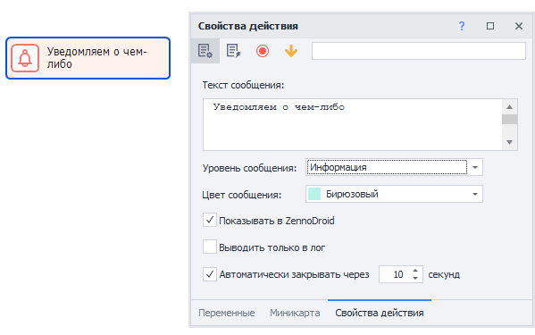
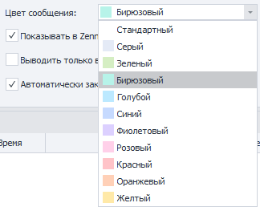

---
sidebar_position: 3
title: Оповещение 
description: Как оповещать пользователя шаблона.
---  
:::info **Пожалуйста, ознакомьтесь с [*Правилами использования материалов на данном ресурсе*](../../Disclaimer).**
:::   
_______________________________________________
С помощью этого действия можно оповещать пользователя о событиях, происходящих в проекте. Сообщения будут отображаться в [**Окне лога**](../../pm/Interface/Log_window).  

Используется для:  
- Логирования действий в шаблоне;  
- Оповещения пользователей об изменениях;  
- Сообщения о версии шаблона и этапах его работы;  
- Уведомления о количестве обработанных данных.  
_______________________________________________
### Как добавить в проект?  
Через контекстное меню: **Добавить действие → Логика → Оповещение**.  

 
_______________________________________________
## Как работать с экшеном?  

 
_______________________________________________
### Доступные параметры:  
#### Текст сообщения.  
Сюда мы пишем текст, который отобразится у пользователя. Можно использовать макросы.  

#### Уровень сообщения.  
Тут указываем тип уведомления:  
- Информация;  
- Предупреждение;  
- Ошибка;  

Это влияет на иконки уведомлений, а также позволяет сортировать по типу в [**Окне лога**](../../pm/Interface/Log_window).  

#### Цвет сообщения.  
   

Задает цвет фона для оповещения. В [**Окне лога**](../../pm/Interface/Log_window) можно сортировать по цвету.   

#### Показывать в ZennoDroid.  
Если поставить галочку, то уведомления также будут приходить и в ZennoDroid, а не только в ProjectMaker.  

#### Выводить только в лог.  
Когда эта опция выключена, оповещения будут всплывать прямо на рабочем столе.  

   

:::info **Важно.**  
Если же в настройках программы уже включена опция ***Выводить оповещение только в лог***, то уведомлений на рабочем столе вы не увидите в любом случае.  
:::  

#### Автоматически закрывать через N секунд.  
Задаем время, которое оповещение будет висеть на рабочем столе после всплытия.  
_______________________________________________
## Полезные ссылки.  
- [**Вкладка «Лог» в ZennoDroid**](../../Execution/Log).
- [**Другие настройки**](../../Settings/Other_Settings). 

