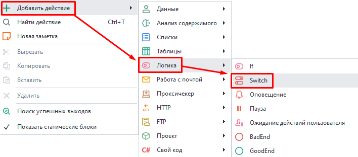
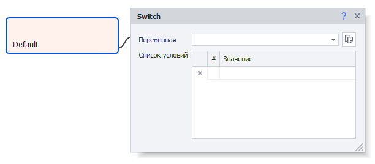
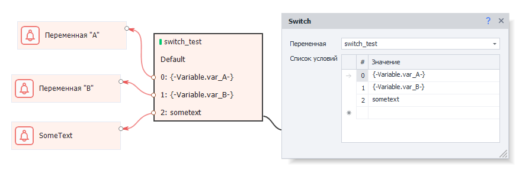
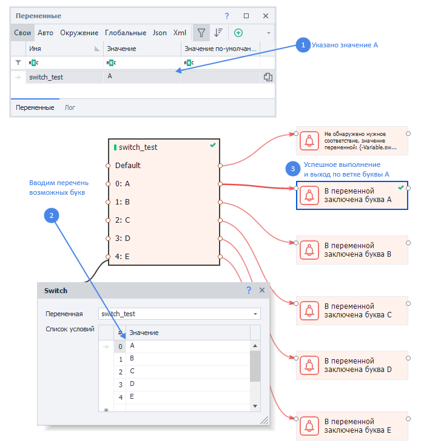

---
sidebar_position: 2
title: Оператор Switch
description: Выбор из нескольких вариантов
---  
:::info **Пожалуйста, ознакомьтесь с [*Правилами использования материалов на данном ресурсе*](../../Disclaimer).**
:::  

export const VideoSample = ({source}) => (
  <video controls playsInline muted preload="auto" className='docsVideo'>
    <source src={source} type="video/mp4" />
</video>
);

Оператор Switch представляет собой расширенную версию [**IF**](./IF). Но оператор **IF** имеет только два выхода — ***True*** или ***False*** (*зеленая или красная ветви*), тогда как у **Switch** есть возможность выбрать несколько разных вариантов. В случае отсутствия нужного варианта, кубик выйдет по ветке *Default*.  

### Как добавить в проект?  
Через контекстное меню: **Добавить действие → Логика → Switch**.  

  
_______________________________________________ 
## Как пользоваться?  
Данный экшен нужен для выбора варианта из заданного перечня. Либо для проверки на определенное соответствие.  

  
_______________________________________________ 
### Доступные свойства.  
#### Переменная.  
Здесь указывается переменная, которую мы будем проверять. Если она не была создана ранее, то ее можно задать прямо из этого поля.  

#### Список условий.  
Тут мы пишем условия для выхода. Значение из *переменной* будет сравниваться с каждым из условий и при нахождении совпадения выйдет по соответствующей ветке.  

В качестве условия для выхода можно использовать не только жестко заданный текст, но и переменные. Как в этом примере:  

  

#### Выход Default.  
Если не будет найдено ни одного совпадения, то экшен выйдет по ветке ***Default***. Если данная ветка при этом не соединена с экшеном, то появится ошибка.  
_______________________________________________ 
### Пример работы.  

  
_______________________________________________ 
### Пример в видео.  
Представим ситуацию, в которой у нас существует какое-либо значение для переменной `switch_test`.  

Далее создадим операции **Оповещение (Notification/Запись в лог)** для каждого из вариантов.  

Видео с примером:  

<VideoSample source={require("@site/static/video/Switch.mp4").default}/> 

