---
sidebar_position: 3
title: Интерфейс бота
description: Визуальный конструктор для создания интерфейса.
---  
:::info **Пожалуйста, ознакомьтесь с [*Правилами использования материалов на данном ресурсе*](../../Disclaimer).**
:::  
_______________________________________________   
## Описание.  
Интерфейс бота (англ. bot user interface, далее BotUI) — это визуальный конструктор для создания интерфейса на основе web-технологий: HTML, CSS, Java Script.  

С помощью данного редактора вы сможете без знаний веб разработки быстро и просто создавать красивый и интуитивно понятный интерфейс для ваших проектов!  

BotUI включает функционал настроек и позволяет передавать входные параметры шаблону/плагину для его последующего выполнения в ZennoDroid.  
_______________________________________________ 
## Как добавить в проект?  
Через контекстное меню: **Добавить действие → Проект → Интерфейс бота**.  

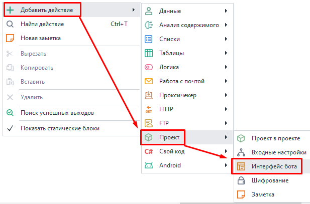  

Или через ***Панель статических блоков***:  

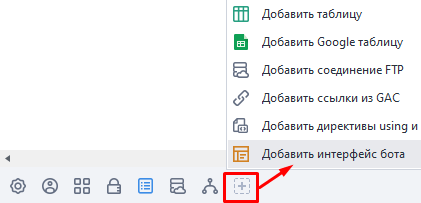    

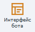 На панели появится соответствующая иконка.  
_______________________________________________   
:::info **Данный блок настроек не совместим с *Входными настройками*.**
Так что при добавлении одного, другой сразу удаляется из проекта. Будьте внимательны и предварительно сохраняйте настройки.  

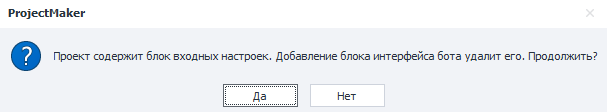
:::  
_______________________________________________  

## Редактор интерфейса бота.  
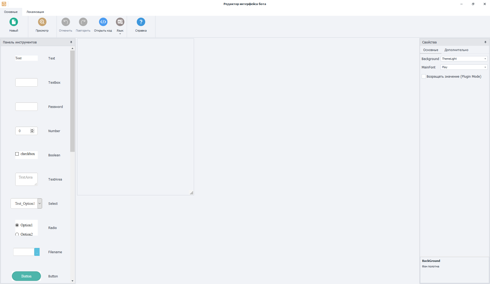  
_______________________________________________
### Основные настройки.  
#### Меню.  
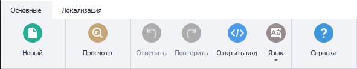  

- **Новый**. Создает новый интерфейс. При создании основное полотно полностью очищается, а имеющиеся на нем элементы удаляются.  
- **Просмотр**. Предварительный просмотр интерфейса
- **Отменить**. Вернуться на шаг назад.  
- **Повторить**. Перейти на шаг вперед.  
- **Открыть код**. Открывает редактор исходного кода, который скрыт за визуальной оболочкой.  
- **Язык**. Переключает язык интерфейса.  
- **Справка**. Переносит вас на текущую статью в справке.  

#### Рабочая область.  
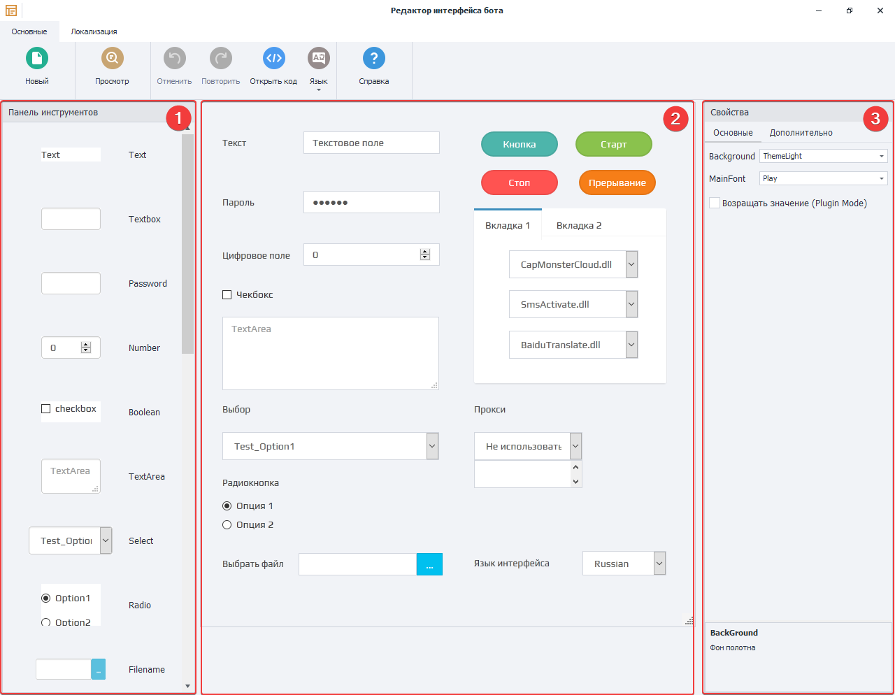  

**1. Панель инструментов.**  
Здесь располагаются различные элементы для построения клиентского интерфейса. Например, формы для ввода текста, выбор между вариантами, дополнительные модули и сервисы, кнопки и чекбоксы.  

**2. Внешний вид интерфейса.**  
Макет (полотно) для будущих входных настроек. На него можно перетаскивать различные элементы из панели слева, располагая их нужным образом.  

**3. Свойства элемента.**  
Здесь мы настраиваем свойства конкретного элемента. Задаем цвет, шрифт, переменную и прочее.  
_______________________________________________
### Элементы в Панели инструментов.  
| Название              | Внешний вид | Описание |
| :----------------: | :------: | :----: |
| ***Text***        |   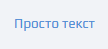   | Обычный текст для заметок на полотне. |
| ***Textbox***     |   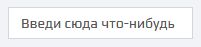   | Однострочное поле ввода. |
| ***Password***    |  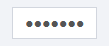   | Поле для пароля. Отличается тем, что визуально символы заменяются на кружочки. |
| ***Number***      |     | Только для целочисленных значений |
| ***Boolean***     |  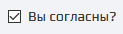   | Чекбокс для выбора: True или False.|
| ***TextArea***    |  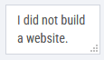   | Поле для многострочного текста. |
| ***Select***      |  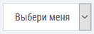   | Выпадающий список. Варианты для выбора задаются через **Options**, где `Text` — отображаемый текст, `Value` — значение для переменной.    |
| ***Radio***       |  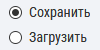   | Группа кнопок для выбора одного из вариантов. |
| ***Filename***    |  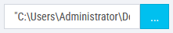   | Поле для ввода пути к файлу. Значение по умолчанию указывается в параметре **FilePath**. |
| ***Button***      |  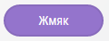   | Кнопка, к которой можно привязать JavaScript-событие.  |
| ***Multiselect*** |  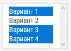   | Выпадающий список с возможностью выбора нескольких вариантов. |
| ***Captcha Modules*** |  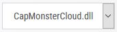   | Выбор сервиса для ***распознавания капчи*** из списка доступных. |
| ***Sms Services*** |  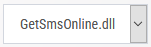   | Выбор сервиса для ***приема СМС*** из списка доступных. |
| ***Translate Services*** |  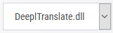   | Выбор сервиса для ***перевода текста*** из списка доступных. |
| ***Tab*** |  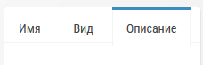   | Коллекция вкладок. Можно добавлять любые другие элементы, кроме непосредственно ***Tab***. Редактируется через параметр **Tabs**. |
| ***Language Selector*** |  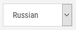   | Выбор языка интерфейса, который настраивается в разделе **Локализация**. |
| ***Start Button*** |  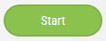   | Кнопка для старта. |
| ***Stop Button*** |  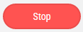   | Кнопка для остановки. |
| ***Interrupt Button*** |     | Кнопка, чтобы прервать действие. |
| ***Proxy Control*** |  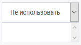   | Использование прокси из текущего проекта. Сами прокси настраиваются через ZennoDroid. |
| ***Mapper*** |     | Элемент для синхронизации списков/таблиц/google таблиц текущего проекта с плагином.  |
| ***User Control*** |    | Сюда можно добавить любые пользовательские элементы с помощью HTML кода.  |  
_______________________________________________
### Как добавить элемент в интерфейс?  
Каждый элемент можно перетащить мышкой на полотно. Располагать их можно только в видимой области.  

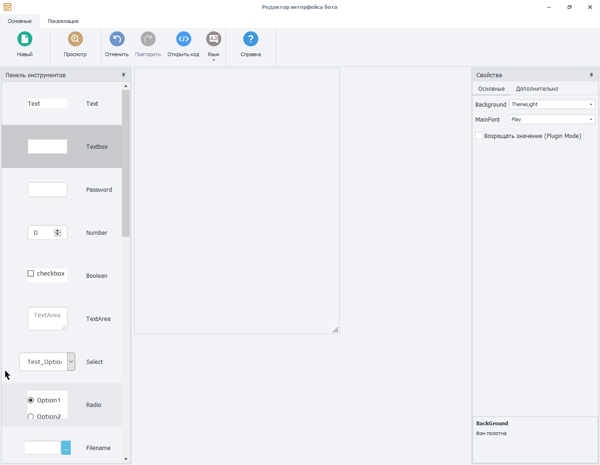  
_______________________________________________
### Внешний вид интерфейса.  
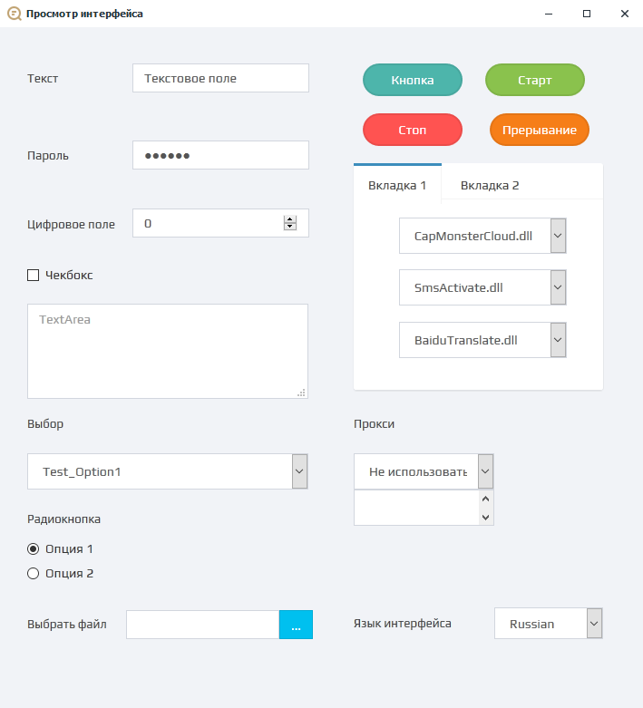  
_______________________________________________
### Свойства элемента.  
При нажатии на элемент, который расположен на полотне, справа появляются его свойства.  
#### Основные.  
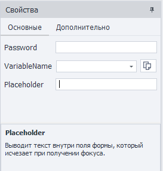  

Каждый элемент имеет свои уникальные параметры, которые можно изменять в этом окне. Например: шрифт, размер и цвет текста.  

**При нажатии на любой из параметров снизу появится его описание.**

<!--All you need is a blank line-->

    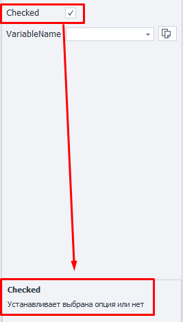

  

#### Дополнительно.  
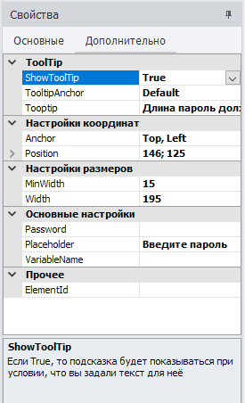  

Дополнительные свойства (метаданные) элемента, которые нужны для более тонкой настройки отображения. Описание каждой из настроек также дано внизу окна.  
:::tip **Пример для поля с паролем.**  
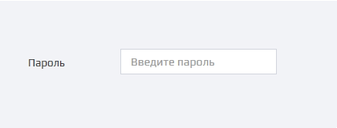
:::  
_______________________________________________
## Локализация.
Здесь можно задать то, как определенные настройки будут отображаться на разных языках. Добавление языков осуществляется через кнопку **Выбор языков** в левом верхнем углу.  

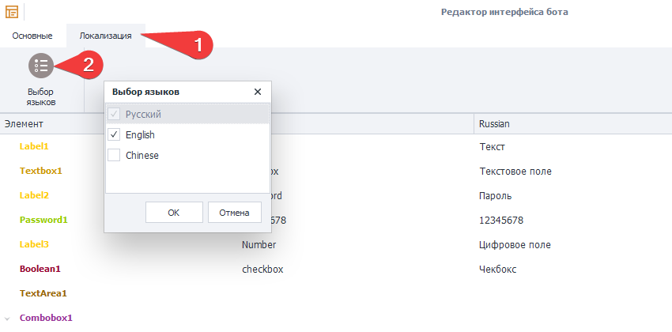  
_______________________________________________
## Пример итогового интерфейса.  
Открыть пользовательский интерфейс в ZD можно нажатием **ПКМ по проекту в списке → Настройки**. Или дважды кликнуть по нему.  

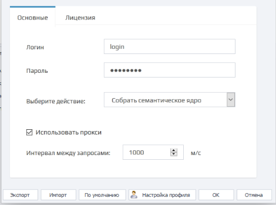  

Получился вот такой простой и понятный интерфейс, который можно использовать для своего шаблона или плагина, а затем передавать его другому пользователю.