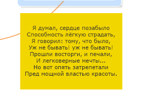
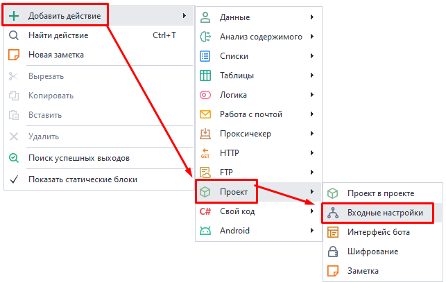
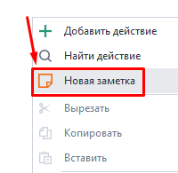
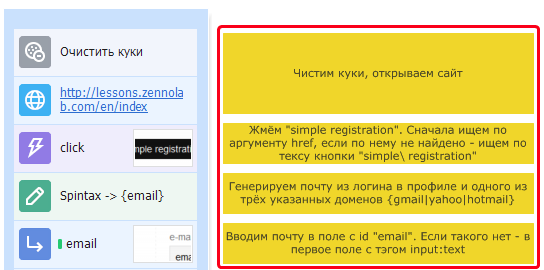
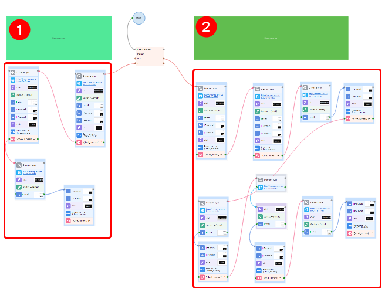
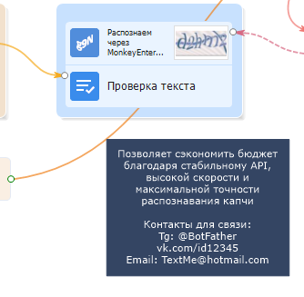
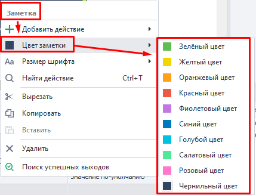
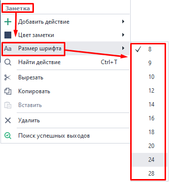
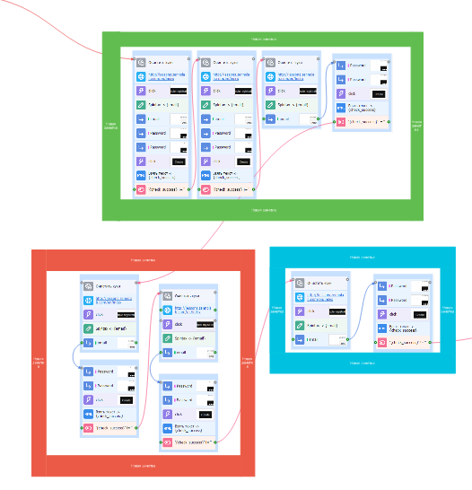
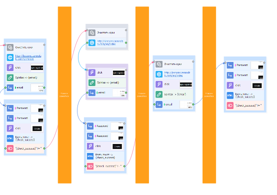

---
sidebar_position: 4
title: Заметки
description: Заметки в проекте.
---  
:::info **Пожалуйста, ознакомьтесь с [*Правилами использования материалов на данном ресурсе*](../Disclaimer).**
:::  
_______________________________________________  
  

Заметка — полотно, на котором можно оставить многострочный комментарий. Подобно бумажным стикерам, которые вы клеите в офисе или на холодильнике.  
_______________________________________________ 
## Как добавить в проект заметку?  
Через контекстное меню: **Добавить действие → Проект → Заметка**:  

  

Или **ПКМ по холсту → Новая заметка**:  

  
_______________________________________________ 
## Примеры использования.  
### Развёрнутое описание конкретного экшена.  
   

Иногда есть необходимость подробно описать свои действия, так как с первого взгляда это может быть не очевидно. Внутренний комментарий в теле экшена ограничен всего несколькими словами. Поэтом на помощь приходят Заметки.  
_______________________________________________
### Комментирование сразу большого числа экшенов.  
  

Бывает, что проект разростается до огромных размеров, и уже тяжело визуально в нем ориентироваться. Например, на скриншоте выше есть два отдельных древа экшенов, а сверху над ними зеленые заметки с кратким описанием.  
_______________________________________________
### Передача шаблона другим людям.  
    

Если вы хотите поделиться своим проектом с кем-то еще, то Заметки могут содержать полезные данные или ваши контакты. Их использование ограничено только вашей фантазией.  
_______________________________________________ 
:::info **Различные примеры использования также доступны в тестовых проектах на *Стартовой странице*.**
::: 
_______________________________________________  

## Настройки.  
Нажмите ПКМ по заметке, чтобы изменить ее внешний вид.  
_______________________________________________  
### Цвет заметки.  
  
_______________________________________________
### Размер шрифта.  
По умолчанию установлен размер 8.  

  
_______________________________________________
## Примеры оформления.  
 

