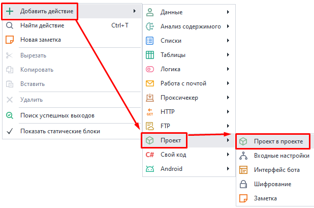
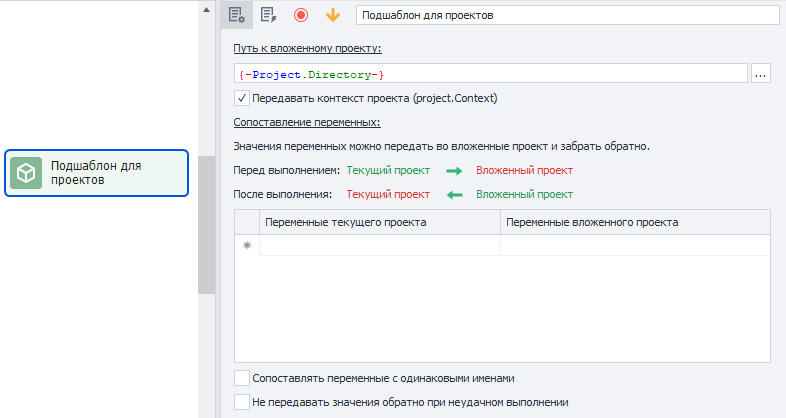
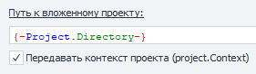
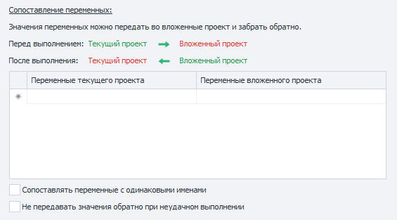
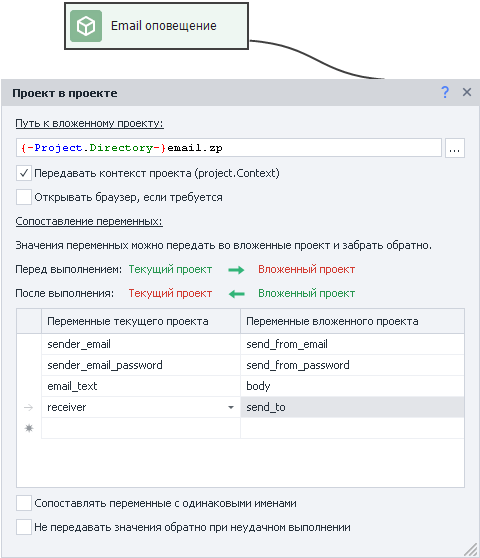
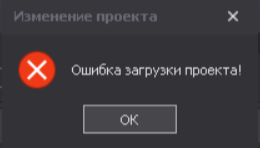

---
sidebar_position: 1
title: Проект в проекте
description: Подключение проекта к другому проекту.
---  
:::info **Пожалуйста, ознакомьтесь с [*Правилами использования материалов на данном ресурсе*](../Disclaimer).**
:::  
_______________________________________________  
## Для чего нужен?  
Этот экшен позволяет подключить уже готовый проект к текущему, над которым вы еще работаете.  

Чаще всего используется для повторяющихся частей. Например:  

**1.** Для работы с конкретным сайтом у вас есть несколько отдельных шаблонов:  
- Парсер товаров;  
- Парсер пользователей;  
- Рассыльщик сообщений.  

**2.** При этом нужно быть авторизованным.  
**3.** В каждом из шаблонов есть одинаковый участок с авторизацией.  
**4.** Выносим этот участок в отдельный подшаблон и подключаем его в нужных местах.  
**5.** Теперь мы можем вносить правки только в один подшаблон, а не сразу в нескольких проектах.  

Также этот экшен подойдет для:  
- Вынесения универсальных функций в подшаблон для использования в других проектах:  
    - *генерация текста*,  
    - *проверка на уникальность*,  
    - *загрузка изображений на хостинги*.  
- Разбивка одного большого шаблона на несколько маленьких по функциям.  
- Использования шаблона как вложенного. Все ограничено лишь вашей фантазией.  
_______________________________________________ 
## Как добавить в проект?  
Через контекстное меню: **Добавить действие → Проект → Проект в проекте**.  

 
_______________________________________________   
## Как работать с экшеном?  
  
_______________________________________________    
### Базовые настройки.   
  

#### Путь к вложенному проекту.  
Тут нужно указать абсолютный путь к подшаблону. Можно использовать переменные, например, `{-Project.Directory-}` *(путь к текущей папке проекта)*.  

#### Передавать контекст проекта (project.Context).  
Данная опция используется при работе с ***C# кодом***. `project.Context` позволяет сохранять С# объекты и переносить их между разными частями шаблона.  
_______________________________________________ 
### Передача переменных.  
  

#### Сопоставление переменных.  
В данном окне происходит передача данных из внешнего проекта во внутренний.  
Передать данные можно только с помощью переменных.  

#### Сопоставлять переменные с одинаковыми именами.  
При включении данной опции все переменные, имена которых идентичны в обоих проектах, будут автоматически сопоставлены, без необходимости ручной настройки.  

:::warning **Ручная настройка имеет больший приоритет.**  
Например, в обоих проектах есть переменная `variable`. Вы включили опцию *Сопоставлять переменные*, но вручную ассоциировали эту переменную с другой — `second_var`. Так что теперь переменные `variable` из обоих проектов будут сопоставлены с `second_var`, а не друг с другом.
:::  

#### Не передавать значения обратно при неудачном выполнении.  
По умолчанию все изменения переменных во внутреннем проекте отражаются также и на переменных из внешнего проекта. При включении данной настройки изменения переменных будут игнорироваться внешним проектом в случае ошибочного завершения внутреннего.  
_______________________________________________ 
## Пример использования.  
В качестве примера отправим себе оповещение через Email.  

  

Создаем шаблон, который будет автоматически определять настройки для соединения с сервером на основе переданного Email. После этого нам нужно будет только передать со внешнего проекта текст сообщения, данные отправителя и получателя.  
_______________________________________________ 
## Ошибка загрузки проекта.  
  

Если во время создания проекта появилась такая ошибка, то скорее всего проблема в том, что вы пытаетесь запустить закрытый шаблон на неактивном оборудовании.  

Для исправления вам нужно зайти в [**Личный кабинет → вкладка Оборудование**](https://userarea.zennolab.com/lk/userarea/UserAddHardware.aspx) и активировать оборудование, с которого вы сейчас работаете.