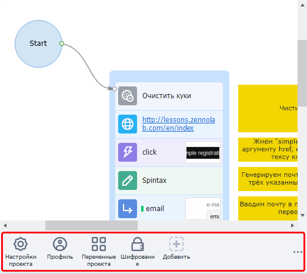
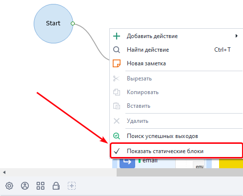
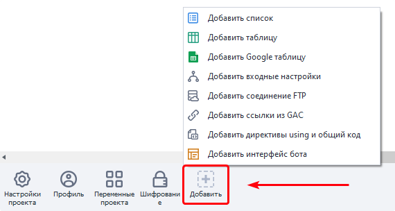
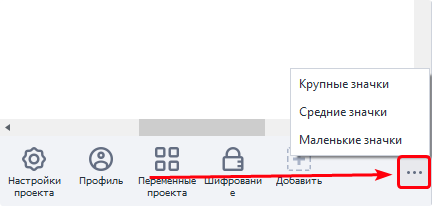

---
sidebar_position: 3
title: Общие принципы
description: Панель статических блоков.
--- 
:::info **Пожалуйста, ознакомьтесь с [*Правилами использования материалов на данном ресурсе*](../../Disclaimer).**
:::  

## Что такое статические блоки?  
  

В каждом проекте в нижней части есть специальное поле — панель статических блоков. Это элементы, которые принадлежат сразу всему проекту и доступны из любой его части. В отличии от действий (кубиков), выполнение которых происходит последовательно во времени.  

Каждый статический блок отвечает за одно или несколько свойств проекта. Такие как настройки проекта, настройки профиля в проекте, шифрование, а также списки и таблицы с данными.  

При создании проекта в нем уже имеются несколько обязательных статических блоков, которые нельзя удалить.  
_______________________________________________
## Как показать эту панель?  
  

Если вы не видите панель статических блоков, то нажмите ПКМ в любом пустом месте полотна и в контекстном меню выберете **Показать статические блоки**.  
_______________________________________________
## Добавление статических блоков.  
  

Через иконку со значком **+**.  
_______________________________________________
## Изменение размера панели.  
  
_______________________________________________
## Удаление статического блока.  
**ПКМ на блоке → Удалить:**  

  

Если кнопка **Удалить** неактивна, то удалить такой статический блок нельзя.