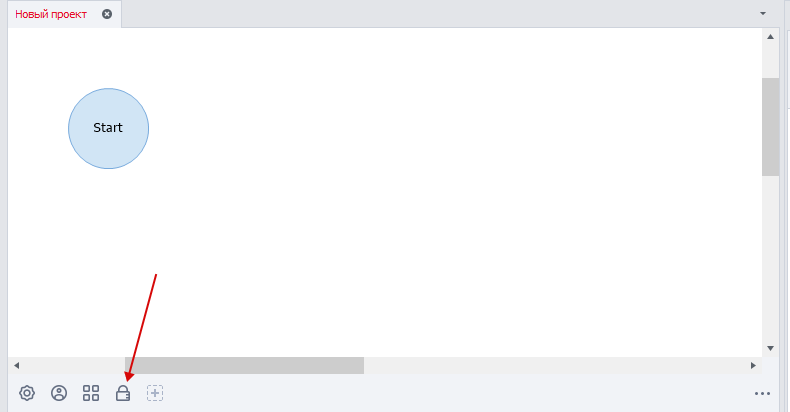
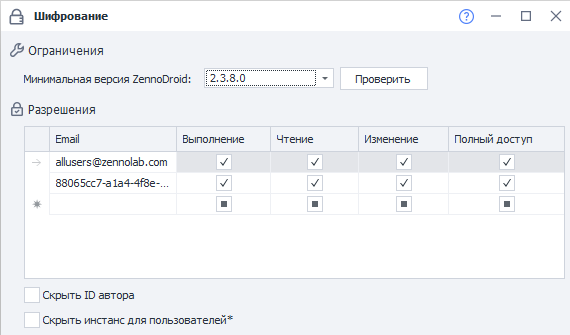

---
sidebar_position: 4
title: Шифрование
description: Защита проектов.
--- 
:::info **Пожалуйста, ознакомьтесь с [*Правилами использования материалов на данном ресурсе*](../../Disclaimer).**
:::  

Шифрование позволяет защитить созданные проекты от непредвиденного копирования и редактирования. Это, например, может пригодится при передаче шаблона другому пользователю, чтобы доступ был только у него.  

## Где находится?  
   

После создания проекта внизу, на панели статических блоков, есть иконка замка. Это и есть блок шифрования.  
_______________________________________________
## Описание полей.  
   
_______________________________________________
### Минимальная версия ZennoDroid.  
В выпадающем списке можно выбрать минимальную версию, на которой запустится шаблон.  

После клика по кнопке **Проверить** запустится проверка шаблона для оценки минимально-возможной версии.  
_______________________________________________
### Разрешения.  
| Email              | Выполнение | Чтение | Изменение | Полный доступ |
| :----------------: | :------: | :----: |:------: | :----: |
| Поле для ввода идентификатора |  Отвечает за возможность выполнять проект   | Дает просмотреть структуру проекта | Позволяет редактировать проект  | Всё перечисленное + выдача права другим пользователям. |  

#### Доступные форматы идентификатора:  
- **support@zennolab.com**. Почта, к которой привязан ZennoDroid.  
- **e927aabf-5ee3-4d3d-9ba7-e0f70537b923@zenno.club**. Можно получить в [**Личном кабинете**](https://account.zennolab.com/personal-area-profile).  
- **allusers@zennolab.com**. Универсальный адрес, который распространяется на всех пользователей.  

#### Подробнее про настройки доступа.  
**Выполнение → Чтение → Изменение → Полный доступ**. Именно в такой иерархии происходит выдача доступа.  
Например, если выдать **Изменение**, то **Чтение** и **Выполнение** включатся автоматически. И наоборот, если снять **Выполнение**, то все следующие также станут неактивны.  
_______________________________________________
### Скрыть ID автора.  
Включите эту опцию, если при передаче шаблона другим пользователям, вы не хотите раскрывать свой внутренний ID в системе ZennoLab.  
_______________________________________________
### Скрыть инстанс для пользователей.  
Эту опцию стоит включить, когда вы не хотите, чтобы браузер был виден при передаче шаблона другим пользователям.  

Данная настройка не влияет на выполнение проекта, а лишь скрывает отображение браузера в ProjectMaker. Она применяется для тех пользователей, у которых есть доступ только на **Выполнение** шаблона.  

Скрывается конкретно окно браузера в ProjectMaker при выполнения проекта в качестве плагина или подпроекта. Но опция не распространяется на экшен ***Ожидание действий пользователя***.

