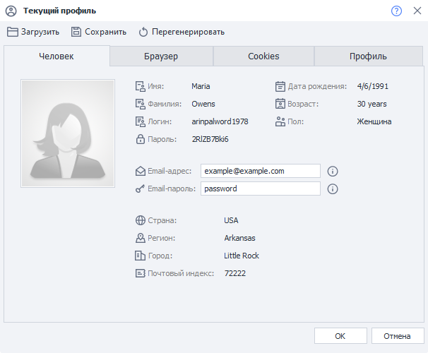
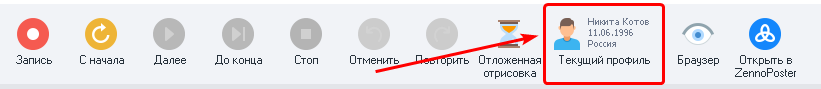
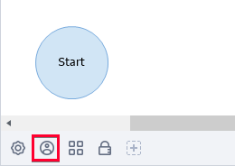
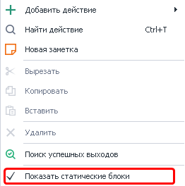
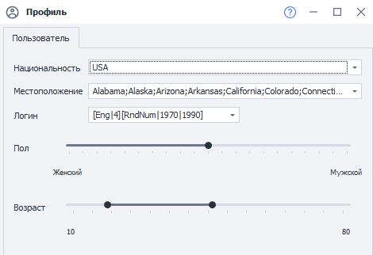
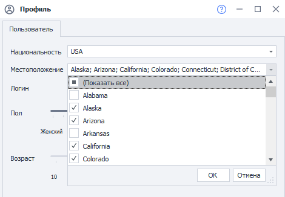
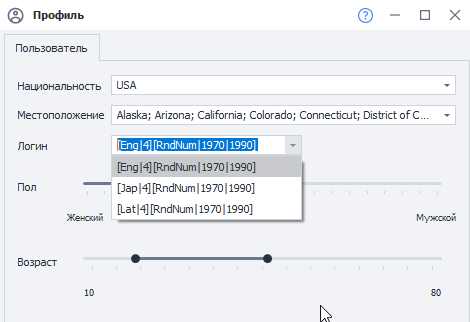

---
sidebar_position: 1
title: Профиль
description: Генерация профиля для проекта
---  

  
_______________________________________________
**Профиль** — это виртуальная личность, параметры которой генерируются при каждом новом запуске шаблона. В ProjectMaker генерация происходит во время нажатия кнопки **«Сначала»**; а в ZennoDroid — при каждом новом выполнении проекта. Подробная информация о профиле указана в **Окне профиля**.   

   

При выполнении проекта в профиле сгенерируются все необходимые данные. Такие как:  
- личные, которые используются при регистрации;    
- от устройства, они нужны для работы с сервисами.  
:::warning **Важно.**
Лучше избегать переназначений отдельных настроек профиля в рамках одного выполнения проекта — вместо этого просто завершите проект и выполните его ещё столько раз, сколько потребуется. Это позволит не усложнять проект внутренними циклами.
::: 

При регистрации аккаунтов правильная логика работы с проектом выглядит так:  
**1.** Старт проекта.  
**2.** Генерация одного нового профиля.  
**3.** Выполнение необходимых действи.  
**4.** Завершение проекта. 
_______________________________________________ 
## Настройка генерации профиля для текущего проекта.  
Для открытия параметров генерации профиля необходимо кликнуть по иконке **Профиля** на **Панели статических блоков**. Она находится под холстом с экшенами.  

  
:::info **Не отображается *Панель Статических Блоков*?**
Нужно кликнуть правой кнопкой мыши в любом пустом месте холста с экшенами и выбрать соответствующую настройку из контекстного меню, которая включает эту область.

 
:::   
  
## Вкладка «Пользователь».  
   
### Национальность.  
:::tip **Национальность по умолчанию.**
*Можно выставить в Настройках, во вкладке Профиль. Также там можно указать email и пароль от него.*
::: 

Доступно 6 национальностей:  
- Россия,  
- USA (США),  
- Germany (Германия),  
- France (Франция),  
- Spain (Испания),  
- United Kingdom (Великобритания).
_______________________________________________   
### Местоположение.  
Местоположение настраивается при помощи выпадающего списка с возможностью выбора нескольких значений. Содержимое списка зависит от выбранной страны:  
- Россия — области, края, республики, некоторые большие города (Москва, Сочи и другие);  
- США — штаты;  
- Германия — земли;  
- Франция — регионы;  
- Испания — автономные сообщества;  
- Великобритания — страны, входящие в её состав. 

   
### Логин.  
При генерации логина используется формула из нескольких частей. По умолчанию в настройках уже сохранены несколько видов формул. Вы также можете вписать туда свою.   

   
#### Подробное описание формул.  
На данный момент для формул поддерживаются языки: `Eng` — английский, `Lat` — латынь, `Jap` — японский.  
Например, при вводе значения `[Eng|4]` сгенерируется никнейм длиной в 4 английских слога с вероятностью таких же сочетаний слогов, как в реальных словах. Через изменение формулы можно создавать более сложные конструкции. Разберем такую формулу:  

`[RndSym|[RndNum|0|4]|0123456789][Lat|3][RndSym|[RndNum|0|2]|-][Jap|1][RndText|2|D]`  

`[RndSym|[RndNum|0|4]|0123456789]` — означает, что в начале ника будет использоваться от 0 до 3 цифр;  
`[Lat|3]` — генерируем 3 слога на латыни;  
`[RndSym|[RndNum|0|2]|-]` — берем случайные 2 буквы или цифры.  

В результате генерации получатся такие ники:  
- 053bomenca-iem,  
- 7lialeme-nozr,  
- 46atbemig-poex,  
- simpvido-se8f,  
- 3afosuxhif6,  
- frigulimdeif,  
- misssefu-yucn.  
_______________________________________________ 
### Пол.  
С помощью этого ползунка устанавливается вероятность генерации того или иного пола.  
_______________________________________________ 
### Возраст.  
Этот параметр позволяет выставить диапазон, в пределах которого будет генерироваться возраст для профиля.  
_______________________________________________ 
## Для чего нужен Профиль?     
Для регистрации на сайтах, форумах, блогах, в социальных сетях и т.д. Благодаря ему вам не нужно ломать голову над тем, где взять имена, фамилии, индексы, города, логины и как генерировать различные параметры устройства. Всё это уже встроено в программу. Вы же можете сосредоточиться на решении более важных задач.
