:::info **Пожалуйста, ознакомьтесь с [*Правилами использования материалов на данном ресурсе*](../Disclaimer).**
:::
_______________________________________________  
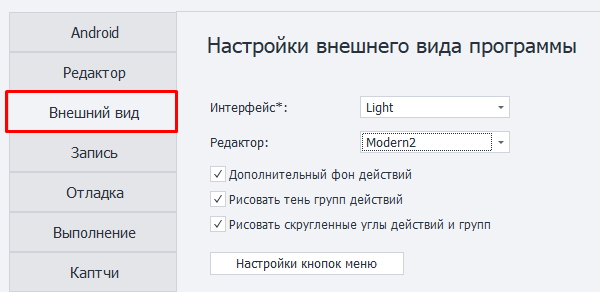  

## Интерфейс.  
Выбор между тёмной и светлой темой  

| 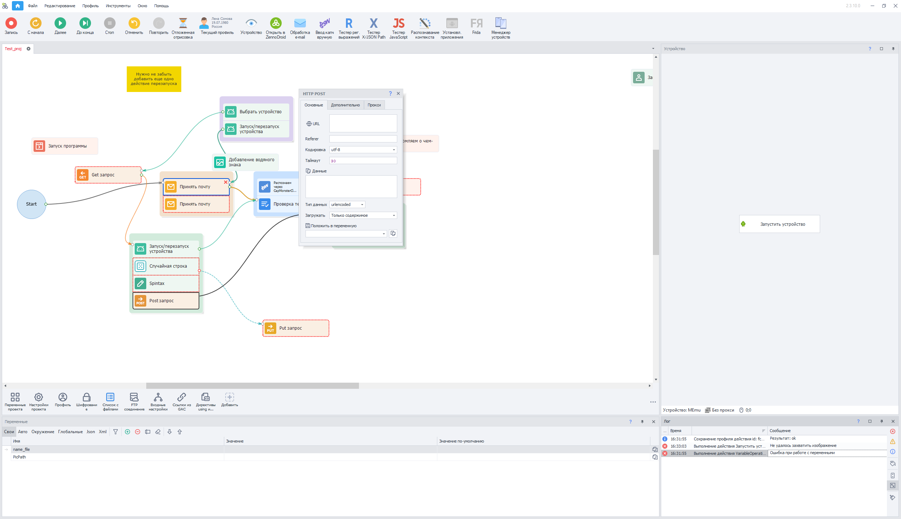    | 
| :--------: | 
| **Light**  |  

| 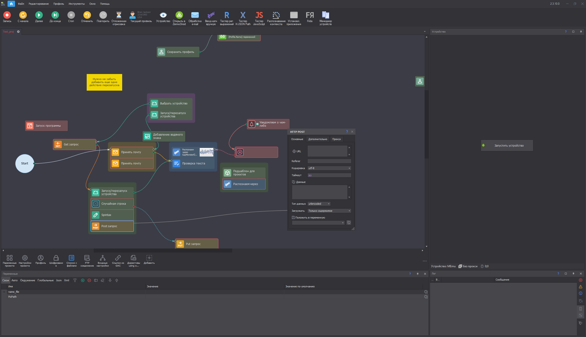    | 
| :--------: | 
| **Dark**  |

:::info **Для изменения темы необходимо перезапустить программу.**
:::  
_______________________________________________

## Редактор.
Тут можно выбрать тему оформления для редактора, которая меняет внешний вид экшенов.  

| **Modern1** *(современный вид по умолчанию)*    | 
| :--------: | 
|  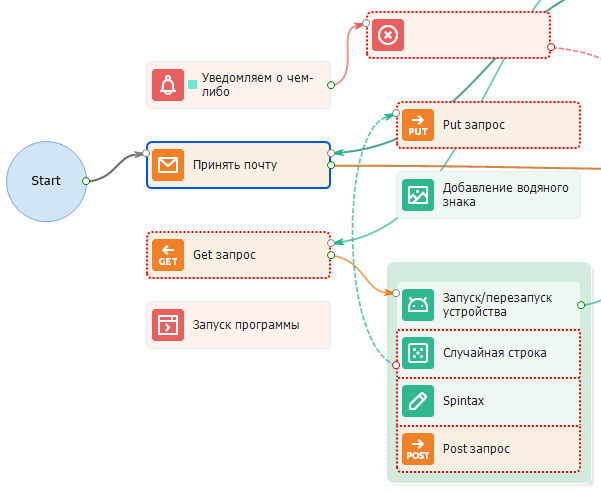 |  

| **Modern2** *(у некоторых значков меняется фон, в остальном всё также)*    | 
| :--------: | 
|  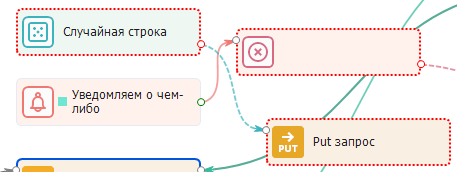 |  

| **Letter** *(иконки заменяются на буквы и символы)*    | 
| :--------: | 
|  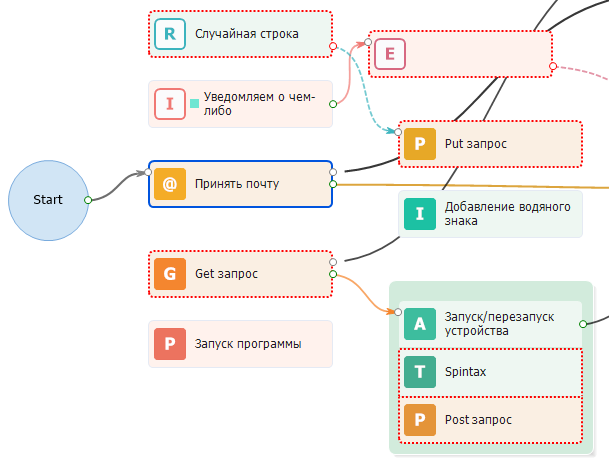 |  

| **Classic** *(так выглядела программа раньше, значки станут совсем другими)*    | 
| :--------: | 
|  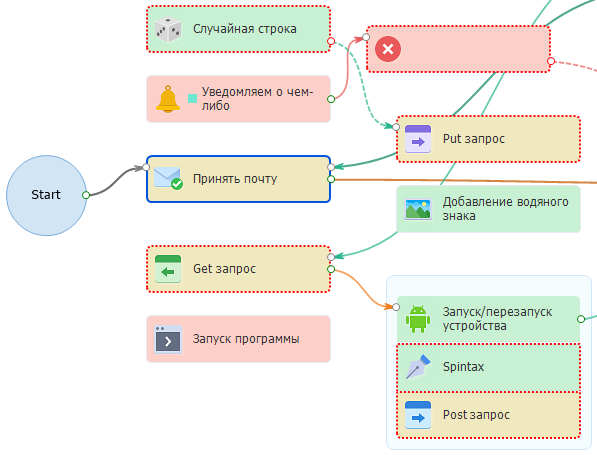 |  

| **Classic2** *(фон экшенов станет более насыщенным)*    | 
| :--------: | 
|  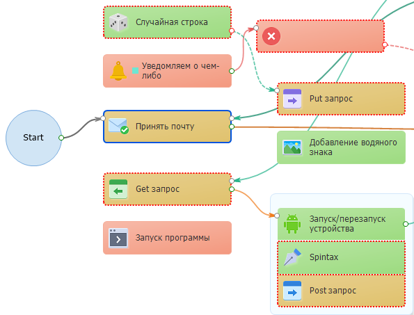 |  
_______________________________________________
## Дополнительный фон действий.
:::info **Изменение недоступно для *Classic* и *Classic2*.**
:::

| Вид с насыщенным фоном    | 
| :--------: | 
|  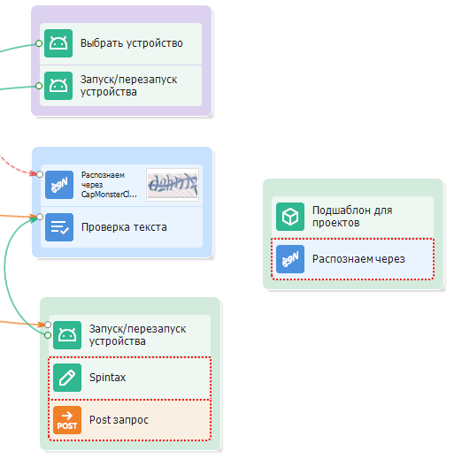 |  

| Вид без насыщенного фона    | 
| :--------: | 
|  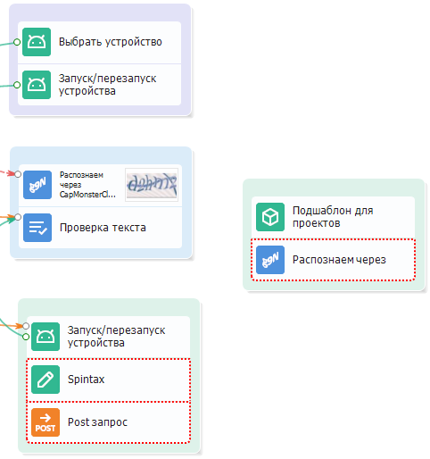 |  
_______________________________________________
## Рисовать тень групп действий.
:::info **Включение данной настройки может замедлить скорость отрисовки!**
::: 

| Настройка включена    | 
| :--------: | 
|  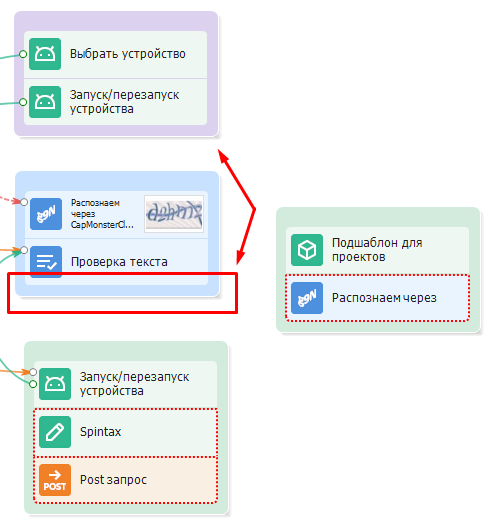 |  

| Настройка выключена    | 
| :--------: | 
|  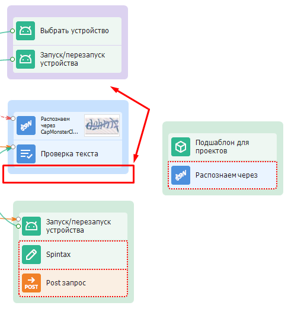 |  
_______________________________________________
## Рисовать скруглённые углы у действий и групп.

| Настройка включена    | 
| :--------: | 
|  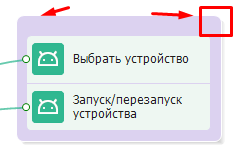 |  

| Настройка выключена    | 
| :--------: | 
|  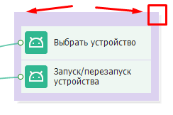 |
_______________________________________________
## Настройки кнопок меню.  
При нажатии на эту кнопку открывается дополнительное меню, в котором можно выбрать кнопки и разделы отображаемые в верхней панели программы.  

### Настройки кнопок инструментов.  
Здесь можно выбрать, для каких инструментов будут отображаться соответствующие кнопки в верхнем меню.  

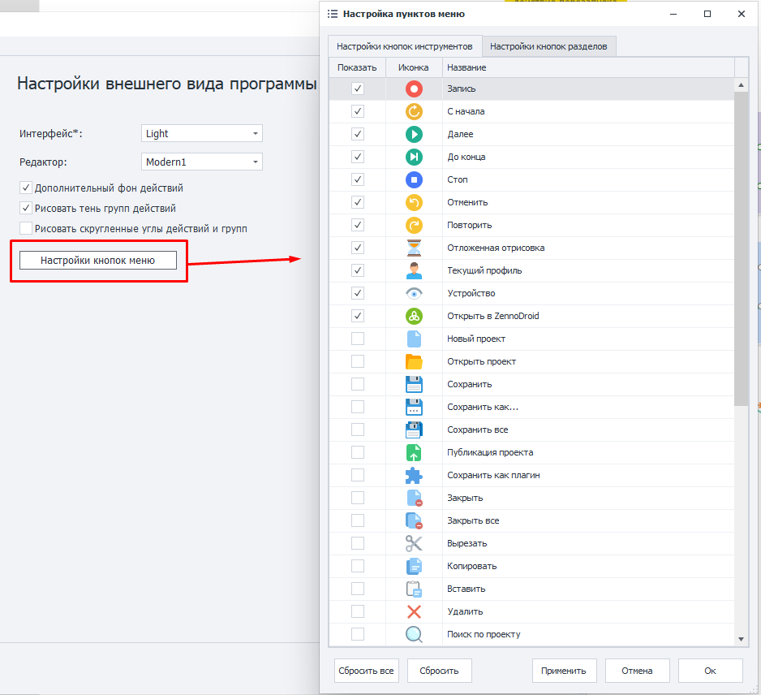  

Когда определитесь с выбором и нажмёте **Применить**, кнопки сразу появятся на панели инструментов:  

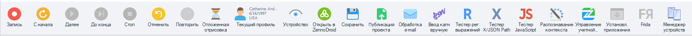  

### Настройки кнопок разделов.
Тут выбираем, какие разделы будут доступны в самом верху программы.  

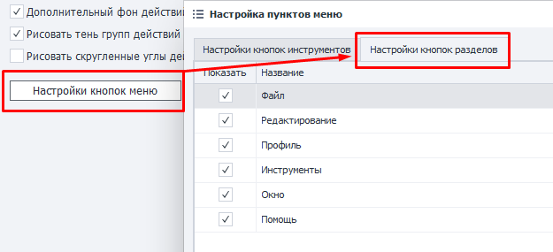  

### Расстановка кнопок и разделов.  
Можно вручную расположить кнопки и разделы в том порядке, в котором вам будет удобно с ними работать. Для этого достаточно зажать ЛКМ по необходимому элементу и перетянуть его в желаемое место.  

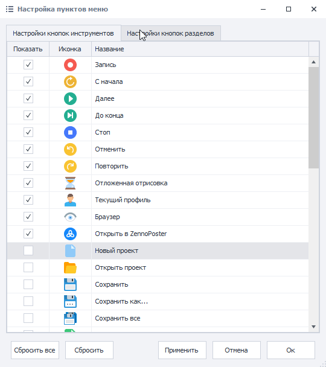  

С помощью кнопки **Сбросить** всегда можно вернуть элементы из текущего окна настроек в их исходное положение. А **Сбросить всё** вернёт в изначальное состояние кнопки сразу из обоих окон.
_______________________________________________  
## Полезные ссылки.   
- [**Интерфейс ProjectMaker**](../category/интерфейс).  
