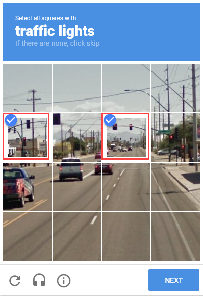
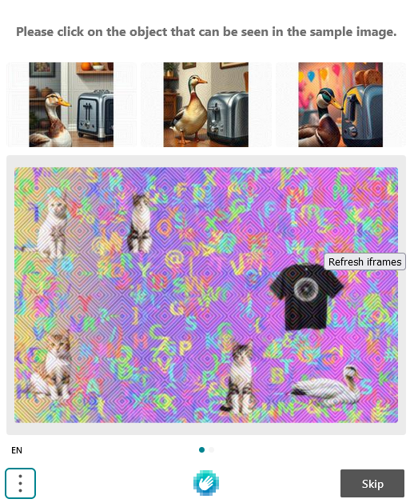
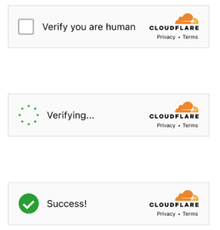
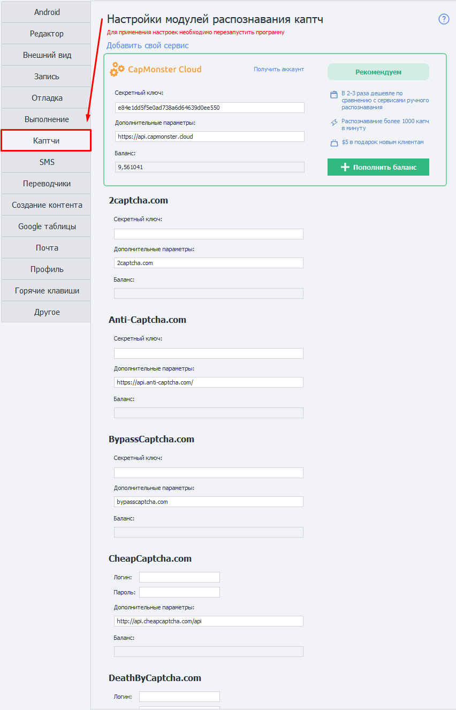
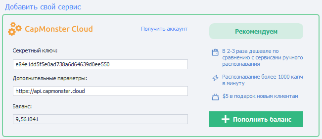
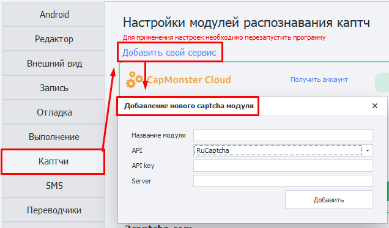
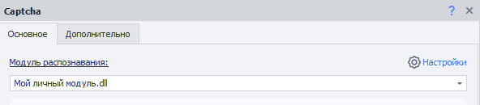

---
sidebar_position: 7
title: Каптчи
description: Настройки модулей распознавания капч. 
---  
:::info **Пожалуйста, ознакомьтесь с [*Правилами использования материалов на данном ресурсе*](../Disclaimer).**
:::
_______________________________________________  
## Описание.  
**Капча** — это автоматически генерируемый тест для проверки, является ли пользователь человеком или компьютером (ботом). Простые их варианты часто представляет собой искаженную надпись из букв и/или цифр. Они могут быть написаны в различных цветовых сочетаниях с применением шума, искривлений, наложения дополнительных линий или произвольных фигур.  

|     | 
| :--------: | 
| **Примеры текстовых капч.**  |  

Встречаются и другие виды капч, где надо не просто ввести символы с картинки, а произвести какое-то действие. Например, вас просят найти автобусы, пальмы, мотоциклы и другие предметы; решить пазл; расставить предметы в определённом порядке или рассортировать их.  

#### Дополнительные примеры капч:  

|     |  |
| :--------: | :-------: |
| [**ReCaptcha**](https://developers.google.com/recaptcha)  | [**HCaptcha**](https://www.hcaptcha.com/)    |  

|     |  |
| :--------: | :-------: |
| [**FunCaptcha**](https://www.arkoselabs.com/arkose-matchkey/)  | [**CloudFlare**](https://www.cloudflare.com/)    |
_______________________________________________
## Для чего нужны эти настройки?
ZennoDroid позволяет решать текстовые капчи вручную. Для этого в [**Экшене распознавания капч**](../Android/CaptchaSolving) достаточно выбрать модуль `MonkeyEnter.dll`. Но это может стать трудоёмкой задачей, если речь идёт о сотнях или даже тысячах капч!  

А если, например, проект работает круглосуточно, а капча появляется в любое время?

Тогда вам помогут перечисленные здесь сервисы. **Они предназначены для того, чтобы не вводить капчи вручную**.  

  
_______________________________________________
## Как подключить сервис?  
  
### Секретный ключ.  
Чаще всего для работы с сервисом необходим так называемый **API ключ**. Это *уникальная строка из случайных символов*, благодаря которой сервис может вас идентифицировать. Например, он может выглядеть вот так: `8fc9b30e544885b8480fb590dfcbdd71`.  

Для получения API ключа вам нужно перейти на сайт подходящего сервиса и ознакомиться с его условиями. Когда определитесь с выбором, выполните регистрацию в каптча-сервисе и получите свой *API-ключ* в личном кабинете.  

### Логин и пароль.  
Некоторые сервисы вместо API ключа для авторизации используют логин и пароль, которые вы задали при регистрации.  

### Дополнительные параметры.
Тут пишется **URL-адрес (домен)** для приёма API-запросов. Он установлен в программе по умолчанию и его **не нужно менять без необходимости**. Если вдруг URL не прописан заранее, то его необходимо уточнить в документации выбранного сервиса.  

### Баланс.  
После авторизации в сервисе в данном поле появится ваш текущий баланс.  

Также это поле используется для вывода информации об ошибках (но не для всех сервисов).  
Возможные ошибки: `IP_BANNED`, `ERROR_WRONG_USER_KEY` и др. 

:::warning **Если после ввода API-ключа данное поле остаётся пустым, значит произошла какая-то ошибка.**
Возможные варианты: введён неправильный ключ (или логин/пароль), неполадки у сервиса, ключ был забанен.
:::
_______________________________________________
## Доступные  сервисы.  
- [**CapMonster Cloud**](https://capmonster.cloud/) — Рекомендуем 👍;    
- [2captcha](https://2captcha.com/);  
- [Anti-Captcha](https://anti-captcha.com/);  
- [BypassCaptcha](http://bypasscaptcha.com/);  
- [CheapCaptcha](https://cheapcaptcha.com/);  
- [DeathByCaptcha](https://deathbycaptcha.com/);  
- [DeCaptcher](http://decaptcher.com/);  
- [Imagetyperz](http://imagetyperz.com/);  
- [Jsdati](https://www.jsdati.com/);  
- [RuCaptcha](https://rucaptcha.com/);  
- [CapMonster 2 Desktop](https://zennolab.com/ru/products/capmonster/);  
_______________________________________________
## Свой модуль.
### Добавление нового модуля (сервиса).  
Вы также можете добавить собственный сервис распознавания каптч на основе API популярных сервисов.  

  
### Необходимые параметры. 
:::tip **Если вы не уверены, какие данные нужно вводить.**
То проконсультируйтесь с поставщиком услуг.
:::
#### Название модуля.  
Указываем имя для модуля, **максимум 20 символов**.  

#### API.  
Выбираем API сервиса, на основе которого создадим свой модуль.  

#### API-key.
Ключ от сервиса. Тот же самый, который указываем в поле **Секретный ключ** при подключении сервиса.  

#### Server.  
URL-адрес (домен), куда будут отправляться запросы на решение капчи.  

### Отправка капч на свой модуль.
После добавления модуля его можно будет выбрать в экшене [**Распознать капчу**](../Android/CaptchaSolving).  

  

### Удаление модуля.  
Чтобы убрать созданный модуль из программы, **необходимо удалить два файла**:  
- `c:\Users\USERNAME\AppData\Roaming\ZennoLab\Configs\ИмяМодуля.dll.config`  
- `c:\Users\USERNAME\AppData\Roaming\ZennoLab\CustomModules\Captcha\ИмяМодуля.dll`  

:::warning **Рекомендуем закрыть ZennoDroid и ProjectMaker перед удаление этих файлов.**
:::
_______________________________________________  
## Полезные ссылки.   
- [**Все о распознавании капч**](https://blog.capmonster.cloud/ru).  
- [**Личный кабинет CapMonster Cloud**](https://capmonster.cloud/Dashboard).