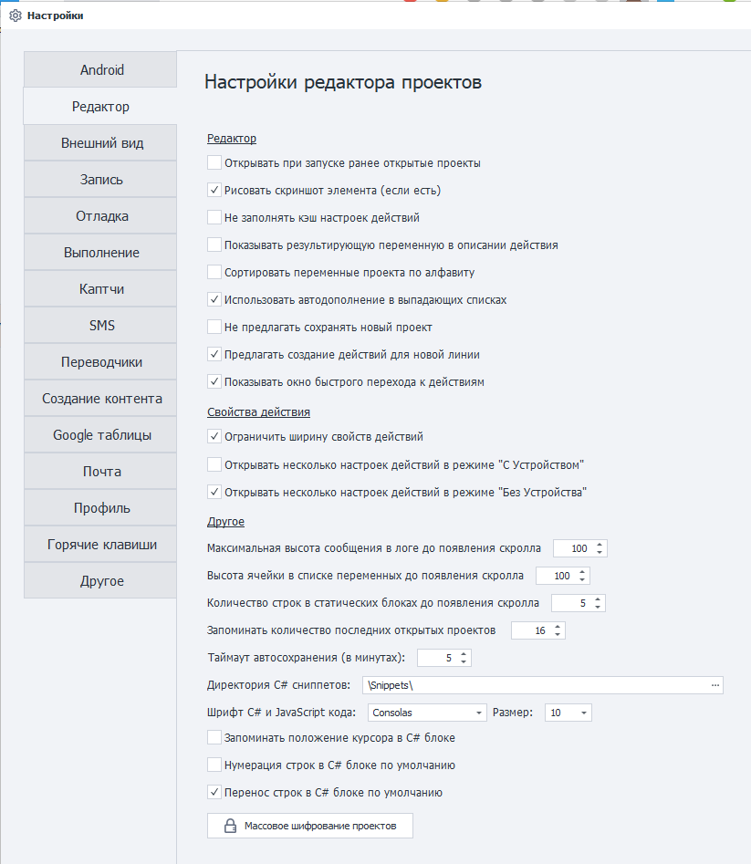
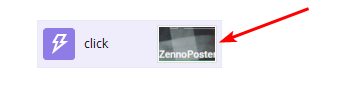
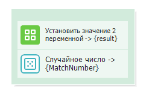
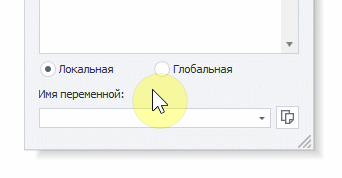
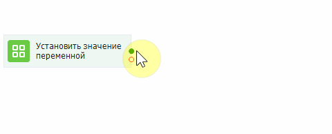
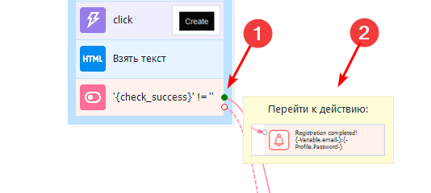
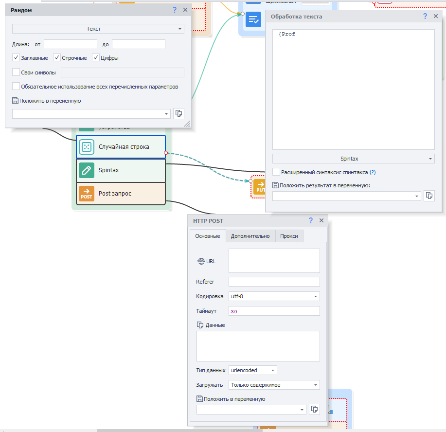
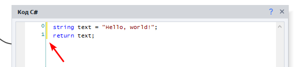
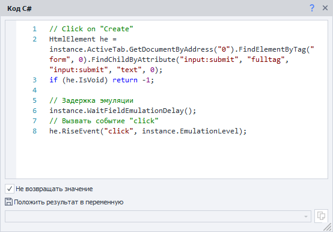
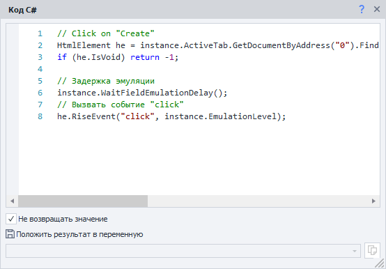

:::info **Пожалуйста, ознакомьтесь с [*Правилами использования материалов на данном ресурсе*](../Disclaimer).**
:::
_______________________________________________  
   

## Редактор.  
### Открывать при запуске ранее открытые проекты.  
Если включить эту опцию, то при запуске программы будут открываться все проекты, которые не были закрыты перед последним выключением.  

### Рисовать скриншот элемента (если есть).  
   

На блоке с действием будет отрисовываться скриншот соответствующего элемента. Это увеличивает общий вес шаблона, но зато помогает лучше в нём ориентироваться.  

### Не заполнять кэш настроек действий.  
Отключает заполнение кэша настроек действий, тем самым ускоряя запуск программы.  

### Показывать результирующую переменную в описании действия.  
Добавляет в комментарии некоторых блоков (в которых подразумевается возврат результата) такую конструкцию: `название действия → {переменная}`.  

 

### Сортировать переменные проекта по алфавиту.  
Переменные будут расположены в алфавитном порядке.  

### Использовать автодополнение в выпадающих списках.  
   

При написании имени переменной или списка/таблицы в выпадающем поле будет срабатывать автонабор. Это позволит не писать всё название целиком и быстро заполнить поле.  

:::info **Для применения требуется перезагрузка.**
:::

### Не предлагать сохранять новый проект.
Убирает окошко с предложением сохранить проект после нажатия кнопки ***С начала***.

### Предлагать создание действий для новой линии.  
При создании новой линии, когда вы потянете за стрелочку от кубика, будет автоматически появляться список возможных действий для добавления.  

  

### Показывать окно быстрого перехода к действиям.  
При наведении на точки крепления линий будет выводится окно для быстрого перехода к действиям.  

## Свойства действия. 
### Ограничить ширину свойств действий.
Управляет сеткой окна **Свойства действия**. Если стоит галочка, то сетка будет фиксированной. Но если ее убрать, она станет гибкой, подстраиваемой под ширину окна.  

### Открывать несколько настроек действий в режиме “С Устройством/Без Устройства“.  
Позволяет открывать сразу несколько настроек действий рядом с кубиком. По умолчанию опция включена только в режиме “Без Устройства“. Это значит, что если вы подключите устройство, то настройка станет не активной.

|     | 
| :--------: | 
| *Открыть можно два и более окон настроек*  |

## Другое.  
### Максимальная высота сообщения в логе до появления скролла.  
Устанавливает высоту поля с сообщением в логе, которая будет видна без необходимости прокрутки. Число означает количество строк, которые поместятся для предпросмотра.  

### Высота ячейки в списке переменных до появления скролла.  
По аналогии с прошлым пунктом задаётся высота ячейки в окне **Переменные** доступная для просмотра.  

### Количество строк в статических блоках до появления скролла. 
Здесь также задаём доступное количество строк в разделе статических блоков до появления прокрутки.  

### Запоминать количество последних открытых проектов.  
Регулирует количество последних открытых проектов, которые будут отображаться на [**Стартовой странице**](../pm/Welcome_PM).

### Таймаут автосохранения.
Устанавливаем время в минутах, через которое проект будет автоматически сохраняться.  

### Директория C# сниппетов.
Указываем директорию, из которой в программу будут автоматически подгружаться **C# сниппеты**.  

**Директория по умолчанию:**  
`C:\Users\*USERNAME*\AppData\Roaming\ZennoLab\ZennoDroid\2\Snippets` 

### Шрифт C# и JavaScript кода. 
Задаём шрифт, который будет использоваться в экшенах [**C#**](../Project%20Editor/CustomCode/С) и [**JavaScript**](../Project%20Editor/CustomCode/JS) кода. По умолчанию стоит *Consolas* 10-го размера.  

### Запоминать положение курсора в C# блоке.
Код будет открываться на той строке, где вы остановились работать в прошлый раз.  

### Нумерация строк в C# блоке по умолчанию.
Строки в [**Коде C#**](../Project%20Editor/CustomCode/С) будут автоматически пронумерованы.  

### Перенос строк в C# блоке по умолчанию.
Эта опция включает автоматический перенос строк в C# коде, если они не помещаются в текущее окно.  

|     |  |
| -------- | ------- |
| Перенос включён  | Перенос выключен    |  

### Массовое шифрование проектов.
Эта кнопка включает позволяет [**Зашифровать**](../Project%20Editor/Static%20Block%20Panel/Encryption) все открытые проекты.  
_______________________________________________  
## Полезные ссылки.   
- [**Все о работе с редактором**](../category/редактор-проектов).  
- [**Все о панели статических блоков**](../category/панель-статических-блоков).   
- [**Написание кода в ZD**](../category/свой-код).