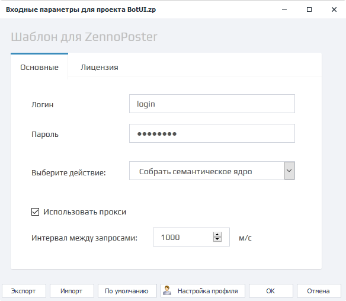

:::info **Пожалуйста, ознакомьтесь с [*Правилами использования материалов на данном ресурсе*](../Disclaimer).**
:::
_______________________________________________
## Что такое Входные параметры?  
Эти настройки нужны для передачи данных в шаблон. В ZennoDroid существуют два типа входных параметров: **классические** и **интерфейс бота (BotUI)**. В них могут содержаться различные типы данных, такие как: пути к файлам, строки текста, числа, сервисы по работе с капчей, СМС-сервисы, выпадающие списки и так далее.  

В ZennoDroid существует два типа входных настроек - [**Классические**](../Project%20Editor/Project/InputSetting) и [**Интерфейс бота (BotUI)**](../Project%20Editor/Project/BotInterface).  

### Примеры внешнего вида.  
| Классические настройки    | Интерфейс бота (BotUI) |
| :--------: | :-------: |
|   |     |  

### Как открыть?  
Этот раздел доступен для редактирования **только через ZennoDroid**, в ProjectMaker вы его не найдёте.  

Выберите нужный **Проект → ПКМ по нему → Настройки**.  

  
_______________________________________________
## Кнопки управления.  
  

### Экспорт.  
Позволяет сохранить файл с текущими установленными настройками.   

| Также настройки можно помещать в ***.bat файл***    | 
| :--------: | 
|   |  

### Импорт.  
С помощью этой кнопки можно загрузить настройки из уже существующего файла.  

### По умолчанию.  
Сброс входных настроек до значений по умолчанию *(те, которые были выставлены разработчиком шаблона)*.  

### Настройки профиля.  
При клике по данной кнопке откроется окно настроек генерации профиля. В нём можно изменить национальность, пол, возраст и формулу генерации логина.  

  

Более подробная информация доступна в статье про [**Профиль**](../Project%20Editor/Static%20Block%20Panel/Profile)  

### ОК и Отмена.  
Позволяют либо сохранить, либо отменить все внесённые изменения.  
_______________________________________________
## Важное примечание.  
Входные настройки считываются **только один раз при старте потока**!  

Если же изменить настройки во время выполнения, то они никак не отразятся на проекте до нового старта.  

### Пример.  
Представим, что пользователь вводит во входных настройках ФИО и дату рождения, а затем запускает шаблон. Когда проект уже запущен, обнаруживается, что были введены некорректные данные. Пользователь бежит в настройки и меняет параметры у работающего шаблона.  

И получится так, что все потоки, которые стартовали до введения новых данных, продолжат работу со старыми значениями. Изменения же применятся только для тех потоков, которые будут запущены после.
