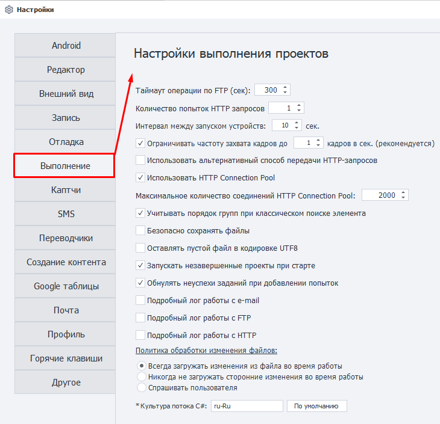
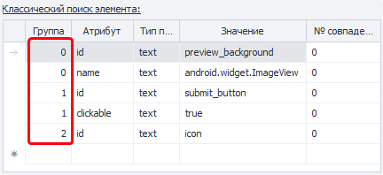

---
sidebar_position: 6
title: Выполнение
description: Настройки выполнения проекта. 
---  
:::info **Пожалуйста, ознакомьтесь с [*Правилами использования материалов на данном ресурсе*](../Disclaimer).**
:::
_______________________________________________
  
_______________________________________________
### Таймаут операции по FTP (сек).  
Тут указываем время в секундах, которое программа может затратить на ожидание выполнения операции по FTP.
_______________________________________________
### Количество попыток HTTP-запросов.  
Количество попыток, которое даётся программе для выполнения ***HTTP-запроса***.
_______________________________________________
### Интервал между запуском устройств (сек).  
Данный интервал помогает избежать пиковых нагрузок при одновременном запуске нескольких устройств.
_______________________________________________
### Ограничивать частоту захвата кадров.  
Данная настройка влияет на отрисовку картинки в превью окна ***Устройство***.  

Если она выключена, то изображение будет отображаться с тем значением FPS, которое выставлено в эмуляторе.

:::tip **Мы рекомендуем ограничивать частоту кадров для улучшения производительности.**
Особенно в многопоточных проектах.
:::
_______________________________________________
### Использовать альтернативный способ передачи HTTP-запросов.  
Если включить эту опцию, то по умолчанию будет использоваться альтернативный способ передачи HTTP-запросов.  

Она задаётся глобально для всей программы, а также всех новых проектов. 

#### Что такое альтернативный способ?  
В ZennoDroid есть два метода работы с запросами:  
- Сторонняя разработка, используется по умолчанию (стандартный метод, библиотека Chilkat);  
- Наша собственная (альтернативный метод).  

Если при работе с HTTP-запросами у вас что-то работает неправильно, то попробуйте переключиться на альтернативный метод.
_______________________________________________
### Использовать HTTP Connection Pool. 
Эта опция оптимизирует работу с ***HTTP-запросами***, повышая её стабильность.
_______________________________________________
### Максимальное количество соединений HTTP Connection Pool.
Данная настройка ограничивает количество соединений для ZennoDroid и ProjectMaker, что позволяет стабилизировать работу с большим количеством HTTP-запросов.  
_______________________________________________
### Учитывать порядок групп при классическом поиске элемента.  
Если включить эту опцию, то условия для поиска будут выполняться по порядку, следуя нумерации в колонке **Группа**.  

 
_______________________________________________
### Безопасно сохранять файлы. 
Предотвращает порчу списков и файлов при внезапных перегрузках сервера. 
_______________________________________________
### Оставлять пустой файл в кодировке UTF8.
Если во время выполнения шаблона список остаётся пустым, то файл сохранится в кодировке UTF-8.
_______________________________________________
### Запускать незавершенные проекты при старте.
На старте программы будут запускаться проекты, которые вы не закрыли во время прошлой сессии.
_______________________________________________
### Обнулять неуспехи заданий при добавлении попыток.
Счётчик неуспешных выполнений заданий будет сбрасываться при добавлении новых попыток выполнения.
_______________________________________________
### Подробный лог работы с e-mail.
Включает подробный лог для операций по ***работе с e-mail***.
_______________________________________________
### Подробный лог работы с FTP.
Включает подробный лог операций по работе с ***FTP***.
_______________________________________________
### Подробный лог работы с HTTP.
Включает подробный лог операций по работе c ***HTTP***.
_______________________________________________
### Политика обработки изменения файлов.
Здесь задаётся то, как будет вести себя программа при внешних изменениях файлов, которые привязаны к спискам и таблицам.  

#### Всегда загружать изменения из файла во время работы.  
Программа будет каждый раз сама ловить и загружать обновления файла.  

#### Никогда не загружать сторонние изменения во время работы.
Программа загрузит только файл в начале работы, но не будет загружать его изменения.

#### Спрашивать пользователя.
Программа всегда будет запрашивать у пользователя подтверждение на загрузку изменений файла.
_______________________________________________
### Культура потока C#.  
Данная настройка влияет на язык локализации потока, выполнения, а также отладки проектов и C# кубиков. Это и называется **Культура**.  

В русской версии установлена по умолчанию *культура* `ru-RU`. Она может влиять на парсинг дат, чисел с десятичной запятой и другое.  

Для установки **InvariantCulture** необходимо *из поля ввода всё удалить* и оставить пустую строку.  

:::tip **Необходима перезагрузка программы.**
Для вступления изменений связанных со сменой культуры потока C#.
:::
