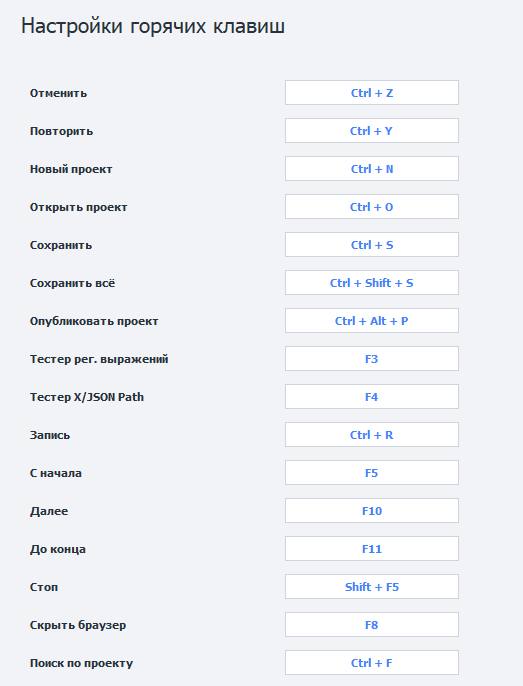

---
sidebar_position: 13
title: Горячие клавиши
description: Список горячих клавиш.
---  
:::info **Пожалуйста, ознакомьтесь с [*Правилами использования материалов на данном ресурсе*](../Disclaimer).**
:::
_______________________________________________
## Описание.
В настройках программы есть возможность указания сочетаний горячих клавиш для удобства работы.  

  
_______________________________________________
## Клавиатурные сокращения. 
| Клавиши              | Назначение | 
| :----------------: | :------ | 
| `ЛКМ по действию` + `Enter/Пробел`        |   Открывает настройки этого действия в плавающем окне    | 
| `Esc`           |   Закрывает настройки действия   | 
| `Clrl` + `C`    | Копирует выбранное действие   | 
| `Ctrl` + `X` |  Вырезает выбранное действие   |  
| `Ctrl` + `V` |  Вставляет действие из буфера обмена в то место, где находится курсор   |  
| `Ctrl` + `Z` |  Отменяет последнее действие   |  
| `Ctrl` + `Y` |  Повторяет последнее действие   |  
| `Ctrl` + `N` |  Создаёт новый проект   |  
| `Ctrl` + `O` |  Открывает существующий проект   |  
| `Ctrl` + `S` |  Сохраняет текущий проект   |  
| `Ctrl` + `F` |  Поиск по проекту   |  
| `Ctrl` + `Shift` + `S` |  Сохраняет текущий проект   |  
| `Ctrl` + `Alt` + `P` |  Публикует текущий проект   |  
| `Delete` |  Удаляет выбранное действие   |  
| `Up ᐃ` |  Перемещает  курсор вверх по группе или на предыдущее действие    |  
| `Down ᐁ` |  Перемещает  курсор вниз по группе или на следующее действие, идущее из успешного выхода   |  
| `Left ᐊ` |  Перемещает  курсор на первое входящее действие или вверх по группе |  
| `Right ᐅ` |  Перемещает  курсор на следующее действие, идущее из успешного выхода или вниз по группе  |  
| `Ctrl` + `Right ᐅ` |  Перемещает  курсор на следующее действие, идущее из неудачного выхода  |  
| `PageUp` |  Позволяет перейти на первое действие в группе   |  
| `PageDown` |  Позволяет перейти на последнее действие в группе   |
| `F3` |  Открывает конструктор регулярных выражений   |
| `F4` |  Открывает тестер X/JSON Path   |  
| `F8` |  Скрывает браузер   |
_______________________________________________  
## Операции с мышью.
| Сочетания              | Назначение | 
| :----------------: | :------ | 
| `Двойной клик ЛКМ по действию`  |   Открывает его настройки    | 
| `Зажать колёсико мыши` + `Двигать мышью`   |   Перемещение по полотну проекта   | 
| `Clrl` + `Крутить колёсиком мыши`    | Увеличивает/Уменьшает масштаб полотна   | 
| `Двойной клик ЛКМ по пустому месту полотна` |  Возвращает масштаб на 100%   |  
| `Двойной клик ЛКМ по любому выходу` + `Двойной клик ЛКМ по входу другого действия` |  Создаёт между ними связь   |
_______________________________________________  
## Горячие клавиши при отладке проекта.  
| Клавиши              | Назначение | 
| :----------------: | :------ | 
| `Clrl` + `R`  |   Включить/Отключить запись проекта   | 
| `F5`   |    Запустить проект с начала   | 
| `F10`    | Перейти к следующему действию   | 
| `F11` |  Выполнять проект до первой точки останова   |  
| `Shift` + `F5` |  Остановить выполнение   |  
_______________________________________________  
## Горячие клавиши при редактировании C# макроса.  
| Клавиши              | Назначение | 
| :----------------: | :------ | 
| `Clrl` + `C`  |   Скопировать выделенное    | 
| `Ctrl` + `X` |   Вырезать выделенное   | 
| `Ctrl` + `V`    | Вставить выделенное   | 
| `Ctrl` + `G` |  Перейти к строке номер n   |  
| `Shift` + `Delete` |  Вырезать текущую строку   |  
| `Ctrl` + `K` |  Закомментировать выделенные строки   |  
| `Ctrl` + `U` |  Раскомментировать выделенные строки   |  