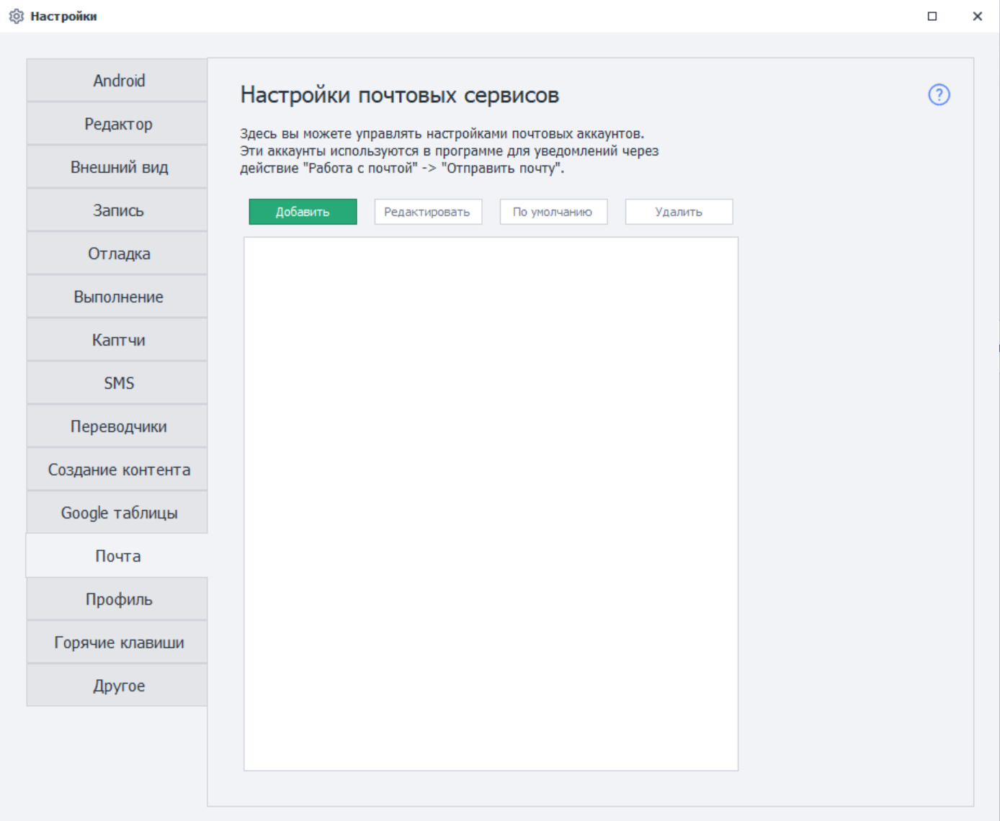
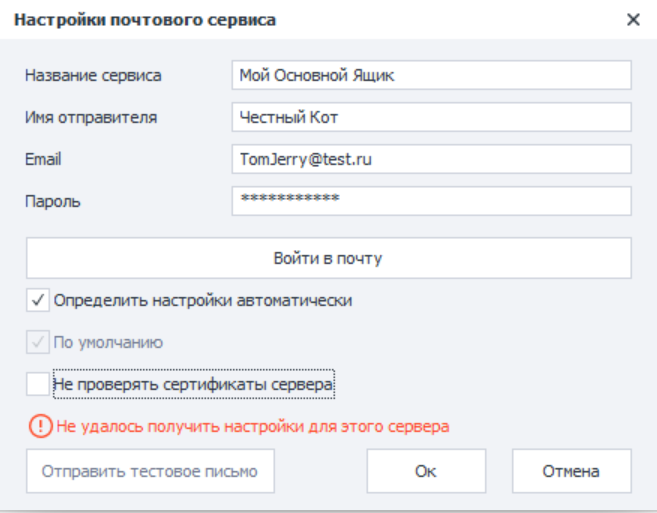
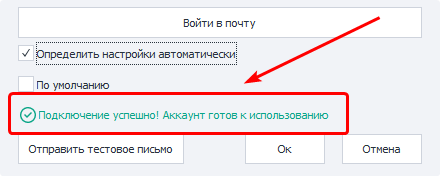
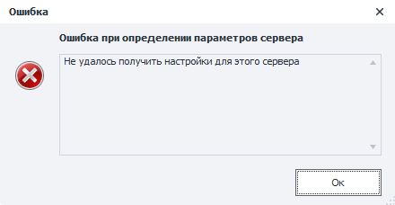
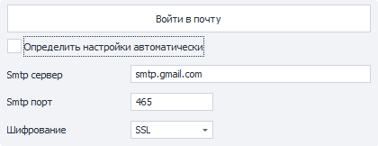

---
sidebar_position: 12
title: Почта
description: Настройка подключения к почтовым ящикам.
---  
:::info **Пожалуйста, ознакомьтесь с [*Правилами использования материалов на данном ресурсе*](../Disclaimer).**
:::
_______________________________________________  
## Описание.  
Этот раздел настроек предназначен для подключения почтовых ящиков, которые затем можно будет использовать для [**отправки писем**](../Project%20Editor/SendEmails).  

## Кнопка «Добавить».  
Клик по данной кнопке открывает окно для добавления нового подключения.  

  

### Название сервиса.
Кастомное обозначение этого аккаунта, которое вы придумываете самостоятельно. Под данным именем он будет отображаться в списке доступных, например, в экшене [**Отправить почту**](../Project%20Editor/SendEmails).  

:::warning **Это обязательный параметр, который должен быть уникальным в рамках программы.**
:::  

### Имя отправителя.  
Под этим именем будет отображаться отправитель в специальной графе у получателя.  

### Email.  
Полный адрес электронного ящика, с которого будет отправляться почта. Он должен быть настоящим, иначе программа выдаст ошибку.  

### Пароль. 
Пароль от этого ящика.  

Некоторые провайдеры электронных адресов в целях безопасности устанавливают специальный пароль для подключения сторонних программ. Он называется **Пароль приложений**. Получить его можно в настройках выбранного сервиса.  

### Кнопка «Войти в почту».  
После нажатия выполнится проверка корректности данных для подключения к SMTP-серверу. При этом правильность пары *Email-Пароль* не проверяется.  

В случае успешного подключения внизу окна появится зеленая надпись:  

  

Если же программе не удастся подключиться к серверу, то появится всплывающее окно с ошибкой:  

  

В этом случае нужно вручную настроить подключение. Для этого убираем галочку с опции **Определить настройки автоматически**.   

### Определить настройки автоматически.  
  

Когда данная настройка включена, то программа попытается автоматически подобрать настройки подключения к SMTP-серверу на основе введенного Email-адреса.  

Если после автоматических настроек вы получаете ошибку, то уберите галочку и введите их вручную, ориентируясь на информацию с сайта провайдера.  

### По умолчанию.  
При включении этой опции текущее подключение будет использоваться каждый раз по умолчанию во всех кубиках [Отправки почты](../Project%20Editor/SendEmails), если не указано иное.  

### Не проверять сертификаты сервера.  
В некоторых случаях при подключении аккаунта можно получить ошибку:  
**`An error occured while attempting to establish an SSL or TLS connection`**.  

Возникает такая ошибка чаще всего при установке незащищенного соединения с сервером почты. Провайдер же из-за этого отказывает в подключении, так как система не может проверить подлинность SSL/TLS сертификатов.  

Причины могут быть различными, вот самые частые из них:  
- Старая версия Windows, у которой давно не обновлялись доверенные сертификаты;  
- Антивирус, подменяющий сертификаты сервера для расшифровки и проверки входящего трафика;  
- Включенные файервол или брандмауэр.  

Решение следует из конкретной причины. Можно обновить Windows или же отключить Файервол/Брандауэр. В случае же с антивирусом особое внимание нужно уделить настройкам проверки входящего трафика и почты.  

Если же ничего не помогает, тогда включайте данную настройку. После этого любые сертификаты, отправленные сервером для установки соединения, проверяться не будут, а соединение успешно отметится как защищенное.  

:::warning **При отключении проверки сертификатов ваш трафик с Email-провайдером может быть перехвачен.**
::: 

### Кнопка «Отправить тестовое письмо».  
При её нажатии ZennoDroid попытается отправить письмо на ваш Email, используя указанный SMTP-сервер. Это нужно для проверки работоспособности введёных данных.  

Если учётные данные аккаунта указаны корректно, то отобразится статус: **`Тестовое письмо отправлено успешно`**. Это значит, что почтовый сервис готов к использованию в программе.  

В случае введения неправильной информации отобразится ошибка: **`Не удалось отправить тестовое письмо`**. В окне можно будет увидеть её более детальное описание.  

:::tip **Некоторые Email-провайдеры требуют явного включения доступа к почте для сторонних программ.**
Найти самостоятельно подходящие настройки можно с помощью запроса в поисковой системе:  
`smtp настройки подключения <НАЗВАНИЕ_ВАШЕГО_ПРОВЙДЕРА>`
:::  

## Кнопка «Редактировать».  
С помощью этой кнопки можно отредактировать добавленные ранее почтовые аккаунты.

## Кнопка «По умолчанию».  
Данная опция позволяет изменить аккаунт, который будет использоваться по умолчанию.  

## Кнопка «Удалить».
Удаляет выбранный аккаунт из настроек программы. 
_______________________________________________  
## Полезные ссылки.    
- [**Принять почту**](../Project%20Editor/SendEmails).   
- [**Окно переменных**](../pm/Interface/Variables).