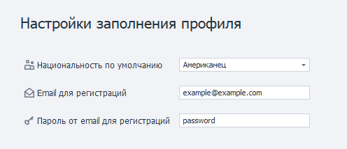
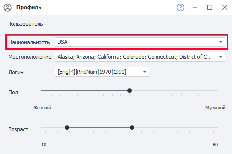
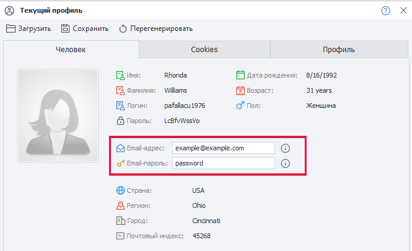

---
sidebar_position: 3
title: Настройки профиля
description: Генерация характеристик при старте проекта.
---  

## Настройки заполнения профиля.  
   

Позволяют указать характеристики, который будет генерироваться по умолчанию при старте проекта.  
_______________________________________________
### Национальность по умолчанию.  
  
   
Национальность для генерации профиля. Её также можно изменить и на уровне шаблона, в настройках профиля проекта.  
_______________________________________________
### E-mail для регистраций.  
Указанный в этой настройке *e-mail* будет использоваться для всех новых профилей.  
Его также можно изменить через переназначение полей в **Операциях над профилем**.  
Значение хранится в переменной окружения `{-Profile.Email-}`.  

   
_______________________________________________
### Пароль от e-mail для регистраций.  
Этот *пароль от e-mail* будет использоваться для всех новых профилей. Его также можно изменить в  
**Операциях над профилем**. Значение хранится в переменной окружения `{-Profile.EmailPassword-}`.