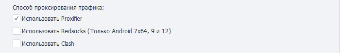

---
sidebar_position: 11
title: Проксирование трафика
description: Подробнее про Proxifier и Redsocks. 
---  
:::info **Пожалуйста, ознакомьтесь с [*Правилами использования материалов на данном ресурсе*](../Disclaimer).**
:::
_______________________________________________  
## Описание.  
ZennoDroid позволяет выбрать способ проксирования трафика для выполнения экшена [**Установка прокси**](../Android/setting#как-поставить-прокси).  

Параметры задаются на вкладке ***Настройки Android***. По умолчанию используется **Proxifier**.  

  

**При одновременном включении обоих вариантов** проксирование трафика автоматически распределится в зависимости от образа устройства:  
- Android 7x64 и Android 9.0: **Redsocks2**;  
- Android 5.1 и Android 7x86: **Proxifier**.  
_______________________________________________ 
### [Proxifier](https://proxifier.com/).  
Это мощная и гибкая программа для перенаправления интернет-трафика через прокси-сервер. Она позволяет приложениям, которые не поддерживают работу через прокси, использовать его.   

Эмулятор будет проксироваться на основе его PID в Windows.  

:::tip **PID (Process Identifier).**  
Это уникальный числовой идентификатор, присваиваемый каждому процессу операционной системой. Он используется для управления процессами, их отслеживания и взаимодействия с ними.  

PID уникален только в пределах одного момента времени. Когда процесс завершается, его PID может быть повторно использован для нового процесса.
:::  
_______________________________________________ 
### Redsocks.  
Данная утилита нужна для перенаправления сетевого трафика через прокси-сервер, минуя необходимость ручной настройки прокси в каждом отдельном приложении. Выполняется прозрачный редиректор TCP/UDP-соединений в прокси.  

:::warning **Работает только на образах Android 7x64 и Android 9.0.**
:::  

По умолчанию DNS-запросы будут направляться через прокси-сервер. Поэтому если ваши запросы будут блокироваться (не подключается к интернету или возникает ошибка **`DNS_PROBE_FINISHED_NO_INTERNET`**), то необходимо отключить перенаправление.  

:::info **С# код для отключения перенаправления DNS-запросов.**  
```
instance.DroidInstance.Proxy.UseDnsTcp = false;
instance.DroidInstance.Proxy.UseDnsUdp = false;  
```  
**Этот код необходимо выполнить перед установкой прокси.**
:::  

#### Адреса DNS.  
При использовании Redsocks можно настроить адреса DNS-сервера. Если их несколько, то разделять нужно запятой `,`  

Все DNS-запросы будут направляться через прокси-сервер.  

:::info **С# код для указания DNS-сервера у каждого потока в отдельности.**  
```
instance.DroidInstance.Proxy.SetDnsServers("8.8.8.8,8.8.4.4"); 
```  
**Этот код необходимо выполнить перед установкой прокси.**
:::  
_______________________________________________ 