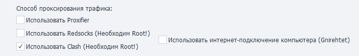

---
sidebar_position: 11
title: Проксирование трафика (Enterprise)
description: Проксирование трафика на реальном устройстве. 
---  
:::info **Пожалуйста, ознакомьтесь с [*Правилами использования материалов на данном ресурсе*](../Disclaimer).**
:::
_______________________________________________  
## Описание.  
ZennoDroid позволяет выбрать способ проксирования трафика для выполнения экшена [**Установка прокси**](../Android/Enterprise/setting#как-поставить-прокси).  

Параметры задаются на вкладке [**Настройки Android**](../Android/Enterprise/setting#как-поставить-прокси). По умолчанию используется **Proxifier**.  

    
_______________________________________________ 
### [Proxifier](https://proxifier.com/).  
Это мощная и гибкая программа для перенаправления интернет-трафика через прокси-сервер. Она позволяет приложениям, которые не поддерживают работу через прокси, использовать его.   

Используется интернет-подключение компьютера. Весь трафик с телефона заворачивается в VPN с помощью Gnirehtet и передаётся на ПК, где уже проксируется через приложение Proxifier.  

:::tip **Gnirehtet — это инструмент, который позволяет раздавать интернет с компьютера на Android-устройство.**
Работает, как привычная всем "точка доступа", но с обратным смыслом. Это полезно в ситуациях, когда у вашего телефона нет мобильного интернета или доступа к Wi-Fi, но ваш компьютер подключен к сети.  

Программа работает через USB-кабель или по беспроводной сети и не требует root-прав на устройстве. 
:::
__________________________________________ 
### Redsocks.  
Данная утилита нужна для перенаправления сетевого трафика через прокси-сервер, минуя необходимость ручной настройки прокси в каждом отдельном приложении. Выполняется прозрачный редиректор TCP/UDP-соединений в прокси.  

Все необходимые файлы копируются на устройство автоматически при первой установке прокси.

:::warning **Работает только на устройствах с Root.**
:::  
_______________________________________________ 
### Clash.  
Это продвинутый прокси-клиент с возможностью маршрутизации трафика по заданным правилам. Он отличается мощным rule-based подходом и сам решает через какой сервер направить трафик в зависимости от настроенных правил. 

Простое и полное проксирование всего UDP-трафика — в отличие от redsocks, не требуется настраивать отдельное проксирование для каждого IP. Благодаря этому, при использовании прокси с поддержкой UDP, даже IP-адрес через WebRTC отображается как адрес прокси.  

:::warning **Работает только на устройствах с Root.**
Необходим BusyBox версии не ниже 1.36.1.
:::  
__________________________________________
### Использовать интернет-подключение компьютера (Gnirehtet).  
Если эта настройка выключена, то весь интернет-трафик будет передоваться через Wi-Fi подключение телефона.  

Но при её включении весь трафик с телефона начинает заворачиваться в VPN с помощью Gnirehtet и передаваться на компьютер.  

:::info **Обязательно выключите передачу данных на телефоне.**
Мы рекомендуем так сделать, если для проксирования трафика используется интернет-подключение компьютера. Это поможет избежать случайной утечки трафика в сеть через Wi-Fi или мобильный интернет смартфона. 

Сделать это можно вручную или с помощью экшена [Консольные команды](../Android/ProLite/ADB_Shell):

- Выключить WiFi: `svc wifi disable`
- Включить WiFi: `svc data disable`
:::  
_______________________________________________
