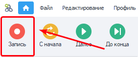
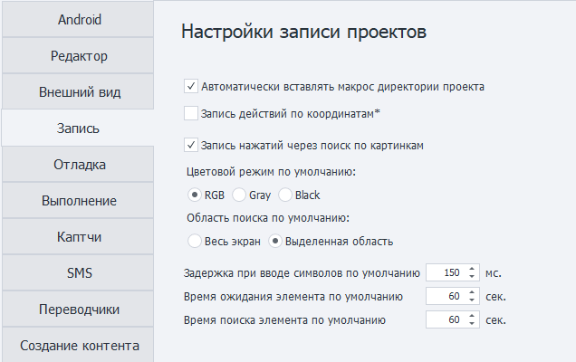
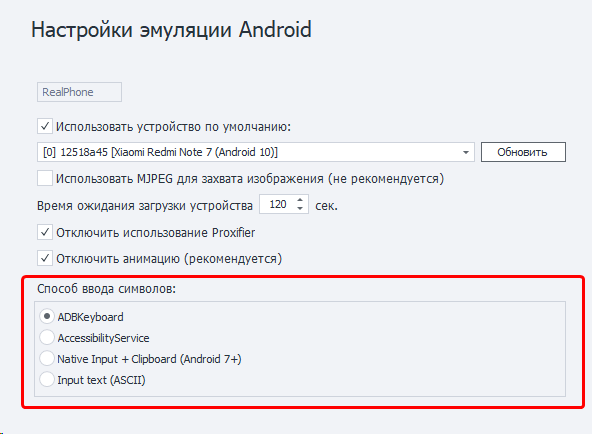

---
sidebar_position: 2
title: Запись и Ввод
description: Запись проекта, а также доступные способы ввода. 
---  
:::info **Пожалуйста, ознакомьтесь с [*Правилами использования материалов на данном ресурсе*](../Disclaimer).**
:::

**Краткое содержание**

<!--All you need is a blank line-->

    + Запись проекта. 
        + Автоматически вставлять макрос директории.
        + Запись действий по координатам.
        + Запись нажатий через поиск по картинкам. 
        + Задержка при вводе символов 
        + Время ожидания и поиска элемента.
    + Способы ввода.   
        + ADBKeyboard. 
        + AccessibilityService.  
        + Native input + Clipboard.  
        + Input text. 
        + Не установилась клавиатура ADBKeyboard. Что делать?

## Запись проекта.  
  

Данная вкладка содержит настройки, которые активируются при включенной записи проекта.  

 
_______________________________________________
### Автоматически вставлять макрос директории.  
:::tip **Интересно.**
*Эта настройка работает даже **при выключенной записи** проекта.*
:::   

В ZennoDroid существуют ***переменные окружения***. Например, `{-Project.Directory-}`, в которой хранится путь к директории, где сохранён файл проекта.  
:::info **Внимательно.**
*Если проект не сохранён на диске, то переменная содержит пустую строку.*
::: 

При включении данной настройки во время создания проекта ProjectMaker будет подставлять макрос  
**директории проекта** туда, куда это возможно. Например, в другие настройки и экшены.  
Указываемый путь должен находиться в той же папке, что и файл проекта, либо в одной из подпапок.  
_______________________________________________
### Запись действий по координатам.  
Эта настройка отвечает за то, что при записи проекта все клики внутри **Окна эмулятора** будут записываться вместе с координатами. В проект добавятся экшены ***эмуляции touch***, в которые автоматически внесутся координаты нажатия.  
:::warning **Важно.**
Разрешение эмулятора должно быть одинаковым во время создания и выполнения проекта!
:::
  
### Запись нажатий через поиск по картинкам.  
После включения параметра при каждом клике внутри **Окна эмулятора** в проект будет добавлен ***экшен touch*** через **Поиск по картинке**.  
#### Цветовой режим.  
Поиск по картинке будет по умолчанию производиться в одном из режимов:    
- **RGB**. Поиск по цветному изображению.        
- **Gray**. Картинка только с оттенками серого.      
- **Black**. Черно-белый режим.  
 
:::tip **Советуем.**
*Для ускорения поиска производите поиск в режиме **Gray** или **Black***
:::   
 
#### Область поиска.  
Выбор области, которая будет выставляться по умолчанию:  
- По всему экрану.  
- По выделенной области экрана. 
:::info **Внимательно.**
*В целях снижения нагрузки на CPU лучше производить поиск по области экрана*
::: 

### Задержка при вводе символов 
Используется в экшенах **Эмуляция клавиатуры** и **Установка значения** в качестве *значения по умолчанию*.  
_______________________________________________
### Время ожидания элемента.  
Применяется в действиях **Установка значения**, **Взятие значения** и **Выполнить событие**  в качестве *значения по умолчанию* для поля ***«Ждать элемент не более (сек)»***.  
_______________________________________________
### Время поиска элемента.  
Используется в экшене **Поиск по картинке** в качестве *значения по умолчанию* для поля  
***«Ждать элемент не более (сек)»***.  
_______________________________________________
## Способы ввода.  
В программе есть **4 способа** ввода символов с клавиатуры.  
  
Ввод символов по-разному работает на устройствах, поэтому наличие нескольких способов дает возможность самостоятельно подобрать оптимальный. Первые три варианта позволяют вводить любые символы, включая эмодзи, последний же работает только с ASCII.  
_______________________________________________
### Подробное описание.  
#### ADBKeyboard.  
Применяется сторонняя клавиатура. Автоматически устанавливается при подключении к устройству. Позволяет вводить символы, как если бы их набирали на виртуальной клавиатуре.  
#### AccessibilityService.  
Используется [***UiAutomator2***](https://github.com/appium/appium-uiautomator2-driver). Позволяет задать любое значение полю, которое находится в фокусе.  
По своей сути не является вводом символов, а просто меняет у поля свойство **Text** на нужное значение.  
:::tip **Имейте в виду.**
*Не будет работать в приложениях, в которых нет стандартного дерева элементов. Например, в играх.*
::: 
  
#### Native input + Clipboard.
Ввод символов осуществляется через интерфейс **IInputManager** и **IClipboard**. Работает достаточно быстро.
:::info **Внимательно.**
*Ввод кириллицы/эмодзи возможен только на Android 7 и выше, ASCII - на любых устройствах.* 
:::  
  
#### Input text.  
Аналог команды ***input text***, но с добавлением всех необходимых преобразований текста для корректного ввода спецсимволов  `< > | ) (` и прочих. Позволяет вводить **только ASCII символы**.  
:::info **Рекомендуем.**
*Посимвольный ввод работает медленно, поэтому лучше выбирать тип ввода с **отключенной задержкой**.*
::: 
  
### Не установилась клавиатура ADBKeyboard. Что делать?  
1. Нужно установить на телефон приложение ***com.android.adbkeyboard.apk*** (*файл лежит в корневой папке с программой*). Например, с помощью экшена **Установить приложение**.  
2. Зайти на телефоне в настройки языка ввода и поставить галку на ***AdbKeyboard***.  
3. Выполнить экшен **Запустить ВМ**. Это активирует клавиатуру. Она появится в любом поле, где нужно ввести текст - снизу вы увидите маленькое уведомление `Adb keyboard ON`.   
 