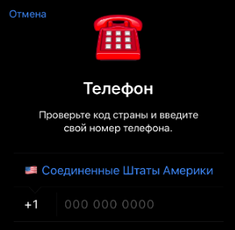
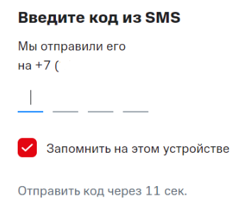
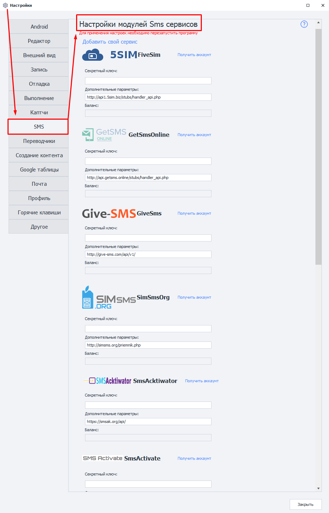
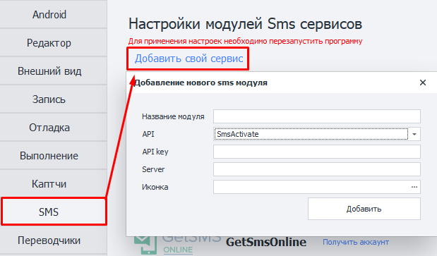
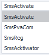
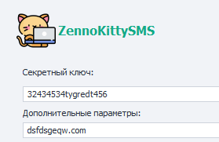
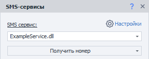

---
sidebar_position: 8
title: SMS
description: Настройки подключения SMS-сервисов. 
---  
:::info **Пожалуйста, ознакомьтесь с [*Правилами использования материалов на данном ресурсе*](../Disclaimer).**
:::
_______________________________________________ 
## Описание.  
Некоторые ресурсы для подтверждения регистрации требуют ввести номер мобильного телефона, на который будет отправлен проверочный код.  

|       | 
| :--------: | 
| **Примеры запросов SMS для входа.**  |

Именно для этого могут понадобиться сторонние SMS-сервисы. А мы постараемся упростить работу с ними.   
_______________________________________________ 
## Как подключиться?

### Секретный ключ.
Чаще всего для работы с сервисом необходим так называемый **API ключ**. Это *уникальная строка из случайных символов*, благодаря которой сервис может вас идентифицировать. Например, он может выглядеть вот так: `8fc9b30e544885b8480fb590dfcbdd71`.  

Для получения API ключа вам нужно перейти на сайт подходящего сервиса и ознакомиться с его условиями. Когда определитесь с выбором, выполните регистрацию в SMS-сервисе и получите свой *API-ключ* в личном кабинете.  

### Дополнительные параметры.
Тут пишется **URL-адрес (домен)** для приёма API-запросов. Он установлен в программе по умолчанию и его **не нужно менять без необходимости**. Если вдруг URL не прописан заранее, то его необходимо уточнить в документации выбранного сервиса.  

### Баланс.  
После авторизации в сервисе в данном поле появится ваш текущий баланс.  

:::warning **Если после ввода API-ключа данное поле остаётся пустым, значит произошла какая-то ошибка.**
Возможные варианты: введён неправильный ключ, неполадки у сервиса, ключ был забанен.
:::
_______________________________________________
## Доступные  сервисы.  
- [5SIM Five Sim](http://5sim.net/);    
- [GetSmsOnline](http://getsms.online/);  
- [Give-SMS](http://give-sms.com/);  
- [SIMsmsOrg](http://simsms.org/);  
- [SMSAcktiwator](http://sms-acktiwator.ru/);  
- [SMS Activate](http://sms-activate.ru/ru/);  
- [SmsHub](https://smshub.org/);  
- [SMSpvaCom](http://smspva.com/);  
- [SMS-REG](http://sms-reg.com/);  
- [VAK-SMS](http://vak-sms.com/);  
- [virtualSMS](http://virtualsms.ru/);  
_______________________________________________  
## Свой сервис.
### Добавить свой сервис (модуль).  
Вы также можете добавить собственный сервис приёма SMS на основе API популярных сервисов.  

  
### Необходимые параметры. 
:::tip **Если вы не уверены, какие данные нужно вводить.**
То проконсультируйтесь с поставщиком услуг.
:::
#### Название модуля.  
Указываем имя нового сервиса, **максимум 20 символов**.  

#### API.  
  

Выбираем API сервиса, на основе которого создадим свой модуль.  

#### API-key.
Ключ от сервиса. Тот же самый, который указываем в поле **Секретный ключ** при подключении сервиса.  

#### Server.  
URL-адрес (домен), куда будут отправляться запросы для приёма SMS.  

#### Иконка.  
Указанная картинка будет отображаться рядом с нашим модулем.  

  

Доступные форматы: `jpg`, `bmp`, `gif`, `png`.

### Работа с добавленным сервисом.
После добавления модуля его можно будет выбрать в экшене ***Работа с SMS сервисами***. А далее работать с ним, как и со встроенными сервисами. 

  

### Удаление модуля.  
Чтобы убрать созданный модуль из программы, **необходимо удалить два файла**:  
- `c:\Users\USERNAME\AppData\Roaming\ZennoLab\Configs\ИмяМодуля.dll.config`  
- `c:\Users\USERNAME\AppData\Roaming\ZennoLab\CustomModules\Sms\ИмяМодуля.dll`  

:::warning **Рекомендуем закрыть ZennoDroid и ProjectMaker перед удаление этих файлов.**
:::