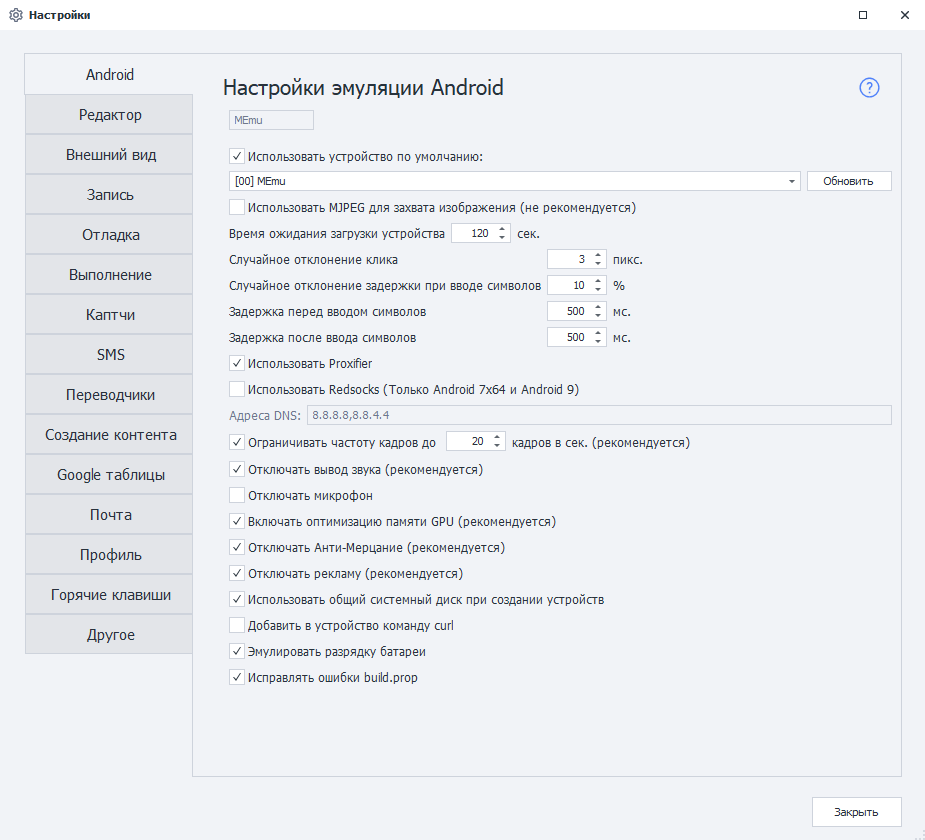
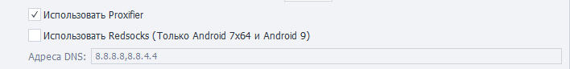
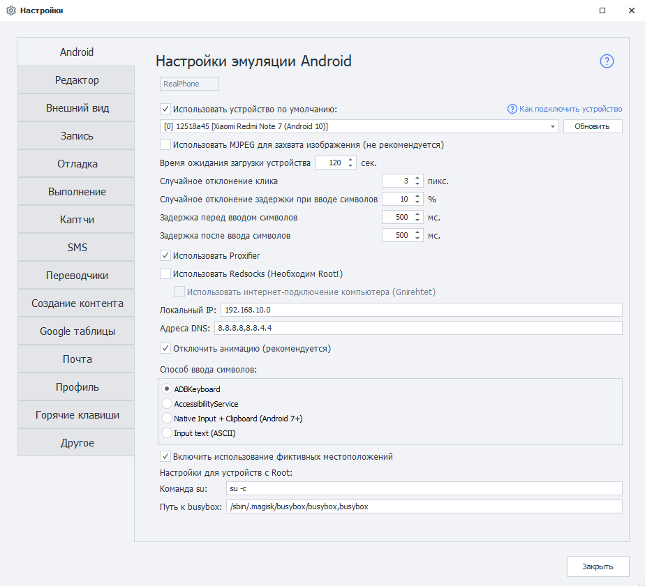

На этой вкладке находятся различные параметры для настройки эмуляции Android, а также настройки реального устройства на базе Android.    

**Краткое содержание**

<!--All you need is a blank line-->

    + Параметры при работе с Memu. 
        + Использовать устройство по умолчанию.
        + Использовать MJPEG для захвата изображения. 
        + Время ожидания загрузки устройства.  
        + Случайное отклонение клика.  
        + Случайное отклонение при вводе символов.
        + Задержка перед и после ввода символов.
        + Проксирование трафика (Proxifier и Redsocks).
        + Ограничивать частоту кадров.
        + Отключать вывод звука и микрофон.
        + Включить оптимизацию памяти GPU.
        + Отключить Анти-Мерцание.
        + Отключить рекламу.
        + Использовать общий системный диск.
        + Добавить в устройство команду cURL.
        + Эмулировать разрядку батареи.
    + Параметры для версии Enterprise.   
        + Время ожидания загрузки устройства.  
        + Отключение анимации.  
        + Способ ввода символов.  
        + Использование фиктивных местоположений. 
        + Настройки для устройств с Root  

 

## Параметры при работе с Memu.  
     
### Использовать устройство по умолчанию.  
Эта настройка позволяет выбрать устройство, которое будет использоваться по умолчанию в  
Project Maker — при условии, что не выбрано другое устройство. При этом данное устройство  
будет игнорироваться ZennoDroid'ом при случайном выборе из списка доступных.  

Если вы хотите использовать выбранное устройство при выполнении проектов в ZennoDroid, то необходимо отключить эту настройку, чтобы не возникало ошибки ***Устройство занято в Project Maker***.
> *Кнопка **«Обновить»** позволяет обновить список доступных устройств*.  
### Использовать MJPEG для захвата изображения.    
Альтернативный способ захвата изображения с устройства. Эту настройку стоит включать только в том случае, если при запуске устройства через ZennoDroid процесс всегда завершается ошибкой, а в логе появляется запись ***Не удалось захватить изображение***.  
### Время ожидания загрузки устройства.  
Это время, отведённое на загрузку эмулятора. Если не удалось загрузить устройство за отведённое здесь время, то выполнение завершится с ошибкой.  
### Случайное отклонение клика.  
Позволяет делать клики с небольшим отклонением от заданных параметров. Используется в экшенах:  
- ***Поиск по картинке***. Нажатие на экран будет осуществляться не в точное место, а с небольшим смещением.  
- ***Выполнить событие***. Если для координат нажатия выбран **Центр**, то нажатие на элемент будет произведено не точно, а с небольшим отклонением.  
### Случайное отклонение при вводе символов.  
Используется в экшенах **Эмуляция клавиатуры** и **Установка значения**. Позволяет настроить отклонение задержки от заданного значения.  

Например, если задана задержка 150 мс, а отклонение 10%, то реальная задержка при вводе каждого символа составит от 135 мс до 165 мс.  
### Задержка перед и после ввода символов.  
Как и прошлый параметр, используется в действиях **Эмуляция клавиатуры** и **Установка значения** для установки задержки.  
### Проксирование трафика (Proxifier и Redsocks).  
ZennoDroid позволяет выбрать способ проксирования трафика для выполнения экшена **Установка прокси**. По умолчанию используется Proxifier.  

 
### Ограничивать частоту кадров.  
Эта настройка влияет на FPS запускаемых эмуляторов. Если она включена, то всем эмуляторам будет принудительно установлено указанное количество кадров.  
### Отключать вывод звука и микрофон.  
Возможность выключать у эмуляторов звук, а также использование микрофона. Отключение звука снижает нагрузку на процессор.  
### Включить оптимизацию памяти GPU.
Лучше всегда держать включенной, так как позволяет снизить нагрузку на видеокарту.  
### Отключить Анти-Мерцание.  
Эта функция позволяет решить проблему мерцания экрана, что позволяет улучшить отображение картинки.  
> *При запуске одновременно нескольких эмуляторов **рекомендуется отключать** Анти-Мерцание для снижения нагрузки на систему.*  
### Отключить рекламу.  
В лаунчер Memu вшит показ рекламы. Это может сломать работу шаблона, так как реклама отображается поверх всех окон. Рекомендуется всегда её отключать.  
### Использовать общий системный диск.  
При создании нового эмулятора будет использоваться общий системный диск. Его можно использовать вообще для всех эмуляторов, тем самым значительно экономя память. Например, один системный диск Android 9 занимает ~ 2ГБ.  

Общий диск работает в режиме только для чтения, то есть на него нельзя записать информацию (как правило, это и не требуется).  

Способ подключения диска для уже созданны х эмуляторов, можно изменить с помощью специального экшена.  
### Добавить в устройство команду cURL.   
В новых версиях Memu эта утилита добавлена по умолчанию, но только для Android 7.1. Этот параметр позволяет добавить cURL в более старые версии эмулятора, а также в эмуляторы на базе Android 5.1.  
### Эмулировать разрядку батареи.  
По умолчанию батарея всегда находится в состоянии ***Заряжается*** и её заряд равен 100%. При включении этой настройки батарея будет разряжаться (~ до 20%), а затем заряжаться (~ до 70%).  
## Параметры для версии Enterprise.  
  
Многие настройки дублируют таковые из первой части статьи, поэтому далее буду перечислены только отличающиеся.  
### Время ожидания загрузки устройства.  
С помощью этого параметра можно задать тайм-аут ожидания подключения к устройству в секундах, прежде чем появится ошибка.  
### Отключение анимации.  
Настройка позволяет отключить плавную анимацию переходов, которая сильно замедляет работу с устройством.  
### Способ ввода символов.  
Настройка позволяет выбрать наиболее подходящий способ эмуляции ввода символов:  
- **ADBKeyboard**.  
- **AccessibilityService**.  
- **Native input + Clipboard**.  
- **Input text**.  
> *Первые три способа выводят любые символы, включая кириллицу и эмодзи. Последний же только ASCII символы.*  
### Использование фиктивных местоположений.  
Данный параметр нужен для подмены местоположения устройства через экшен **Установка Geo-позиции**.  
### Настройки для устройств с Root.  
Эти настройки необходимы для экшенов **Сохранить/восстановить данные приложения**. Мы не рекомендуем менять эти параметры без необходимости.  

Команда `su` позволяет указать путь и параметры для запуска команд с привилегиями суперпользователя. По умолчанию: `su -c`.  

Настройка **Путь к busybox** позволяет указать путь к файлу busybox.  
По умолчанию: `/sbin/.magisk/busybox/busybox`.  

