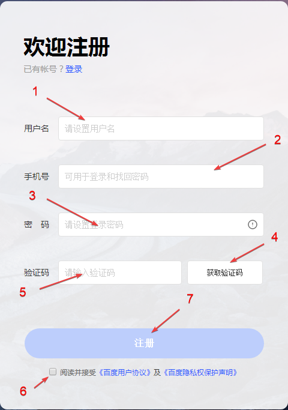
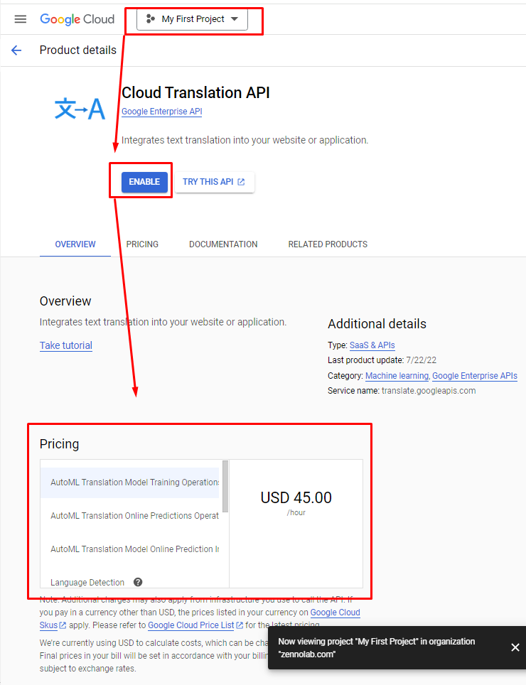

---
sidebar_position: 9
title: Переводчики
description: Настройки сервисов для перевода текста. 
---  
:::info **Пожалуйста, ознакомьтесь с [*Правилами использования материалов на данном ресурсе*](../Disclaimer).**
:::
_______________________________________________
## Описание.  
В этом разделе настроек вводятся данные для использования в проектах сервисов автоматического перевода.  
**Они нужны для:**  
- *перевода статей*;  
- *перевода текста сообщений на язык получателя*;  
- *перевода заготовленного текста для ботов-автоответчиков*.

  
 _______________________________________________ 
## Baidu Translate.
  

:::info **Родной язык ресурса - китайский.**  
Поэтому для удобства настройки рекомендуем воспользоваться браузером со встроенным переводчиком.
:::

### Получение секретного ключа.  
#### 1. Заходим на [сайт сервиса](https://fanyi.baidu.com/).  
#### 2. Наводим курсор на указанный иероглиф:  
  
#### 3. Появится выплывающее окно для авторизации:  
  
#### 4. Авторизация в сервисе.
  

**1**. Вводим сюда логин и пароль.  
**2**. Кнопка для авторизации.  
**3**. Восстановление пароля.  
**4**. Вернутся к авторизации через приложение.  
**5**. Создать аккаунт.  

#### 5. Создать новую учётную запись.  
В окне авторизации выбираем **Зарегистрироваться**:  

  

Открывается страница ввода ваших данных для создания новой учётной записи:  

  

**1**. Имя пользователя.    
**2**. Номер телефона без кода страны.  
:::info **Принимаются только китайские номера.**  
:::   
**3**. Пароль, соответствующий требованиям сервиса.    
**4**. Кнопка для отправки авторизационного СМС.    
**5**. Поле для ввода кода из СМС.  
**6**. Согласиться с условиями пользования сайтом.  
**7**. Регистрация.    

После регистрации в личном кабинете можно будет скопировать ключ и вставить его в **Настройках ZennoDroid**.  
_______________________________________________
## Deepl Translate.  

:::info **Сервис временно не работает с гражданами и компаниями из РФ.**  
Но если у вас есть действующий способ оплаты одной из стран: ЕС, Швейцарии, Великобритании, США, Канады или Японии, то вы можете получить доступ к DeepL Pro, введя эти данные при оплате.  
:::  

### Получение секретного ключа.  
#### 1. Переходим на [сайт сервиса](https://www.deepl.com/ru/translator) и нажимаем кнопку с тремя полосками в правом верхнем углу.  
  
#### 2. Нажимаем на вкладку **Расценки**.  
  
#### 3. Выбираем **DeepL API** и далее один из двух планов: DeepL API Free *(бесплатный)* или DeepL API Pro *(4.99€)*.  
  
#### 4. Теперь вводим свой **email** и придумываем **пароль**.  
  
#### 5. Далее заполняем личные данные *(страну, адрес, имя и фамилию)*.  
  
#### 6. Затем указываем реквизиты карты.   
  

Даже если выбираете бесплатный план, то карта всё равно должна быть действующей, чтобы регистрация прошла успешно.  
#### 7. После успешного оформления переходим в Личный кабинет → Ключи API.  
  

Полученный API-ключ нужно вставить в настройки ZennoDroid.  
_______________________________________________
## Google Translate через API  
:::info **Сервис временно не работает с гражданами и компаниями из РФ.**  
::: 

  

:::tip **Перед использованием рекомендуем внимательно ознакомиться с тарифами и ценами.**  
::: 

### Получение секретного ключа. 
#### 1. Для начала нужно войти в свой аккаунт Google.  
   
#### 2. Затем создать первый проект на платформе [**Google Cloud**](https://console.cloud.google.com/projectcreate).  
  
#### 3. Теперь выбирайте свой проект и добавляйте [**Cloud Translation API**](https://console.cloud.google.com/apis/library/translate.googleapis.com?inv=1&invt=AbeTEA&project=sonic-verbena-438109-p0).  
 

:::info **Предварительно нужно создать платёжный аккаунт в сервисе.**  
:::  

#### 4. Получаем API key и вставляем его в настройки ZennoDroid.  
_______________________________________________
## Google Translate в Веб-Интерфейсе.  
Настройка для данного метода не требуется, просто используйте [**онлайн переводчик**](https://translate.google.com/) в браузере.  

:::tip **Работает бесплатно.**  
:::
_______________________________________________
## Microsoft Translation. 
:::info **Сервис временно не работает с гражданами и компаниями из РФ.**  
::: 

  

:::tip **Перед использованием рекомендуем внимательно ознакомиться с тарифами и ценами.**  
:::  

### Получаем API key.
#### 1. Заходим на сайт [**Microsoft Azure**](https://azure.microsoft.com/en-gb/pricing/purchase-options/azure-account/) и авторизуемся, либо создаём новый аккаунт.    
  

:::tip **Доступен пробный период на 30 дней.**  
:::

#### 2. После получения пробного периода переходим на страницу [Служб Azure](https://portal.azure.com/) и **Создаём свой ресурс**.  
  

#### 3. Через поисковую строку находим Переводчик, открываем его и нажимаем Создать.  
  

#### 4. Получаем API key и вставляем его в ZennoDroid.  
_______________________________________________
## Яндекс Переводчик.  

### Получаем секретный ключ.  
#### 1. Регистрируемся на платформе [**Yandex Cloud**](https://yandex.cloud/ru/services/translate).  
  

:::tip **Начисляется стартовый грант для знакомства с платформой.**  
:::

#### 2. После авторизации переходим в [**личный дашборд**](https://console.yandex.cloud/folders/) и создаём платёжный аккаунт.  
  

#### 3. Теперь нужно создать [**сервисный аккаунт**](https://yandex.cloud/ru/docs/iam/concepts/users/service-accounts).
  

#### 4. Далее на [**личном дашборде**](https://console.yandex.cloud/folders/) нужно перейти в раздел Права доступа.  
Рядом с нужным аккаунтом нажимаем на **значок из трёх точек → Изменить роли → Добавить роль → `ai.translate.user`**.  

  

#### 5. Переходим в Сервисный аккаунт и создаём API ключ.  
  

:::warning **Значение ключа доступно для просмотра только один раз, сразу после его создания.**  
:::  
_______________________________________________
## Пример использования.  
В ходе выполнения проекта можно переводить различный используемый контент. Например, перевести фразу с русского на английский, чтобы отправить её в сообщении.  

  

1. Получаем строку с текстом из ***Списка***.  
2. Добавляем экшен ***Обработка текста***.  
3. Настраиваем функцию перевода, указав желаемый сервис и параметры.  
4. Отправляем переведённое сообщение адресату.  

