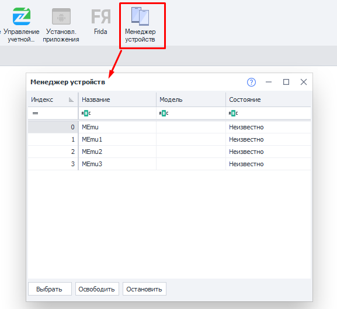
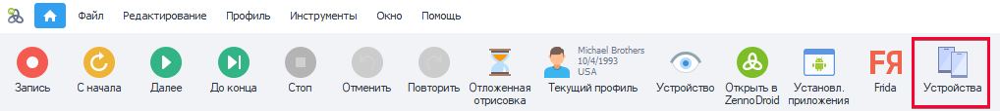
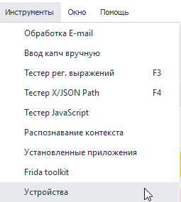
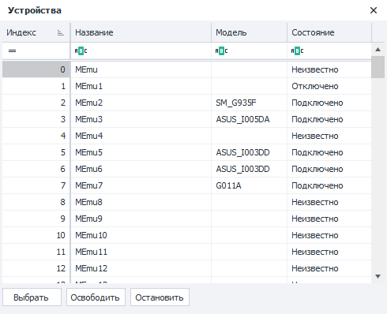
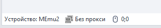
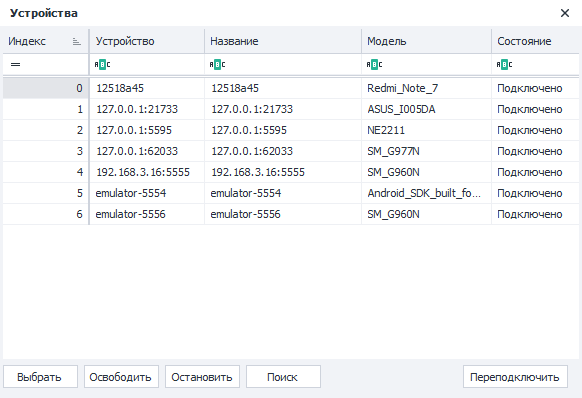
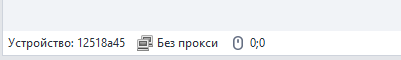

:::info **Пожалуйста, ознакомьтесь с [*Правилами использования материалов на данном ресурсе*](../Disclaimer).**
:::
_______________________________________________  
## Memu.  
  

В данном окне отображаются все виртуальные устройства, созданные в MEmu. Здесь можно получить краткую информацию о них и быстро переключиться между ними.  

### Как его открыть?  
Есть два способа.  
#### Через Панель инструментов.  
  

#### В выпадающем списке раздела «Инструменты».  

### Описание доступных элементов.  
  

#### Колонки:  
- **Индекс**. Порядковый номер устройства.  
- **Название**. По умолчанию все устройства проименованы в формате `MEmu+Индекс`. Но для удобства распознавания вы можете задать более конкретное имя. Сделать это можно:  
    - нажав на нужную ячейку + F2,  
    - через экшен ***Переименовать***.  
- **Модель**. Тут указывается модель телефона. Информация отображается только для подключённых в данный момент устройств.  
- **Состояние**. Статус подключения эмулятора.  
    - *Подключено*. Всё в порядке, с устройством можно работать.  
    - *Отключено*. Эмулятор запущен, но ZennoDroid не может с ним взаимодействовать.  
    Возможные пути решения:  
        - *перезагрузить устройство*,  
        - *удалить устройство*,  
        - *создать новое устройство*.  
    - *Неизвестно*. Эмулятор остановлен.  

#### Кнопки:  
- **Выбрать**. Сделает активным устройство, которое выбрано в таблице.  
Используется для быстрого переключения между подключенными устройствами.  
Название выбранного устройства также отображается в панели состояния:  
  
- **Освободить**. Останавливает активное устройство и полностью отключает его от использования.  
Строка в панели состояния при этом становится пустой.  
Используется для устранения ошибки **Устройство занято в ProjectMaker**, когда нет возможности переключиться на другое.  
- **Остановить**. Останавливает активное устройство, которое при этом продолжает считаться выбранным.  
Используется в качестве альтернативы для экшена ***Остановить***.
_______________________________________________ 
## Реальные устройства (Enterprise).
  

В этом окне перечислены все реальные устройства, подключенные к компьютеру, а также запущенные эмуляторы. Здесь можно получить краткую информацию о них и быстро переключиться между ними.  

### Как его открыть?  
Есть два способа.  
#### Через Панель инструментов.  
  

#### В выпадающем списке раздела «Инструменты».  
  

### Описание доступных элементов.    
#### Колонки:  
- **Индекс**. Порядковый номер устройства. Индексы присваиваются в алфавитном порядке, основываясь на идентификаторе устройства.  
- **Устройство**. Идентификатор устройства, его серийный номер или IP адрес в локальной сети.    
- **Название**. По умолчанию совпадает с идентификатором устройства. Но для удобства распознавания вы можете задать более конкретное имя. Сделать это можно:  
    - нажав на нужную ячейку + F2,  
    - через экшен ***Переименовать***.  
- **Модель**. Тут указывается модель телефона. Информация отображается только для подключённых в данный момент устройств.  
- **Состояние**. Статус подключения устройства к компьютеру.  
    - *Подключено*. Всё в порядке, с устройством можно работать.  
    - *Отключено*. Компьютер видит устройство, но не может с ним взаимодействовать.    
    Возможные пути решения:  
        - *нажать кнопку переподключить*,  
        - *вытащить кабель из устройства и вставить заново*,  
        - *перезагрузить устройство*.  
    - *Не авторизовано*. Необходимо в телефоне разрешить взаимодействие с компьютером, подтвердив всплывающий запрос.  

#### Кнопки:  
- **Выбрать**. Сделает активным устройство, которое выбрано в таблице.  
Используется для быстрого переключения между подключенными устройствами.  
Название выбранного устройства также отображается в панели состояния:  
  
- **Освободить**. Останавливает активное устройство и полностью отключает его от использования.  
Строка в панели состояния при этом становится пустой.  
Используется для устранения ошибки **Устройство занято в ProjectMaker**, когда нет возможности переключиться на другое.  
- **Остановить**. Останавливает активное устройство, которое при этом продолжает считаться выбранным.  
Используется в качестве альтернативы для экшена ***Остановить***.  
- **Поиск**. Сканирует локальную сеть на наличие устройств подключенных через ADB. Альтернатива команде adb connect `192.168.x.x:5555`.  
- **Переподключить**. Осуществляет попытку переподключения устройств, которые отображаются в списке, но имеют статус **Отключено**. 