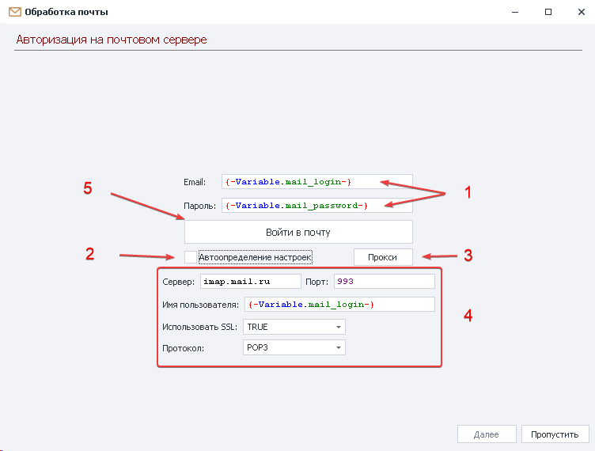
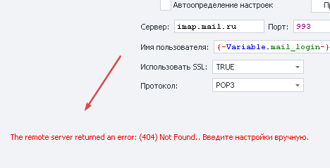
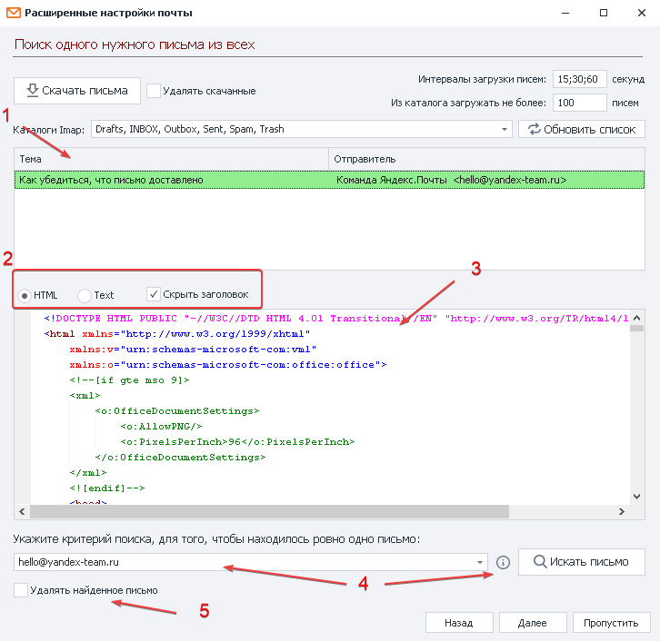
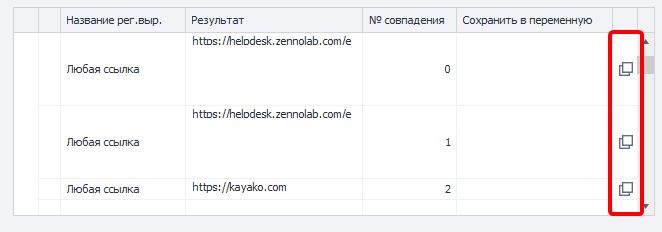
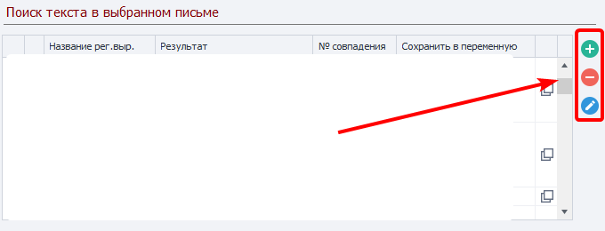
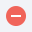
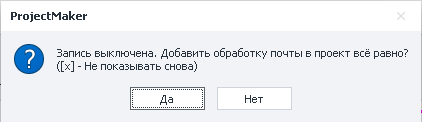

:::info **Пожалуйста, ознакомьтесь с [*Правилами использования материалов на данном ресурсе*](../Disclaimer).**
:::
_______________________________________________  
## Описание. 
Позволяет работать с почтовыми аккаунтами, не используя при этом окно браузера. С помощью этого инструмента можно найти нужное письмо и информацию о нём. Подходит для массовой обработки входящих писем.  

### Для чего используется?  
- **Быстрый доступ к почтовому ящику**.  
- **Получение данных из писем**.  
- **Активация учётных записей на сайтах**.  
- **Удаление ненужных писем из ящика**.  
- **Удаление скачанных писем**.  
_______________________________________________
## Как настроить?  
:::info **Перед настройкой утилиты убедитесь, что в вашей учетной записи активирована опция работы через IMAP.**
:::

### Вход в почтовый ящик.  
  

**1.** Указываем логин и пароль от учётной записи. Для хранения этих данных можно использовать переменные.  
**2.** Если установить здесь галочку, то ZennoDroid сам подберёт необходимые параметры для соединения с почтовым сервером.  
:::warning **Работает не со всеми сервисами.** 
:::  
**3.** Нажав на эту кнопку, можно настроить сторонние прокси, если в этом есть необходимость.  
**4.** Указываем данные для IMAP соединения, если ZennoDroid не смог определить их самостоятельно. Нужные значения можно получить на сайте почтового сервиса.  
**5.** Заполнив все поля, нажимаем на кнопку **Войти в почту** для перехода к следующему шагу.  
:::info **При возникновении ошибки на данном этапе в левом нижнем углу появится комментарий.**  
  

Исправьте ошибку, следуя рекомендациям.
:::  
_______________________________________________
## Поиск нужного письма.  
  

### Доступные настройки.  
#### Интервалы загрузки писем.  
Иногда письма от сервисов приходят с задержкой, поэтому важно указать временной промежуток в секундах, которое программа будет ждать загрузки.  

Через `;` указывается количество попыток. Например, на скриншоте первая попытка через 15, вторая через 30, третья через 60 секунд.  

#### Из каталога загружать не более.  
Указываем количество писем, которое хотим загрузить.  

#### Удалять скачанные.  
Если включить данную опцию, то после скачивания все загруженные письма удалятся из ящика.  

#### Обновить список.  
Позволяет получить актуальный список папок в почте.  

#### Каталоги Imap.  
Здесь чекбоксами можно отметить конкретные папки, в которых будет происходить поиск. Например: *Входящие*, *Спам*, *Исходящие*, *Черновики* и подобные.  

Если же оставить поле пустым, то скачиваться будут только письма из папок *INBOX* и *Спам*.  

### Скачать письма.  
После нажатия на эту кнопку ZennoDroid скачает с почты все письма, которые соответствуют заданным параметрам.  

  

#### 1. Список скачанных писем.  
В этом поле отображаются все скачанные письма с указанием их *Темы*, а также *Имени* и *Почты* отправителя.  

#### 2. Варианты отображения содержимого письма.  
Тут выбираем, в каком виде хотим видеть содержимое письма:  
- *в исходном HTML-коде*,  
- *только текст*,  
- *скрыть заголовки (отображать или скрыть служебные заголовки)*.  

#### 3. Тело письма.  
Здесь вы можете увидеть само содержимое выбранного письма.  

#### 4. Критерий поиска письма.  
Тут нужно указать критерий для поиска одного единственного письма. Удобнее всего прописать сюда [**регулярное выражение**](./RegEx_Tester).  

Если критерий указан верно, то в **Списке скачанных писем** *зелёным цветом* выделится нужное письмо.  

#### 5. Удалять найденное письмо.  
При включении данной опции найдённое письмо будет удалено из ящика после обработки.  
_______________________________________________
## Поиск элемента в выбранном письме.  
### Список регулярных выражений и найденных элементов.  
  

#### Название регулярного выражения.  
Тут отобразится имя выражения.  
#### Результат.  
Та информация, которая была найдена этим выражением.  
#### № совпадения.  
Часто для одного регулярного выражения находится сразу несколько результатов. Поэтому тут отображается порядковый номер найденного элемента (нумерация с нуля).

:::warning **Мы не рекомендуем делать привязку в проектах к номеру совпадения.**  
Так как структура письма может меняться, а вместе с ней и порядок ссылок. 
:::  

Старайтесь подбирать регулярное выражение таким образом, чтоб в результате его работы оставалось только одно совпадение.  

#### Сохранить в переменную.  
В этой колонке можно выбрать существующую или создать новую переменную, в которую сохранится результат работы выражения.  

#### Кнопки для копирования перменной в буфер обмена.  
С помощью специальных кнопок в правой части панели можно скопировать макрос любой переменной.  

:::tip **Можно сохранять результат работы сразу нескольких регулярных выражений.**  
Например, за одно действие из письма можно достать активационный код, ссылку на сайт, номер телефона, а также имя и фамилию отправителя. Достаточно заранее для каждого из элементов составить регулярное выражение, а затем добавить переменные, в которые будет сохранён результат.   
:::  

### Редактирование регулярных выражений.  
  

Если не подходит ни одно из предустановленных регулярных выражений, то можно создать своё.  

####  Создание с нуля.  
После нажатия по этой кнопке откроется окно с [**Конструктором регулярных выражений**](./RegEx_Tester), а в текстовое поле уже будет вставлено содержимое письма. Вам остаётся только создать выражение и назвать его (чтобы не путать с другими), а затем нажать кнопку **ОК**. После этого наше регулярное выражение появится в общем списке.  

####  Удаление.  
При нажатии по данной кнопке будет удалено выделенное в общем списке выражение.  
:::warning **Удалить можно только созданные пользователем выражения.**   
:::  

####  Редактирование.  
С помощью этого действия можно отредактировать выделенное выражение.  

После редактирования предустановленного выражения будет создано новое, так как вшитые параметры изменять нельзя. Новое выражение отобразится в общем списке.  

Однако при изменении пользовательского выражения новое значение запишется прямо в него, без создания отдельного выражения.  
_______________________________________________
## Завершение.  
Проделав все действия по поиску нужной информации, нажимаем **Закончить**.  

ZennoDroid предложит добавить экшен [**Принять почту**](../Project Editor/RecieveEmails) в проект для дальнейшего использования.  

:::warning **Когда в почте присутствуют два одинаковых письма, экшен выберет для обработки самое новое.**   
::: 
_______________________________________________  
## Полезные ссылки.   
- [**Принять почту**](../Project%20Editor/RecieveEmails).  
- [**Отправить почту**](../Project%20Editor/SendEmails).   
- [**Настройки почтовых сервисов**](../Settings/Mailbox).