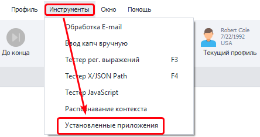
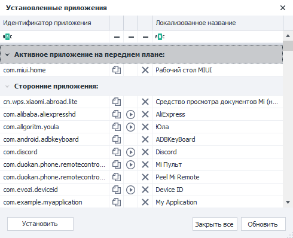

   

Открыть окно можно через верхнее меню **Инструменты → Установленные приложения**.  
В нем отобразятся все установленные в системе приложения вместе с их понятными названиями,  
которые обычно написаны на иконке.  

   

Идентификатор приложения можно скопировать в буфер обмена и использовать в экшене  
**Действия с приложениями** для их запуска, остановки и удаления. А также для сохранения  
и восстановления данных. При этом все действия будут записаны в проект.