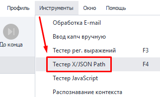
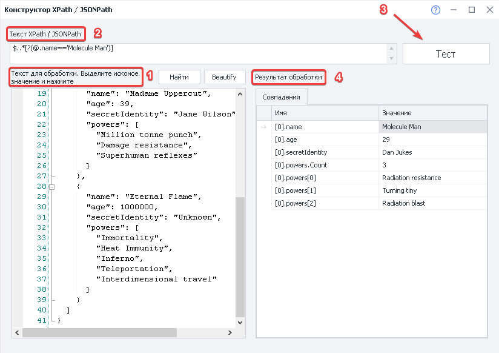
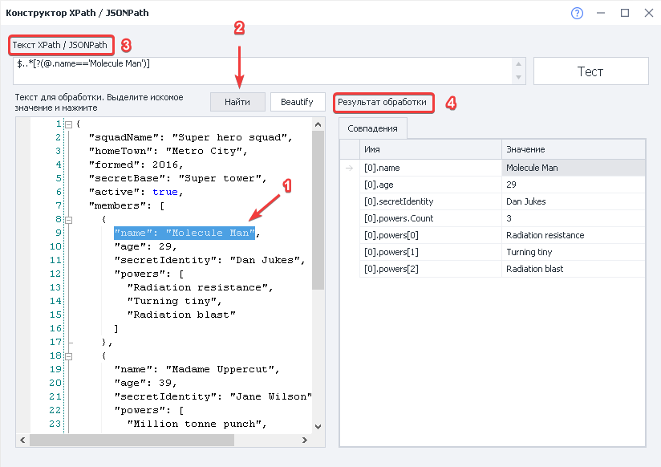

:::info **Пожалуйста, ознакомьтесь с [*Правилами использования материалов на данном ресурсе*](../Disclaimer).**
:::
_______________________________________________ 
## Описание.  
Этот инструмент предназначен для проверки корректности данных в форматах **XML** или **JSON** и помощи в составлении правильных выражений для парсинга данных.  

### Как открыть?  
#### Через Панель инструментов.  
   

_______________________________________________
## Как работать с инструментом?  
### Как проверить правильность выражения XPath/JSONPath?  
  

**1**. В поле ввода вставляем код для обработки.    
**2**. Выше добавляем готовое выражение, которое хотим проверить.  
**3**. Нажимаем на кнопку **Тест**.  
**4**. По итогу в **Результате** обработки получаем совпадения. Если выражение было составлено правильно, то здесь отобразятся те значения, которые нам и нужны.  

### Как быстро составить выражение XPath/JSONPath?
  

**1**. В поле ввода вставляем код для обработки и выделяем тот фрагмент, по примеру которого хотим составить выражение.    
**2**. Нажимаем на кнопку **Найти**.  
**3**. Теперь в поле с XPath/JSONPath получаем готовое выражение под наши нужды.  
**4**. Можно проверить результат работы выражения по совпадениям, которые оно выдаёт.  

Получившееся выражение можно в дальнейшем использовать в экшене [**Обработка JSON и XML**](../Data/JSON_XML).  

:::tip **Кнопка «Beautify».**  
Она позволяет автоматически отформатировать код и привести его к удобному для чтения формату. 
::: 
_______________________________________________ 
## Базовый синтаксис.  
### XPath.  
| Выражение    | Результат |
| :--------: | :------- |
| `имя_узла`  | Выбирает все узлы с именем `имя_узла`.    |
| `/` | Выбор осуществляется от корневого узла.     |
| `//` | Выбор от узла, соответствующего выбору, независимо от местонахождения.    |
| `.`  | Выбирает текущий узел.    |
| `..` | Выбирает родителя текущего узла.    |
| `@` | Выбор атрибутов.    |  

**Для поиска неизвестных узлов используются специальные символы:**  
| Спец. символ    | Описание |
| :--------: | :------- |
| `*`  | Любой элемент.    |
| `@*` | Каждый из атрибутов.     |
| `node()` | Соответствует любому узлу каждого типа    |

### JSONPath.  
| Выражение    | Результат |
| :--------: | :------- |
| `$`  | Выбирает от корневого узла. |
| `..` | Родительский оператор. |
| `[]` | Операторы потомка. |
| `.`  |  Выбор от текущего узла, соответствующего выбору. |
| `@` | Выбирает текущий узел. |
| `?()` | Применяет выражение по фильтру. |  
_______________________________________________ 
## Пример.  
### Код для обработки.  
```js
{ "store": {
    "book": [ 
      { "category": "reference",
        "author": "Nigel Rees",
        "title": "Sayings of the Century",
        "price": 8.95
      },
      { "category": "fiction",
        "author": "Evelyn Waugh",
        "title": "Sword of Honour",
        "price": 12.99
      },
      { "category": "fiction",
        "author": "Herman Melville",
        "title": "Moby Dick",
        "isbn": "0-553-21311-3",
        "price": 8.99
      },
      { "category": "fiction",
        "author": "J. R. R. Tolkien",
        "title": "The Lord of the Rings",
        "isbn": "0-395-19395-8",
        "price": 22.99
      }
    ],
    "bicycle": {
      "color": "red",
      "price": 19.95
    }
  }
}
```  

### Примеры выражений.  
| XPath              | JSONPath | Результат |
| :---------------- | :------ | ----: |
| `/store/book/author` |   `$.store.book[*].author`   | Ищем элементы `author` всех элементов `book` в `store`.|
| `//author`           |   `$..author`   | Все элементы `author`. |
| `/store/*`   |  `$.store.*`   | Берём всё содержимое из `store`. |
| `/store//price` |  `$.store..price`   | Достаём значение цены из элемента `price` для всех элементов в `store`. |
| `//book[3]` |   `$..book[2]`   | Получаем третий элемент `book`. |
| `//book[last()]` |   `$..book[(@.length-1)]` или `$..book[-1:]`   | Последний элемент `book`. |
| `//book[position()<3]`    |  `$..book[0,1]` или `$..book[:2]`   | Первые **2** элемента `book`. |
| `//book[isbn]` |  `$..book[?(@.isbn)]`   | Фильтруем по всем элементам `book` со значением `isbn`. |
| `//book[price<10]` |   `$..book[?(@.price<10)]`   | Фильтруем по всем элементам `book` со значением цены `price` меньше, чем **10**.  |
| `//*`          |   `$..*`   | Берём все элементы в XML документе или же все члены JSON структуры. |
_______________________________________________  
## Полезные ссылки.   
- [**Обработка JSON и XML**](../Data/JSON_XML).  
- [**Дерево элементов**](../pm/Interface/ElementTree).