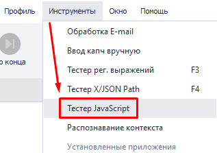
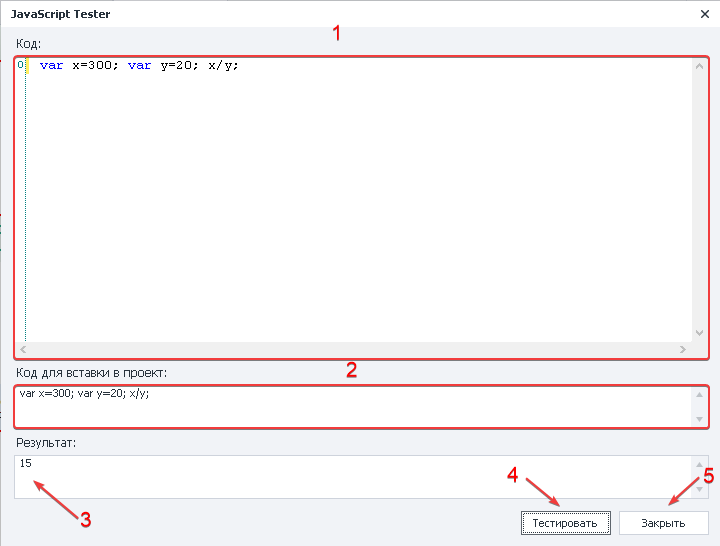
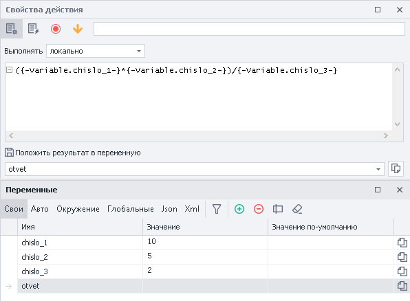
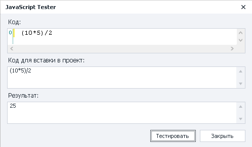
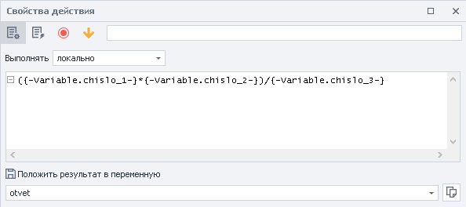
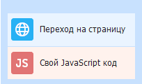

:::info **Пожалуйста, ознакомьтесь с [*Правилами использования материалов на данном ресурсе*](../Disclaimer).**
:::
_______________________________________________   
## Описание.  
Инструмент позволяет проверить корректность работы локального JavaScript кода. Сформированный код в дальнейшем можно вставить в экшен и использовать при работе шаблона.  

:::info *Работает **только** с кодом локального выполнения.*
:::
### Как открыть?  
#### Через Панель инструментов.  
   

_______________________________________________  
## Как работать с инструментом?  
### Обзор окна.  
  

**1**. В это поле вставляем код, который хотим проверить.  
**2**. Здесь определяем, в каком формате нужно использовать код в экшене ***JavaScript***.  
**3**. Тут отобразится результат выполнения кода.  
**4**. Кнопка для тестирования кода.  
**5**. Выйти из тестера.  
_______________________________________________
### Пример №1.  
Представим, что нам нужно произвести математические вычисления с помощью JavaScript и переменных.  

  

Перед использованием нашей заготовки в проекте давайте запустим тестер и проверим правильность написания кода.  

  

Мы убедились, что составили код верно. Так что просто заменим статичные значения переменными и добавим в экшен ***JavaScript***.  

  
_______________________________________________
### Пример №2.  
Допустим, нам понадобилось перейти на страницу в интернете и выполнить код JavaScript.  

  

1. Заходим на сайт.  
2. Помещаем необходимый код в тестер и проверяем его работу.  
3. Копируем получившийся код и вставляем его в проект.  
4. Добавляем экшен ***JavaScript***, используя формат из тестера.  

Таким образом, помимо тестирования самого кода перед использованием в проекте, ZennoDroid также подскажет в каком формате будет правильно поместить его в экшен.