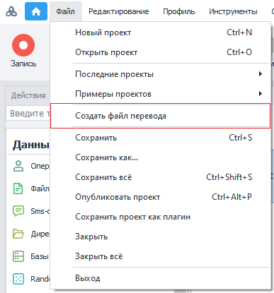

:::info **Пожалуйста, ознакомьтесь с [*Правилами использования материалов на данном ресурсе*](../Disclaimer).**
:::
_______________________________________________ 
## Описание.  
Функция локализации позволяет адаптировать ваши проекты для использования иностранной аудиторией. Происходит это через замену текстовых полей с информацией проекта на заданные в специальном файле переводы.   

### Что такое файл перевода?
Он представляет из себя таблицу в формате `.csv` с запятой в качестве разделителя. Его можно открыть любым текстовым редактором.  

Файл перевода можно добавить в проект как статический блок **Таблица** или **Google Таблица**, выполнив предварительный импорт в документы Google.  

:::tip **Альтернативный вариант перевода проекта.**
Выполнить автоматический **перевод текста таблицы** можно также через экшен **Обработка текста → Перевод текста**.
:::

### Как его создать?  
Создать таблицу можно с помощью верхнего меню ProjectMaker → Файл → Создать файл перевода:  

  

После нажатия на эту кнопку **будет выполнен сбор и запись** в файл следующих текстовых полей проекта:  
- **Записи в заметках**;  
- **Сообщения из экшена «Ожидание действий пользователя»**;  
- **Содержание оповещений**;  
- **Комментарии к экшенам**;  
- **Комментарии для групп действий**.  
:::info **Локализованные оповещения и сообщения.**
Они также будут переведены в ходе выполнения проекта ZennoDroid.
:::

