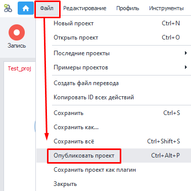
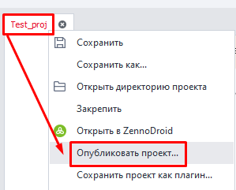
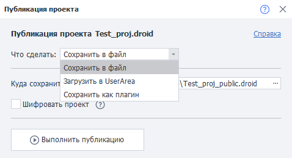
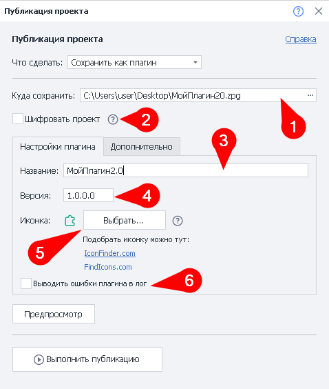
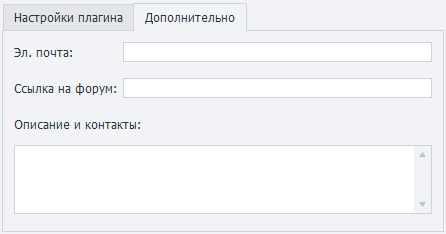
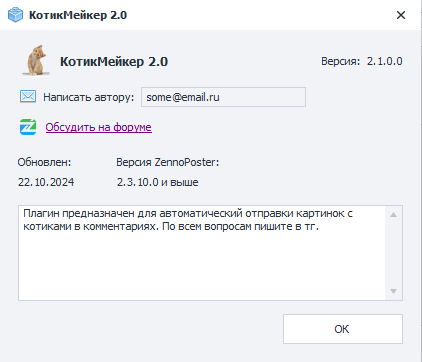
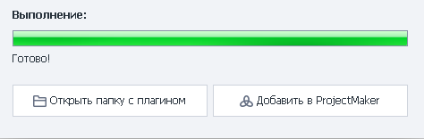

:::info **Пожалуйста, ознакомьтесь с [*Правилами использования материалов на данном ресурсе*](../Disclaimer).**
:::
_______________________________________________  
## Описание. 
Публикация проекта собирает все зависимые библиотеки, шифрует, архивирует и упаковывает их в готовый шаблон. Для продажи своего шаблона вам не придётся самому собирать комплект библиотек и расписывать в инструкции, где они должны находиться.  

Все права на выполнение проекта, которые вы настроили, при этом останутся без изменений. 

Также доступна функция **Загрузки в Личный кабинет**. Она экономит время на поддержке и обновлении шаблона. Вы просто загружаете новую версию из ProjectMaker, а ваши клиенты автоматически получают её.  

### Для чего используется?  
- Выдача доступа к шаблону пользователям **ZennoBox** или **ZennoPoster** на условиях подписки.  
- Сохранение ***плагинов***.  
- Шифрование проектов, в которых используются сторонние библиотеки.  

### Преимущества.  
- Упаковывает внешние зависимости в один проект.  
- Позволяет ускорить выполнение и запуск проекта, за счёт прекомпиляции всей логики и кода.  
- Повышает безопасность. Даже если у вас украдут учетную запись, проект невозможно будет открыть.  
_______________________________________________
## Как опубликовать проект?  
**Есть три способа:**  
#### С помощью сочетания клавиш.  
Комбинация по умолчанию — `Ctrl+Alt+P`.  

#### Через верхнее меню.  
**Файл → Опубликовать проект**.  

 

#### Из панели открытого проекта.  
**ПКМ по вкладке нужного проекта → Опубликовать проект**.  

_______________________________________________
## Как работать с инструментом.  
  
_______________________________________________
### Что сделать?  
В этой секции нужно выбрать желаемый вариант действия с проектом:  
- **Сохранить в локальный файл**.  
- **Загрузить в UserArea**.  
:::info **Проект при этом уже должен существовать в UserArea.**
::: 
- **Сохранить как плагин**.  
:::warning **Для сохранения проекта как плагин, нужно использовать BotUI в качестве входных настроек.**
:::  
_______________________________________________
### Сохранить в файл.  
#### Куда сохранить.  
Необходимо указать локальный путь на компьютере, куда хотим сохранить проект.  

#### Встроить внешние библиотеки.  
:::info **Данный пункт появляется только при использовании внешних библиотек.**
:::  

Если у вас добавлены внешние библиотеки с помощью блока [**Ссылки из GAC**](../Project%20Editor/CustomCode/GAC_reference), то помимо прочего нужно выбрать, какие из них будут вшиты в проект.  

:::warning **Если у вас вдруг возникли ошибки, то попробуйте разместить библиотеки рядом с .zp файлом проекта.**
:::  

#### Шифровать проект.  
Мы рекомендуем включить эту опцию, если вы используете сторонние библиотеки.  
_______________________________________________
### Загрузить в UserArea.  
В этом варианте нужно выбрать только имя проекта из выпадающего списка.  

Читайте подробнее о том, как [**Продавать ботов**](https://zennolab.atlassian.net/wiki/spaces/RU/pages/494895200) и [Пользоваться ZennoBox](https://zennolab.atlassian.net/wiki/spaces/RU/pages/495386651).  
_______________________________________________
### Сохранить проект как плагин.  

#### Название.  
Придумываем название для плагина. Это имя будет отображаться в ProjectMaker.  

:::tip **Можно создать несколько плагинов с одинаковыми именами.**
Но мы не рекомендуем так делать. Задавайте уникальные названия, чтобы не путаться.
:::  

#### Версия.  
Указываем текущую версию плагина.  

#### Иконка.  
Загружаем иконку для своего плагина, чтобы его визуально было проще отыскать среди других экшенов.  
- **Поддерживаемые форматы** — `png`, `ico`, `bmp`;  
- **Размеры** — от *16х16*, до *128х128*;  

#### Выводить ошибки плагина в лог.  
При включении данной опции в лог будет выводиться текст ошибок, которые привели к завершению работы шаблона.  

Если же опция выключена, то будет отображаться только это сообщение: `Ошибка при обработке плагина`.  

#### Вкладка «Дополнительно».
  

Данная вкладка пригодится, если вы продаёте свой плагин или просто делитесь им с другими людьми.  

Здесь вы можете указать свой email для обратной связи, а также описание плагина и дополнительные контакты. Ещё будет полезно добавить ссылку на тему с плагином на [**нашем форуме**](https://zenno.club/discussion/).  

#### Предпросмотр и публикация.  
Перед сохранением плагина можно нажать кнопку **Предпросмотр**, чтобы увидеть, как ваш плагин будет отображаться для других.  

  

А после клика по **Выполнить публикацию** начнётся проверка и сборка проекта. В случае отсутствия ошибок вы увидите это окно:  

  
_______________________________________________
## Ограничения.  
В зависимые сборки нужно добавлять все необходимые для публикации библиотеки. Если `библиотека 1` зависит от `библиотеки 2`, обе должны быть в **`Reference`**. Иногда это невозможно, так как некоторые сторонние сборки могут вызвать ошибки упаковки и шифрования или даже привести к неработоспособности шаблона.  

Всегда проверяйте работоспособность проекта с внешними зависимостями. Если что-то не работает, первым делом исключайте сборки из объединения.

