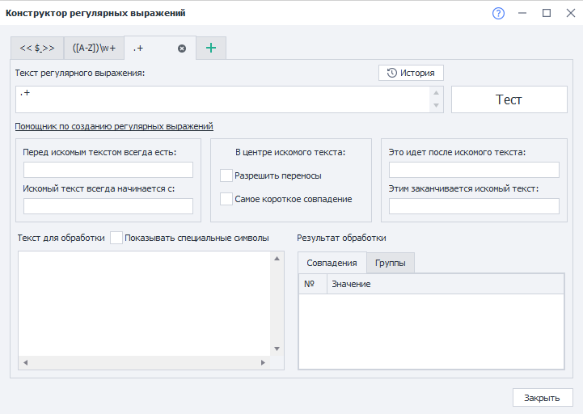
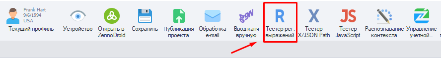
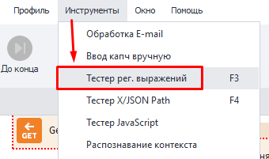
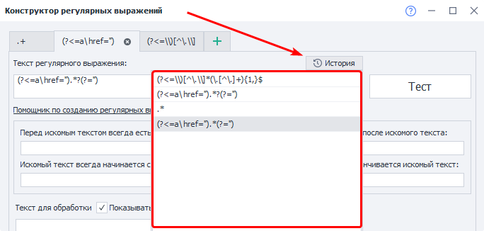
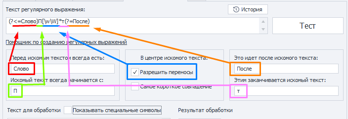
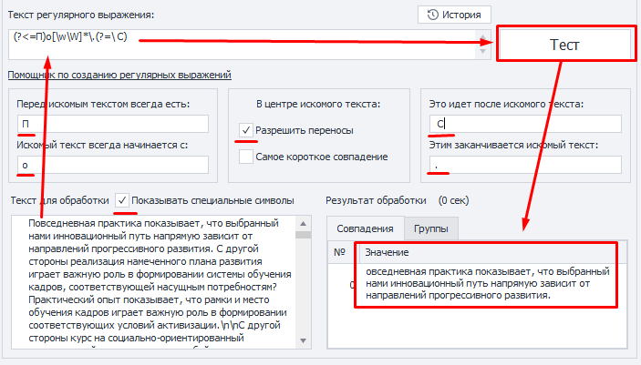
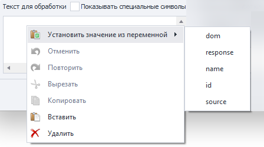
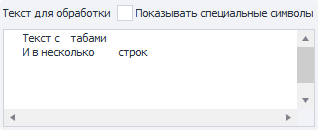
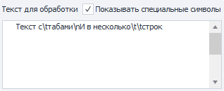
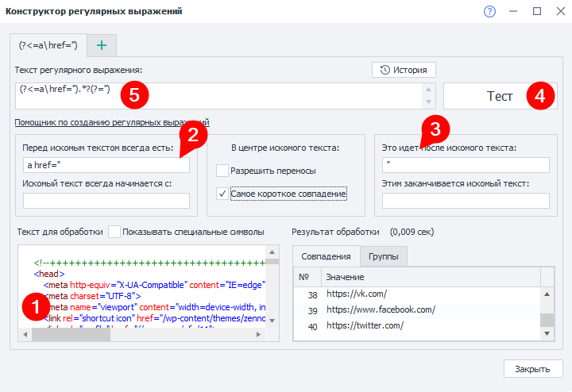

:::info **Пожалуйста, ознакомьтесь с [*Правилами использования материалов на данном ресурсе*](../Disclaimer).**
:::
_______________________________________________  
## Описание.  
**Регулярные выражения** — это своеобразный фильтр для поиска текстовых строк, соответствующий требуемым условиям.  

Наш встроенный конструктор позволит быстро создавать правила, не вникая во все тонкости их составления.  

### Где используются регулярные выражения?  
- **Извлечение информации со страниц сайта**;    
- **Фильтрация данных в списках, таблицах**;    
- **Поиск письма или ссылки подтверждения регистрации**;  
- **Нахождение конкретного фрагмента в тексте**;  
- **Определение строк для удаления в списках**;  
- **И множество других полезных применений**.  
_______________________________________________
## Конструктор регулярных выражений.  
  

### Как открыть?  
Есть два способа.  
#### Через Панель инструментов.  
  

#### В выпадающем списке раздела «Инструменты».  

_______________________________________________
### Работа с окном.  
#### Вкладки.  
  

Можно одновременно работать над несколькими регулярными выражениями в разных вкладках. В качестве имени вкладки используется *текст регулярного выражения*.  

#### История.  
  

Сюда сохраняются все выражения, которые ранее были проверены через кнопку **Тест**.  

#### Текст регулярного выражения.  
В это поле будет вноситься текст выражения, составленный на основе заданных параметров. Его можно редактировать вручную.  

  

:::warning **При внесении изменений в любой из пунктов «Помощника».**  
Все ручные правки и дополнения, которые были указаны в поле с выражением, будут безвозвратно утеряны.
:::  

#### Кнопка «Тест».  
После нажатия этой кнопки составленное выражение применится к нашему **Тексту для обработки**, а итоговый текст отобразится в **Результате обработки**.  

  

#### Перед искомым текстом всегда есть|Это идёт после искомого текста.  
Задаём то, что есть **До** и **После** текста, который мы хотим найти. Содержимое не будет включёно в результат работы выражения.  

#### Искомый текст всегда начинается с|Этим заканчивается искомый текст.  
Тут указываем то, с чего будет начинаться, и чем заканчиваться итоговый текст. Содержимое войдёт в результат работы выражения.  

#### Разрешить переносы.  
Позволяет включить поиск по многострочному тексту. Иначе поиск будет выполнен только по первой строке.  

#### Самое короткое совпадение.  
При включении данной опции результат выдаст нам самое короткое значение, которое соответствует составленному выражению.  

#### Текст для обработки.  
Сюда вводим текст, из которого мы будем брать нужный нам фрагмент.  

:::tip **Значение для данного поля можно вставить прямо из переменной.**  
  

В выпадающем списке отобразятся только переменные текущего проекта.
:::  

#### Показывать специальные символы.  
Эта настройка определяет, будут ли отображаться переносы строк, табы и прочие действия в виде специальных символов.  

| Выключено    | Включено |
| :--------: | :-------: |
|    |      |  

#### Результат обработки.  
- **Вкладка «Совпадения»**.  
Здесь отобразится результат применения регулярного выражения к тексту.  
- **Вкладка «Группы»**.  
Сюда попадут результаты работы после применения **групповых** регулярных выражений.  
_______________________________________________
## Пример использования.  
В качестве примера возьмём конкретную и частую задачу — парсинг ссылок. Допустим, что мы получили HTML-разметку страницы и теперь хотим спарсить все ссылки из этого кода, а затем сохранить их в ***Список***.  

   

**1**. Вставляем в поле наш исходный код, из которого мы будем доставать ссылки.  
**2**. Указываем тег, который обычно идёт перед ссылкой — `a href=”`.  
**3**. Добавим кавычки, которыми закрывается строка с ссылкой, и включим опцию **Самое короткой совпадение**, ведь нам нужно собрать строку только между двумя крайними кавычками.  
**4**. Протестируем полученное выражение и посмотрим на список ссылок, которые нам удалось достать. Если же ничего не получилось, то попробуйте изменить условия поиска.  
**5**. Теперь можем скопировать готовое регулярное выражение и применить его в своём шаблоне.  

:::tip **Регулярное выражение ищет столько подстрок, сколько есть в тексте.**  
Если нужно взять какой-то конкретный номер совпадения, обратите внимание на ***диапазоны**.
::: 
_______________________________________________
## Символы со специальным значением.  
Большинство символов в регулярных выражениях означают сами себя, но исключением являются **Специальные символы**.  
Например, эти — `[` `]` `\` `/` `^` `$` `.` `|` `?` `*` `+` `(` `)` `{` `}`.  

Они могут быть экранированы символом `\`, тогда они также станут представлять сами себя в тексте.  

Из этого следует, что простейшее регулярное выражение выглядит так — `abc`. И ему соответствует строка — *abc*.   

| Спец. символ | Значение | Пример |Результат |
| :----------------: | :------ | :----: |----: |
| `*`       |   Число повторений символа, который стоит ДО (включая 0 и больше)   | `ab*c` |`abc`, `abbc`, `ac` |
| `.`           |   Подставляется один любой символ (кроме символа новой строки)   | `a.c` |`aac`, `abc`, `acc` |
| `+`    |  Число повторений символа, который стоит ДО (ОТ 1 и больше)   | `ab+c` |`abc`, `abbc`, `abbbbc` |
| `?` |  Число повторений символа, который стоит ДО (ТОЛЬКО 0 или 1)   | `a?c` |`abc`, `ac` |  
| &#124; |  Оператор **ИЛИ**   | a &#124; b &#124; c |`a`, `b`, `c` |
| `()` |  Группировка   | `zennolab(com)+` |`zennolabcom`, `zennolabcomcom` |
| `[]` |  Список символов, один из которых может присутствовать в тексте   | `zennoposter[57]` |`zennoposter5`, `zennoposter7` |
| `[^]` |  Список символов, которые не входят в указанный набор   | `[^0-9]` |`abc` 123 |
| `-` |  Диапазон символов (используется в квадратных скобках)   | `[3-7]`, `[а-д]` |`3`, `4`, `5`, `6`, `7`, `а`, `б`, `в`, `г`, `д` |
| `^` |  Начало строки   | `^a` |`a`aa aaa |
| `$` |  Конец строки   | `a$` |aaa aa`a` |
| `{}` |  Количество повторений предыдущего символа. `{n}` — **n** раз; `{m,n}` — от **m** до **n** включительно; `{m,}` — не менее **m** раз; `{,n}` не более n раз.   | `zen{2}oposter`, `(abc){2,3}`    |`zennoposter`, `abcabc abcabcabc` |  
| `\` |  Экранирование специальных символов   | `a\.b\.c` |`a.b.c` |
| `\b` |  Граница слова   | `a\b`, `\ba`  |`zennola`, `ab` |
| `\B` |  Не граница слова (любые символы кроме тех, что на границе)   | `\Ba` |zennol`a`b |
| `\s` |  Пробельный символ   | `aaa\s?bbb` (один или ноль пробелов)  |`aaa bbb`, `aaabbb` |
| `\S` |  Непробельный символ (любые символы без пробелов и табуляций)   | `a\S+bc` |`aaabc` |
| `\d` |  Цифровой символ   | `abc\d+` |`abc123` |
| `\D` |  Нецифровой символ (любые символы кроме цифр)   | `abc123\D+` |`abc` |
| `\w` |  Любой буквенный или цифровой символ, включая знак **_**   | `\w+` |`abc_123` |
| `\W` |  Cимволы, кроме буквенного, цифрового или **_** (то есть пробелы или прочие символы)   | `\W+` |`₽ @$ &` |
| `\r` |  Возврат каретки. Этот символ используется для перемещения курсора в начало строки, но не создаёт новую строку.   | `Hello, World!\n This is a test.\r` |`This is a test.` |
| `\n` |  Перевод строки. Создаёт новую строку.   | `This is a test.\r Another line.\n` |`Another line.` |
| `\t` |  Знак табуляции, создание отступов.   | `Name\tAge\tCity` |`Name   Age     City` |
_______________________________________________
## Модификаторы.  
Они действуют с момента вхождения и до конца регулярного выражения или противоположного модификатора.  

| Модификатор  | Действие | 
| :----------------: | :------ | 
| `(?i)`  |  Включает нечувствительность к регистру  | 
| `(?-i)` |  Выключает нечувствительность к регистру   | 
| `(?s)`  |  Включает режим, когда точка соответствует символам переноса строки.  | 
| `(?-s)` |  Выключает режим, когда точка соответствует символам переноса строки.   | 
| `(?m)`  |  Многострочный поиск. Символы `^` и `$` вызывают соответствие только до и после символов новой строки. | 
| `(?-m)` |  Многострочный поиск. Символы `^` и `$` вызывают соответствие только с началом и концом текста.   | 
| `(?x)`  |  Включает режим без учёта пробелов между частями регулярного выражения. Позволяет использовать `#` для комментариев.  | 
| `(?-x)` |  Выключает режим без учёта пробелов между частями регулярного выражения. Запрещает использовать `#` для комментариев. | 
_______________________________________________
## Просмотр вперёд и назад.
Поиска фрагмента текста. Просматривает окружающий текст (до или после искомого фрагмента ), но не включает его в результат.  

Отрицательный просмотр используется реже. Он наоборот отслеживает, чтобы указанные соответствия не встречались до или после искомого текстового фрагмента.  

| Выражение | Тип просмотра | Пример | Соответствие |
| :----------------: | :------ | :----: |----: |
| `(?=шаблон)` |   Позитивный просмотр вперёд   | `Людовик(?=XVI)` | ЛюдовикXV, `Людовик`XVI, `Людовик`XVIII, ЛюдовикLXVII, ЛюдовикXXL |
| `(?!шаблон)` |   Негативный просмотр вперёд (с отрицанием)   | `Людовик(?!XVI)` |`Людовик`XV, ЛюдовикXVI, ЛюдовикXVIII, `Людовик`LXVII, `Людовик`XXL |
| `(?<=шаблон)`    |  Позитивный просмотр назад   | `(?<=Сергей )Иванов` |Сергей `Иванов`, Игорь Иванов |
| `(?<!шаблон)` |  Негативный просмотр назад (с отрицанием)   | `(?<!Сергей )Иванов` |Сергей Иванов, Игорь `Иванов` |  
_______________________________________________
## Сборник полезных регулярных выражений.
### E-mail адрес.  
```
(?i)[A-Z0-9._%+-]+@[A-Z0-9-]+.+.[A-Z]{2,4}
```
### Номер телефона.  
```
+?(\d{1,3})?[- .]?(?(?:\d{2,4}))?[- .]?[\d-]{5,9}
```
### IP адрес.  
```
(?:(?:25[0-5]|2[0-4][0-9]|[01]?[0-9][0-9]?)\.){3}(?:25[0-5]|2[0-4][0-9]|[01]?[0-9][0-9]?)
```
### URL адрес.  
```
(https?:\/\/)?([\w\.]+)\.([a-z]{2,6}\.?)(\/[\w\.]*)*\/?
```
### Извлечение имени и расширения файла из пути.  
```
(?<=\\)[^\.\\]*(\.[^\.]+){1,}$
```
_______________________________________________
## Полезные ссылки.  
- [**Регулярные выражения на все случаи жизни**](https://zenno.club/discussion/threads/reguljarnye-vyrazhenija-na-vse-sluchai-zhizni.20829/)