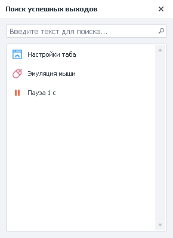
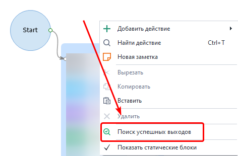
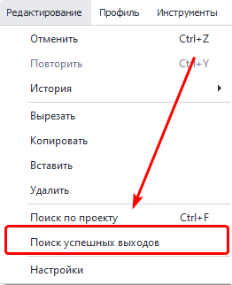
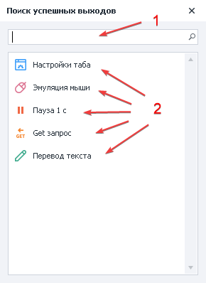
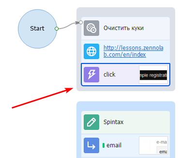

:::info **Пожалуйста, ознакомьтесь с [*Правилами использования материалов на данном ресурсе*](../Disclaimer).**
:::
_______________________________________________  
## Описание.  
Данный инструмент позволяет найти незапланированное **успешное** завершение проекта, а также разрывы в его работе.  

  

### Как открыть?  
**Есть два способа:**  
#### Через Контекстное меню.  
ПКМ по любой части холста → Поиск успешных выходов.  

  

#### Через Верхнюю панель.  
Редактирование → Поиск успешных выходов.  

  
_______________________________________________ 
## Работа с окном.  
### Взглянем детальнее.  

*1*. Строка быстрого поиска нужного экшена.  
*2*. Список действий, которые приводят к успешному завершению проекта.  

Если дважды кликнуть по одному из действий, то фокус проекта сместится на него.  

:::tip **Поиск находит функцию, только если она указана внутри экшена.**
:::  

### Как можно использовать?  
Бывают ситуации, когда по невнимательности вы забываете соединить два экшена с помощью стрелок логики. Тогда проект будет досрочно завершаться с успехом, выполнив только часть задуманной работы. При этом ошибок никаких не будет.  

#### Пример досрочного завершения.  
  

Проект со скриншота завершится успехом на экшене **click**, потому что он не соединён с другими экшенами.  

Если в проекте не более 10 кубиков, то это не станет существенной проблемой. Однако при работе с большими шаблонами поиск такого разрыва вручную займёт много времени.  

### Пример использования.  
1. Открываем окно **Поиска успешных выходов**.  
2. Сверяем список удачных завершений с запланированной логикой.  
3. Исправляем шаблон при необходимости.  

Таким образом, если вы где-то ошиблись, то этот инструмент покажет возможные проблемные места.  

:::info **Мы рекомендуем пользоваться этим после написания каждого шаблона для грамотной отладки.**
::: 
_______________________________________________  
## Полезные ссылки.   
- [**Выполнить событие**](../Android/RunEvent).  
- [**Обработка текста**](../Data/Text).   
- [**Пауза**](../Project%20Editor/Logic/Pause).