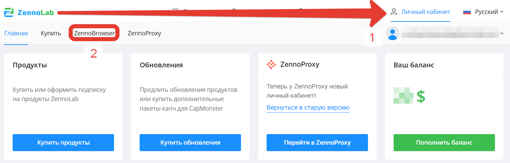
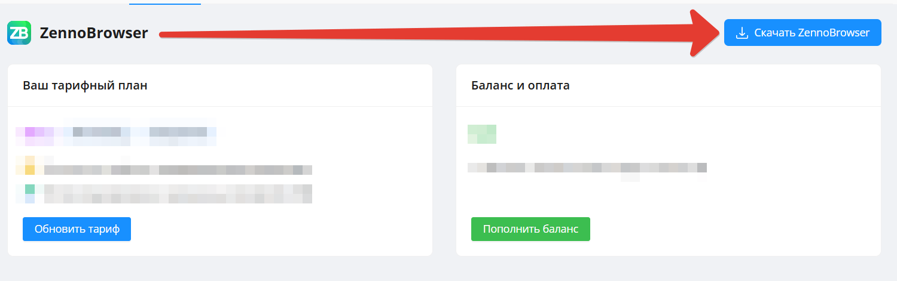

import DisclaimerNotice from '@site/src/components/DisclaimerNotice';

# Установка ZennoBrowser
<DisclaimerNotice />

**Шаг 1.** Перейдите [в личный кабинет ZennoLab](https://account.zennolab.com/personal-area-main/).

**Шаг 2.** В левой верхней части экрана найдите вкладки “Главная”, “Купить”, ZennoBrowser. Откройте одноимённую.

**Шаг 3.** В правом верхнем углу нажмите на кнопку скачивания, загрузите и установите браузер.

**Шаг 4.** Установка завершена! Можно приступать к работе.
