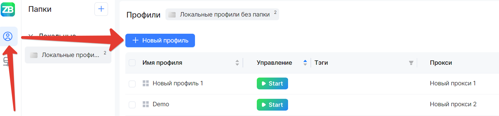
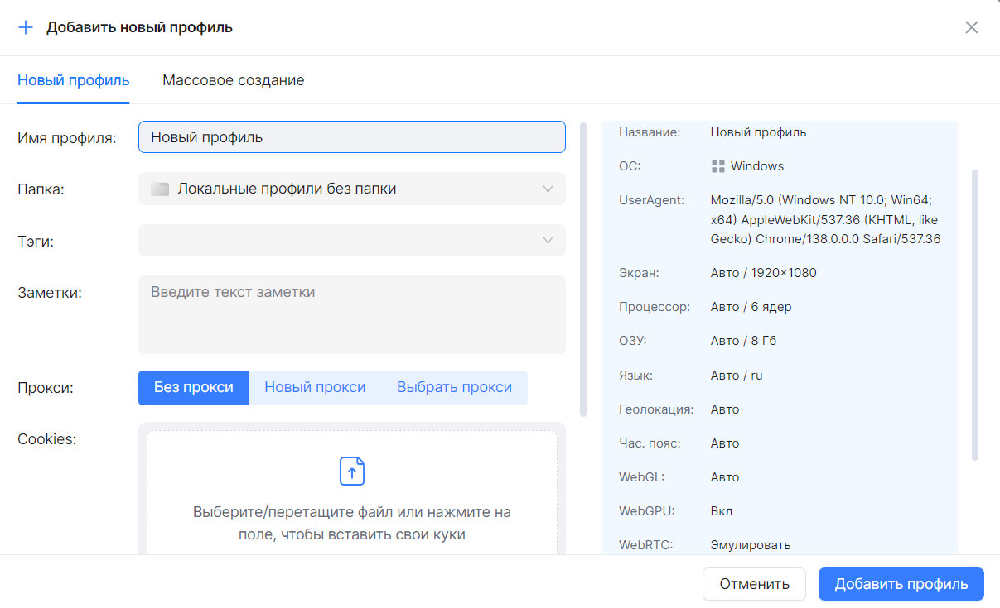
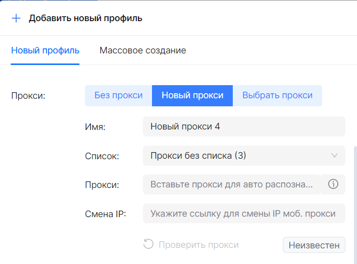
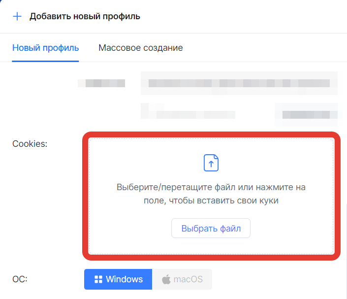

import DisclaimerNotice from '@site/src/components/DisclaimerNotice';

# Создание профиля
<DisclaimerNotice />

**Единичное создание:**

 1. В Менеджере профилей нажмите "Новый профиль".
 2. Выберите режим "Новый профиль".
 3. Заполните основные параметры:
 - Имя профиля — любое удобное название;
 - Тип профиля — локальный или облачный;
 - Папка — выберите папку для организации;
 - Теги — добавьте метки для поиска (опционально).

 4. Выберите одну из опций:
 - Без прокси — для работы с подключением без прокси;
 - Новый прокси — впишите прокси во время создания профиля;
 - Выбрать прокси — ручной выбор конкретного прокси из списка ранее созданных.

**Дополнительные настройки:**

 - Импортируйте cookie-файлы при необходимости;
 - Добавьте заметки для удобства.

